# Localization

## Inputs

### Pointcloud Map

Environment map created with point cloud, published by the map server.

- sensor_msgs/msg/PointCloud2

A 3d point cloud map is used for LiDAR-based localization in Autoware.

### Manual Initial Pose

Start pose of ego, published by the user interface.

- geometry_msgs/msg/PoseWithCovarianceStamped
   - std_msgs/msg/Header header
   - geometry_msgs/msg/PoseWithCovariance pose
      - geometry_msgs/msg/Pose pose
         - geometry_msgs/msg/Point position
         - geometry_msg/msg/Quaternion orientation
      - double[36] covariance

### 3D-LiDAR Scanning

LiDAR scanning for NDT matching, published by the LiDAR sensor.

- sensor_msgs/msg/PointCloud2

The raw 3D-LiDAR data needs to be processed by the [point cloud pre-processing modules](../../autoware-architecture/sensing/data-types/point-cloud.md) before being used for localization.

### Automatic Initial pose

Start pose of ego, calculated from INS(Inertial navigation sensor) sensing data.

- geometry_msgs/msg/PoseWithCovarianceStamped
   - std_msgs/msg/Header header
   - geometry_msgs/msg/PoseWithCovariance pose
      - geometry_msgs/msg/Pose pose
         - geometry_msgs/msg/Point position
         - geometry_msg/msg/Quaternion orientation
      - double[36] covariance

 When the initial pose is not set manually, the message can be used for automatic pose initialization.

Current Geographic coordinate of the ego, published by the GNSS sensor.     
- sensor_msgs/msg/NavSatFix
   - std_msgs/msg/Header header
   - sensor_msgs/msg/NavSatStatus status
   - double latitude
   - double longitude
   - double altitude
   - double[9] position_covariance
   - unit8 position_covariance_type

Current orientation of the ego, published by the GNSS-INS.
- autoware_sensing_msgs/msg/GnssInsOrientationStamped
   - std_msgs/Header header
   - autoware_sensing_msgs/msg/GnssInsOrientation orientation
      - geometry_msgs/Quaternion orientation
      - float32 rmse_rotation_x
      - float32 rmse_rotation_y
      - float32 rmse_rotation_z 

### IMU Data

Current orientation, angular velocity and linear acceleration of ego, calculated from IMU sensing data.

- sensor_msgs/msg/Imu
   - std_msgs/msg/Header header
   - geometry_msgs/msg/Quaternion orientation
   - double[9] orientation_covariance
   - geometry_msgs/msg/Vector3 angular_velocity
   - double[9] angular_velocity_covariance
   - geometry_msgs/msg/Vector3 linear_acceleration
   - double[9] linear_acceleration_covariance

### Vehicle Velocity Status

Current velocity of the ego vehicle, published by the vehicle interface.

- autoware_auto_vehicle_msgs/msg/VelocityReport
   - std_msgs/msg/Header header;
   - float longitudinal_velocity;
   - float lateral_velocity;
   - float heading_rate;

Before the velocity input localization interface, module `vehicle_velocity_converter` converts message type `autoware_auto_vehicle_msgs/msg/VelocityReport` to `geometry_msgs/msg/TwistWithCovarianceStamped`.

## Outputs

### Vehicle pose

Current pose of ego, calculated from localization interface.

- geometry_msgs/msg/PoseWithCovarianceStamped
   - std_msgs/msg/Header header
   - geometry_msg/PoseWithCovariance pose
      - geometry_msgs/msg/Pose pose
         - geometry_msgs/msg/Point position
         - geometry_msgs/msg/Quaternion orientation
      - double[36] covariance

### Vehicle velocity

Current velocity of ego, calculated from localization interface.

- geometry_msgs/msg/TwistWithCovarianceStamped
   - std_msgs/msg/Header header
   - geometry_msg/TwistWithCovariance twist
      - geometry_msgs/msg/Twist twist
         - geometry_msgs/msg/Vector3 linear
         - geometry_msgs/msg/Vector3 angular
      - double[36] covariance

### Vehicle acceleration

Current acceleration of ego, calculated from localization interface.

- geometry_msgs/msg/AccelWithCovarianceStamped
   - std_msgs/msg/Header header
   - geometry_msg/AccelWithCovariance accel
      - geometry_msgs/msg/Accel accel
         - geometry_msgs/msg/Vector3 linear
         - geometry_msgs/msg/Vector3 angular
      - double[36] covariance

### Vehicle kinematic state

Current pose and twist of ego,  calculated from localization interface. 
**Note:** Kinematic state contains pose and velocity. In the future, [pose](#vehicle-pose) and [velocity](#vehicle-velocity) will not be used as output for localization. 

- nav_msgs/msg/Odometry
   - std_msgs/msg/Header header
   - string child_frame_id
   - geometry_msgs/msg/PoseWithCovariance pose
   - geometry_msgs/msg/TwistWithCovariance twist

The message will be subscribed by the planning and control module.

### Localization Accuracy

Diagnostics information that indicates if the localization module works properly.

TBD.