# Localization

## Inputs

### PointCloud Map

Environment map created with point cloud, Published by the Map Server.

- sensor_msgs::msg::PointCloud2

### Initial Pose

Start pose of ego, Published by the User Interface.

- geometry_msgs::msg::PoseWithCovarianceStamped

### 3D-LiDAR Scanning

LiDAR scanning for NDT matching. Published by the LiDAR sensor.

- sensor_msgs::msg::PointCloud2

### GNSS 

Current Geographic coordinate of the ego. Published by GNSS sensor.

- sensor_msgs::msg::NavSatFix

When the initial pose is not set manually, the GNSS message can be used for automatic pose initialization.

### IMU

Current orientation, angular velocity and linear acceleration of ego. Published by IMU sensor.

- sensor_msgs::msg::Imu

### Vehicle Velocity Status

Current velocity of the ego vehicle. Published by the Vehicle Interface.

- autoware_auto_vehicle_msgs/msg/VelocityReport
   - std_msgs::msg::Header header;
   - float longitudinal_velocity;
   - float lateral_velocity;
   - float heading_rate;

## Outputs

### Vehicle acceleration

Current acceleration of ego.

- geometry_msgs::msg::AccelWithCovarianceStamped

### Vehicle kinematic state

Current pose and twist of ego.

- geometry_msgs::msg::Odometry

### Localization Accuracy

Diagnostics information that indicates if the localization module works properly.

TBD.