# Map

## Overview

Autoware relies on high-definition point cloud maps and vector maps of the driving environment to perform various tasks. Before launching Autoware, you need to load the pre-created map files.

## Inputs

- Point cloud maps (`.pcd`)
- Lanelet2 maps (`.osm`)

Refer to [Creating maps](../../../how-to-guides/integrating-autoware/creating-maps/index.md) on how to create maps.

## Outputs

### Point cloud map

It loads point cloud files and publishes the maps to the other Autoware nodes in various configurations. Currently, it supports the following types:

- Raw point cloud map (sensor_msgs/msg/PointCloud2)
- Downsampled point cloud map (sensor_msgs/msg/PointCloud2)
- Partial point cloud map loading via ROS service (autoware_map_msgs/srv/GetPartialPointCloudMap)
- Differential point cloud map loading via ROS service (autoware_map_msgs/srv/GetDifferentialPointCloudMap)

### Lanelet2 map

It loads a Lanelet2 file and publishes the map data as `autoware_map_msgs/msg/LaneletMapBin` message. The lan/lon coordinates are projected onto the MGRS coordinates.

- autoware_map_msgs/msg/LaneletMapBin
  - std_msgs/Header header
  - string version_map_format
  - string version_map
  - string name_map
  - uint8[] data

### Lanelet2 map visualization

Visualize `autoware_map_msgs/msg/LaneletMapBin` messages in `Rviz`.

- visualization_msgs/msg/MarkerArray
