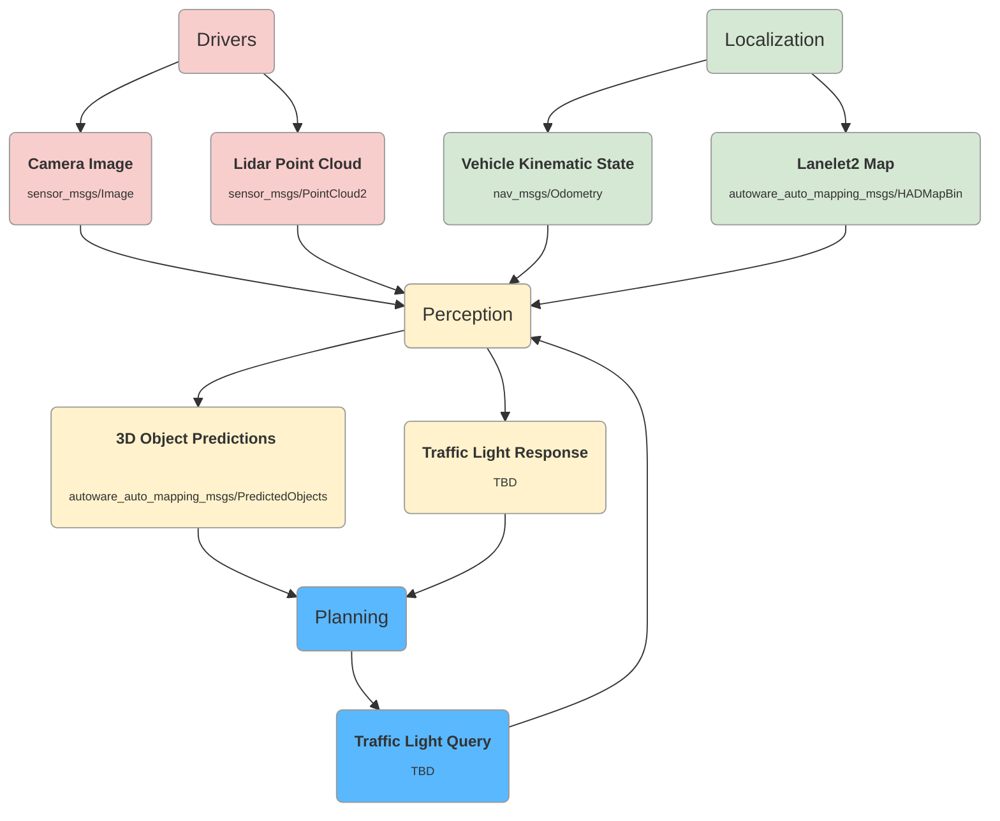

# Perception

## Inputs

### PointCloud

PointCloud data published by Lidar.

- [sensor_msgs/msg/PointCloud2](http://docs.ros.org/en/api/sensor_msgs/html/msg/PointCloud2.html)

### Image

Image frame captured by camera.

- [sensor_msgs/msg/Image](http://docs.ros.org/en/api/sensor_msgs/html/msg/Image.html)

### Vehicle kinematic state

current position of ego, used in traffic signals recognization. See Iutputs of Planning.

### Lanelet2 Map

map of the environment. See Iutputs of Planning.

## Output

### 3D Object Predictions

3D Objects detected, tracked and predicted by sensor fusing.

- [autoware_auto_perception_msgs/msg/PredictedObjects](https://gitlab.com/autowarefoundation/autoware.auto/autoware_auto_msgs/-/blob/master/autoware_auto_perception_msgs/msg/PredictedObjects.idl)
  - [std_msgs/Header](https://docs.ros.org/en/noetic/api/std_msgs/html/msg/Header.html) header
  - sequence<[autoware_auto_perception_msgs::msg::PredictedObject](https://gitlab.com/autowarefoundation/autoware.auto/autoware_auto_msgs/-/blob/master/autoware_auto_perception_msgs/msg/PredictedObject.idl)> objects
    - unique_identifier_msgs::msg::UUID uuid
    - float existence_probability
    - sequence<[autoware_auto_perception_msgs::msg::ObjectClassification](https://gitlab.com/autowarefoundation/autoware.auto/autoware_auto_msgs/-/blob/master/autoware_auto_perception_msgs/msg/ObjectClassification.idl)> classification
      - uint8 classification
      - float probability
    - [autoware_auto_perception_msgs::msg::PredictedObjectKinematics](https://gitlab.com/autowarefoundation/autoware.auto/autoware_auto_msgs/-/blob/master/autoware_auto_perception_msgs/msg/PredictedObjectKinematics.idl) kinematics
      - [geometry_msgs::msg::PoseWithCovariance](https://docs.ros.org/en/noetic/api/geometry_msgs/html/msg/PoseWithCovariance.html) initial_pose
      - [geometry_msgs::msg::TwistWithCovariance](https://docs.ros.org/en/noetic/api/geometry_msgs/html/msg/TwistWithCovariance.html)
      - [geometry_msgs::msg::AccelWithCovariance](https://docs.ros.org/en/noetic/api/geometry_msgs/html/msg/AccelWithCovariance.html) initial_acceleration
      - sequence<[autoware_auto_perception_msgs::msg::PredictedPath](https://gitlab.com/autowarefoundation/autoware.auto/autoware_auto_msgs/-/blob/master/autoware_auto_perception_msgs/msg/PredictedPath.idl), 10> predicted_paths
        - sequence<[geometry_msgs::msg::Pose](https://docs.ros.org/en/lunar/api/geometry_msgs/html/msg/Pose.html), 100> path
        - builtin_interfaces::msg::Duration time_step
        - float confidence
    - sequence<[autoware_auto_perception_msgs::msg::Shape](https://gitlab.com/autowarefoundation/autoware.auto/autoware_auto_msgs/-/blob/master/autoware_auto_perception_msgs/msg/Shape.idl), 5> shape
      - [geometry_msgs::msg::Polygon](https://docs.ros.org/en/noetic/api/geometry_msgs/html/msg/Polygon.html) polygon
      - float height

### Traffic Light Response

traffic light signals recognized by object detection model.**The message definition is under discussion.**

- TrafficLightResponse
  - uint64 traffic_light_id
  - uint8 traffic_light_state

With the traffic_light_state being one of the following

- GREEN = 1
- GREEN_BLINKING = 2
- YELLOW = 3
- YELLOW_BLINKING = 4
- RED = 5
- RED_BLINKING = 6
- OFF = 7
- UNKNOWN = 8
