# Sensing

```mermaid
graph TD
    cmp_drv("Drivers"):::cls_drv
    cmp_loc("Localization"):::cls_loc
    cmp_per("Perception"):::cls_per
    cmp_sen("Preprocessors"):::cls_sen
    msg_ult("<font size=2><b>Ultrasonics</b></font size>
    <font size=1>sensor_msgs/Range</font size>"):::cls_drv
    msg_img("<font size=2><b>Camera Image</b></font size>
    <font size=1>sensor_msgs/Image</font size>"):::cls_drv
    msg_ldr("<font size=2><b>Lidar Point Cloud</b></font size>
    <font size=1>sensor_msgs/PointCloud2</font size>"):::cls_drv
    msg_rdr_t("<font size=2><b>Radar Tracks</b></font size>
    <font size=1>radar_msgs/RadarTracks</font size>"):::cls_drv
    msg_rdr_s("<font size=2><b>Radar Scan</b></font size>
    <font size=1>radar_msgs/RadarScan</font size>"):::cls_drv
    msg_gnss("<font size=2><b>GNSS-INS Position</b></font size>
    <font size=1>sensor_msgs/NavSatFix</font size>"):::cls_drv
    msg_gnssori("<font size=2><b>GNSS-INS Orientation</b></font size>
    <font size=1>autoware_sensing_msgs/GnssInsOrientationStamped</font size>"):::cls_drv
    msg_gnssvel("<font size=2><b>GNSS Velocity</b></font size>
    <font size=1>geometry_msgs/TwistWithCovarianceStamped</font size>"):::cls_drv
    msg_gnssacc("<font size=2><b>GNSS Acceleration</b></font size>
    <font size=1>geometry_msgs/AccelWithCovarianceStamped</font size>"):::cls_drv
    msg_ult_sen("<font size=2><b>Ultrasonics</b></font size>
    <font size=1>sensor_msgs/Range</font size>"):::cls_sen
    msg_img_sen("<font size=2><b>Camera Image</b></font size>
    <font size=1>sensor_msgs/Image</font size>"):::cls_sen
    msg_pc_combined_rdr("<font size=2><b>Combined Radar Tracks</b></font size>
    <font size=1>radar_msgs/RadarTracks</font size>"):::cls_sen
    msg_pc_rdr("<font size=2><b>Radar Pointcloud</b></font size>
    <font size=1>radar_msgs/RadarScan</font size>"):::cls_sen
    msg_pc_combined_ldr("<font size=2><b>Combined Lidar Point Cloud</b></font size>
    <font size=1>sensor_msgs/PointCloud2</font size>"):::cls_sen
    msg_pose_gnss("<font size=2><b>GNSS-INS Pose</b></font size>
    <font size=1>geometry_msgs/PoseWithCovarianceStamped</font size>"):::cls_sen
    msg_gnssori_sen("<font size=2><b>GNSS-INS Orientation</b></font size>
    <font size=1>sensor_msgs/Imu</font size>"):::cls_sen
    msg_gnssvel_sen("<font size=2><b>GNSS Velocity</b></font size>
    <font size=1>geometry_msgs/TwistWithCovarianceStamped</font size>"):::cls_sen
    msg_gnssacc_sen("<font size=2><b>GNSS-INS Acceleration</b></font size>
    <font size=1>geometry_msgs/AccelWithCovarianceStamped</font size>"):::cls_sen

    cmp_drv --> msg_ult --> cmp_sen
    cmp_drv --> msg_img --> cmp_sen
    cmp_drv --> msg_rdr_t --> cmp_sen
    cmp_drv --> msg_rdr_s --> cmp_sen
    cmp_drv --> msg_ldr --> cmp_sen
    cmp_drv --> msg_gnss --> cmp_sen
    cmp_drv --> msg_gnssori --> cmp_sen
    cmp_drv --> msg_gnssvel --> cmp_sen
    cmp_drv --> msg_gnssacc --> cmp_sen

    cmp_sen --> msg_ult_sen
    cmp_sen --> msg_img_sen
    cmp_sen --> msg_gnssori_sen
    cmp_sen --> msg_gnssvel_sen
    cmp_sen --> msg_pc_combined_rdr
    cmp_sen --> msg_pc_rdr
    cmp_sen --> msg_pc_combined_ldr
    cmp_sen --> msg_pose_gnss
    cmp_sen --> msg_gnssacc_sen
    msg_ult_sen --> cmp_per
    msg_img_sen --> cmp_per
    msg_pc_combined_rdr --> cmp_per
    msg_pc_rdr --> cmp_per
    msg_pc_combined_ldr --> cmp_per
    msg_pc_combined_ldr --> cmp_loc
    msg_pose_gnss --> cmp_loc
    msg_gnssori_sen --> cmp_loc
    msg_gnssvel_sen --> cmp_loc
    msg_gnssacc_sen --> cmp_loc
classDef cls_drv fill:#F8CECC,stroke:#999,stroke-width:1px;
classDef cls_loc fill:#D5E8D4,stroke:#999,stroke-width:1px;
classDef cls_per fill:#FFF2CC,stroke:#999,stroke-width:1px;
classDef cls_sen fill:#FFE6CC,stroke:#999,stroke-width:1px;
```

## Inputs

### Ultrasonics

Distance data from ultrasonic radar driver.

- [sensor_msgs/Range](https://github.com/ros2/common_interfaces/blob/rolling/sensor_msgs/msg/Range.msg)

### Camera Image

Image data from camera driver.

- [sensor_msgs/Image](https://github.com/ros2/common_interfaces/blob/rolling/sensor_msgs/msg/Image.msg)

### Radar Tracks

Tracks from radar driver.

- [radar_msgs/RadarTracks](https://github.com/ros-perception/radar_msgs/blob/ros2/msg/RadarTracks.msg)

### Radar Scan

Scan from radar driver.

- [radar_msgs/RadarScan](https://github.com/ros-perception/radar_msgs/blob/ros2/msg/RadarScan.msg)

### Lidar Point Cloud

Pointcloud from lidar driver.

- [sensor_msgs/PointCloud2](https://github.com/ros2/common_interfaces/blob/rolling/sensor_msgs/msg/PointCloud2.msg)

### GNSS-INS Position

Initial pose from GNSS driver.

- [geometry_msgs/NavSatFix](https://github.com/ros2/common_interfaces/blob/rolling/sensor_msgs/msg/NavSatFix.msg)

### GNSS-INS Orientation

Initial orientation from GNSS driver.

- [autoware_sensing_msgs/GnssInsOrientationStamped](https://github.com/autowarefoundation/autoware_msgs/blob/main/autoware_sensing_msgs/msg/GnssInsOrientationStamped.msg)

### GNSS Velocity

Initial velocity from GNSS driver.

- [geometry_msgs/TwistWithCovarianceStamped](https://github.com/ros2/common_interfaces/blob/rolling/geometry_msgs/msg/TwistWithCovarianceStamped.msg)

### GNSS Acceleration

Initial acceleration from GNSS driver.

- [geometry_msgs/AccelWithCovarianceStamped](https://github.com/ros2/common_interfaces/blob/rolling/geometry_msgs/msg/AccelWithCovarianceStamped.msg)

## Output

### Ultrasonics

Distance data from ultrasonic radar. Used by the Perception.

- [sensor_msgs/Range](https://github.com/ros2/common_interfaces/blob/rolling/sensor_msgs/msg/Range.msg)

### Camera Image

Image data from camera. Used by the Perception.

- [sensor_msgs/Image](https://github.com/ros2/common_interfaces/blob/rolling/sensor_msgs/msg/Image.msg)

### Combined Radar Tracks

Radar tracks from radar. Used by the Perception.

- [radar_msgs/RadarTracks.msg](https://github.com/ros-perception/radar_msgs/blob/ros2/msg/RadarTracks.msg)

### Radar Point Cloud

Pointcloud from radar. Used by the Perception.

- [radar_msgs/RadarScan.msg](https://github.com/ros-perception/radar_msgs/blob/ros2/msg/RadarScan.msg)

### Combined Lidar Point Cloud

Lidar pointcloud after preprocessing. Used by the Perception and Localization.

- [sensor_msgs/PointCloud2](https://github.com/ros2/common_interfaces/blob/rolling/sensor_msgs/msg/PointCloud2.msg)

### GNSS-INS pose

Initial pose of the ego vehicle from GNSS. Used by the Localization.

- [geometry_msgs/PoseWithCovarianceStamped](https://github.com/ros2/common_interfaces/blob/rolling/geometry_msgs/msg/PoseWithCovarianceStamped.msg)

### GNSS-INS Orientation

Orientation info from GNSS. Used by the Localization.

- [sensor_msgs/Imu](https://github.com/ros2/common_interfaces/blob/rolling/sensor_msgs/msg/Imu.msg)

### GNSS velocity

Velocity of the ego vehicle from GNSS. Used by the Localization.

- [geometry_msgs/TwistWithCovarianceStamped](https://github.com/ros2/common_interfaces/blob/rolling/geometry_msgs/msg/TwistWithCovarianceStamped.msg)

### GNSS Acceleration

Acceleration of the ego vehicle from GNSS. Used by the Localization.

- [geometry_msgs/AccelWithCovarianceStamped](https://github.com/ros2/common_interfaces/blob/rolling/geometry_msgs/msg/AccelWithCovarianceStamped.msg)
