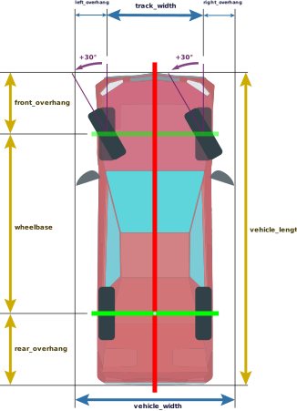

# Vehicle dimensions

## Vehicle axes and base_link

{: style="width:500px"}

The `base_link` frame is used very frequently throughout the Autoware stack, and is a projection of the rear-axle center onto the ground surface.

- Localization module outputs the `map` to `base_link` transformation.
- Planning module plans the poses for where the `base_link` frame should be in the future.
- Control module tries to fit `base_link` to incoming poses.

## Vehicle dimensions

{: style="width:550px"}

### wheelbase

The distance between front and rear axles.

### track_width

The distance between left and right wheels.

### Overhangs

Overhangs are part of the minimum safety box calculation.

When measuring overhangs, side mirrors, protruding sensors and wheels should be taken into consideration.

#### left_overhang

The distance between the axis centers of the left wheels and the left-most point of the vehicle.

#### right_overhang

The distance between the axis centers of the right wheels and the right-most point of the vehicle.

#### front_overhang

The distance between the front axle and the foremost point of the vehicle.

#### rear_overhang

The distance between the rear axle and the rear-most point of the vehicle.

### vehicle_length

Total length of the vehicle. Calculated by `front_overhang + wheelbase + rear_overhang`

### vehicle_width

Total width of the vehicle. Calculated by `left_overhang + track_width + right_overhang`

### Wheel parameters

{: style="width:350px"}

#### wheel_width

The lateral width of a wheel tire, primarily used for dead reckoning.

#### wheel_radius

The radius of the wheel, primarily used for dead reckoning.

### polygon_footprint

{: style="width:350px"}

The polygon defines the minimum collision area for the vehicle.

The points should be ordered clockwise, with the origin on the `base_link`.

## Wheel orientations

If the vehicle is going forward, a positive wheel angle will result in the vehicle turning left.

Autoware assumes the rear wheels don't turn on `z` axis.

## Notice

The vehicle used in the illustrations was created by xvlblo22 and is from <https://www.turbosquid.com/3d-models/modular-sedan-3d-model-1590886>.
