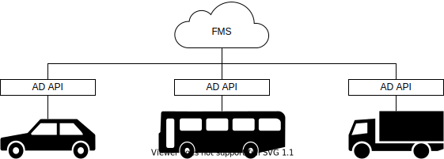
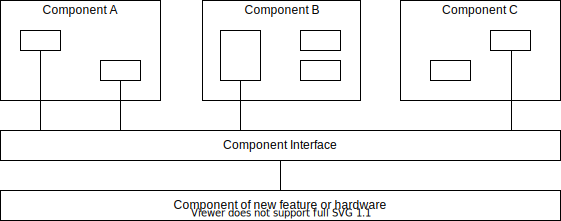
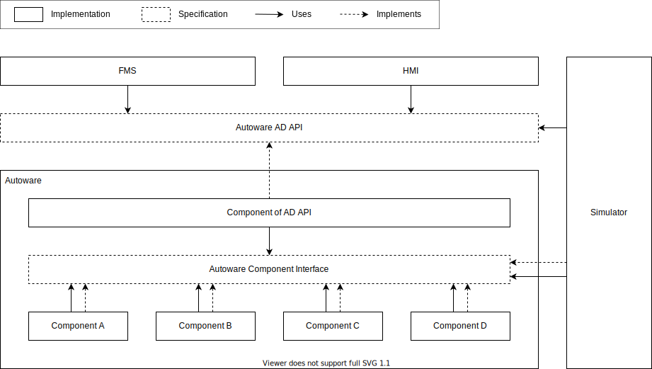
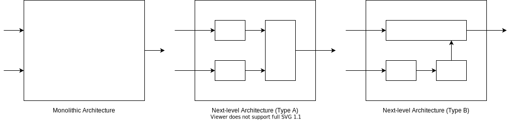

# Autoware interface design

## Abstract

Autoware defines three categories of interfaces. The first one is Autoware AD API for operating the vehicle from outside the autonomous driving system such as the Fleet Management System (FMS) and Human Machine Interface (HMI) for operators or passengers. The second one is Autoware component interface for components to communicate with each other. The last one is the local interface used inside the component.

## Concept

- Applications can operate multiple and various vehicles in a common way.

  

- Applications are not affected by version updates and implementation changes.

  

- Developers only need to know the interface to add new features and hardware.

  

## Requirements

Goals:

- AD API provides functionality to create the following applications:
  - Drive the vehicle on the route or drive to the requested positions in order.
  - Operate vehicle behavior such as starting and stopping.
  - Display or announce the vehicle status to operators, passengers, and people around.
  - Control vehicle devices such as doors.
  - Monitor the vehicle or drive it manually.
- AD API provides stable and long-term specifications. This enables unified access to all vehicles.
- AD API hides differences in version and implementation and absorbs the impact of changes.
- AD API has a default implementation and can be applied to some simple ODDs with options.
- The AD API implementation is extensible with the third-party components as long as it meets the specifications.
- The component interface provides stable and medium-term specifications. This makes it easier to add components.
- The component interface clarifies the public and private parts of a component and improves maintainability.
- The component interface is extensible with the third-party design to improve the sub-components' reusability.

Non-goals:

- AD API does not cover security. Use it with other reliable methods.
- The component interface is just a specification, it does not include an implementation.

## Architecture

The components of Autoware are connected via the component interface.
Each component uses the interface to provide functionality and to access other components.
AD API implementation is also a component.
Since the functional elements required for AD API are defined as the component interface, other components do not need to consider AD API directly.
Tools for evaluation and debugging, such as simulators, access both AD API and the component interface.

The component interface has a hierarchical specification.
The top-level architecture consists of some components. Each component has some options of the next-level architecture.
Developers select one of them when implementing the component. The simplest next-level architecture is monolithic.
This is an all-in-one and black box implementation, and is suitable for small group development, prototyping, and very complex functions.
Others are arbitrary architecture consists of sub-components and have advantages for large group development.
A sub-component can be combined with others that adopt the same architecture.
Third parties can define and publish their own architecture and interface for open source development.
It is desirable to propose them for standardization if they are sufficiently evaluated.

## Features

### Communication methods

As shown in the table below, interfaces are classified into four communication methods to define their behavior.
Function Call is a request-response communication and is used for processing that requires immediate results. The others are publish-subscribe communication.
Notification is used to process data that changes with some event, typically a callback. Streams handle continuously changing data.
Reliable Stream expects all data to arrive without loss, Realtime Stream expects the latest data to arrive with low delay.

| Communication Method | ROS Implementation                | Optional Implementation |
| -------------------- | --------------------------------- | ----------------------- |
| Function Call        | Service                           | HTTP                    |
| Notification         | Topic (reliable, transient_local) | MQTT (QoS=2, retain)    |
| Reliable Stream      | Topic (reliable, volatile)        | MQTT (QoS=2)            |
| Realtime Stream      | Topic (best_effort, volatile)     | MQTT (QoS=0)            |

These methods are provided as services or topics of ROS since Autoware is developed using ROS and mainly communicates with its packages.
On the other hand, FMS and HMI are often implemented without ROS, Autoware is also expected to communicate with applications that do not use ROS.
It is wasteful for each of these applications to have an adapter for Autoware, and a more suitable means of communication is required.
HTTP and MQTT are suggested as additional options because these protocols are widely used and can substitute the behavior of services and topics.
In that case, text formats such as JSON where field names are repeated in an array of objects, are inefficient and it is necessary to consider the serialization.

### Naming convention

The name of the interface must be `/<component name>/api/<interface name>`,
where `<component name>` is the name of the component. For an AD API component, omit this part and start with `/api`.
The `<interface name>` is an arbitrary string separated by slashes.
Note that this rule causes a restriction that the namespace `api` must not be used as a name other than AD API and the component interface.

The following are examples of correct interface names for AD API and the component interface:

- /api/autoware/state
- /api/autoware/engage
- /planning/api/route/set
- /vehicle/api/status

The following are examples of incorrect interface names for AD API and the component interface:

- /ad_api/autoware/state
- /autoware/engage
- /planning/route/set/api
- /vehicle/my_api/status

### Logging

It is recommended to log the interface for analysis of vehicle behavior.
If logging is needed, rosbag is available for topics, and use logger in rclcpp or rclpy for services.
Typically, create a wrapper for service and client classes that logs when a service is called.

### Restrictions

For each API, consider the restrictions such as following and describe them if necessary.

Services:

- response time
- pre-condition
- post-condition
- execution order
- concurrent execution

Topics:

- recommended delay range
- maximum delay
- recommended frequency range
- minimum frequency
- default frequency

## Data structure

### Data type definition

Do not share the types in AD API unless they are obviously the same to avoid changes in one API affecting another.
Also, implementation-dependent types, including the component interface, should not be used in AD API for the same reason.
Use the type in AD API in implementation, or create the same type and copy the data to convert the type.

### Constants and enumeration

Since ROS don't support enumeration, use constants instead.
The default value of type such as zero and empty string should not be used to detect that a variable is unassigned.
Alternatively, assign it a dedicated name to indicate that it is undefined.
If one type has multiple enumerations, comment on the correspondence between constants and variables.
Assign unique values to all constants so that it can be distinguished from other enumerations.
Do not use enumeration values directly, as assignments are subject to change when the version is updated.

### Time stamp

Clarify what the timestamp indicates. for example, send time, measurement time, update time, etc. Consider having multiple timestamps if necessary.
Use `std_msgs/msg/Header` when using ROS transform.
Also consider whether the header is common to all data, independent for each data, or additional timestamp is required.

### Request header

Currently, there is no required header.

### Response status

The interfaces whose communication method is Function Call use a common response status to unify the error format.
For these interfaces, include a variable of type ResponseStatus with the name status in the response.
ResponseStatus has three members, level, code and message.
The level is a classification of results. It indicates whether the API was successful.
The code is a number to identify the error cause for each API. The message is text for users.

## Concerns, assumptions and limitations

- The applications use the version information provided by AD API to check compatibility.
  Unknown versions are also treated as available as long as the major versions match (excluding major version 0).
  Compatibility between AD API and the component interface is assumed to be maintained by the version management system.
- If an unintended behavior of AD API is detected, the application should take appropriate action.
  Autoware tries to keep working as long as possible, but it is not guaranteed to be safe.
  Safety should be considered for the entire system, including the applications.
