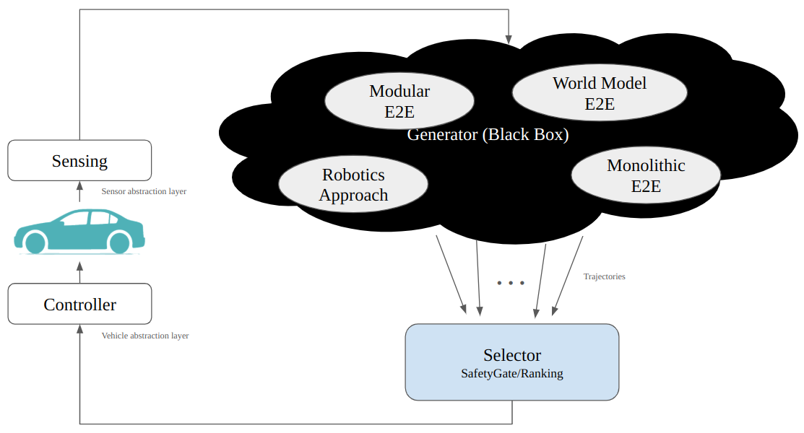

# Requirements and Considerations for the New Autoware Architecture

In order to introduce new **End-to-End (E2E) learning-based planners** into Autoware, we set the following high-level requirements for the new Autoware architecture.

---

## 1. Define a Robust, Consistent Interface Across Evolutionary Steps

As explained in the *“Autoware 2.0 Architecture Description”* chapter, we plan to take the following evolutionary steps towards **Level 4 autonomous driving**:

1. **Current robotics-based planning approach**
2. **Modular E2E integration** for perception and planning
3. **Fully monolithic E2E system**
4. **Hybrid of E2E and traditional robotics-based planning**

We aim to **avoid disruptive changes to core interfaces** at each stage.
This ensures that users can adopt new E2E modules **incrementally**, without requiring major rewrites.

Moreover, some users may prefer to **retain classical rule-based planners** for specific scenarios (e.g., deterministic planning). By **preserving interface consistency**, we allow these users to easily switch between E2E and traditional approaches as needed.

## 2. Introduce a Framework for Minimum Safety Guarantees

A major challenge with learning-based planners is their **black-box nature**, making it difficult to verify whether the generated trajectories are **safe and valid**.

To address this, the architecture must incorporate a **post-processing phase** that enforces safety constraints on neural network outputs.

* These safety requirements may vary across **users and applications**.
* Therefore, the framework should support **easy customization**, allowing developers to define and enforce **domain-specific safety policies**.

## 3. Support User-Defined Behavior Preferences

In autonomous driving, many decisions are inherently **non-deterministic**.
For example, the timing of a lane change often depends on **driver preference and context**; both maintaining the current lane and changing lanes can be equally valid choices.

Some E2E planners, such as the **Diffusion Drive planner**, can generate multiple feasible trajectories in such scenarios.
However, the vehicle must ultimately **commit to a single maneuver**.

Therefore, the architecture must support a **mechanism for users to influence decision-making**, allowing their preferences to **guide behavior selection** when multiple valid options exist.

## 4. Generator-Selector Architecture

To flexibly accommodate these diverse approaches, we propose a **Generator-Selector Framework**.
This framework consists of two core components:

* **Generator**: Generates candidate trajectories that the vehicle can follow.
* **Selector**: Selects the safest and most optimal trajectory from among the candidates.

### Generator

The **Generator** can be any module capable of generating candidate trajectories that the vehicle may follow.
Examples include:

* **Rule-based**: Existing Autoware planners can be reused as-is.
* **Optimization-based**: Methods such as *Model Predictive Control (MPC)*.
* **Machine learning-based**: Component-based E2E modular approach or Monolithic E2E.

Multiple Generators can be executed **in parallel** or **selectively activated depending on the context**.

### Selector

The **Selector** is responsible for two main functions:

#### 1. Safety Gate (Safety Assurance)

Validates the output of black-box Generators (e.g., neural networks) to ensure a **minimum level of safety**.
Examples:

* Check using an HD map to ensure that traffic signals are obeyed.

#### 2. Ranking (Trajectory Evaluation and Selection)

Evaluates and ranks the outputs from multiple Generators, then selects the best one.
Examples:

* Use a robotics-based approach when an HD map is available; fall back to E2E models otherwise.
* Score trajectories based on driving policies such as **safety, comfort, or rule compliance**.

These Selector functions are implemented as **plugins**, allowing developers to:

* Customize safety requirements.
* Inject preference to select suitable trajectories for their own use case.

---

## Reference Links

* GitHub Discussions:
    * [Discussion #5033](https://github.com/orgs/autowarefoundation/discussions/5033)
    * [Discussion #6301](https://github.com/orgs/autowarefoundation/discussions/6301)
* Proposed Architecture: [New Planning Framework Wiki](https://github.com/tier4/new_planning_framework/wiki)
* GitHub Issue: [#6292](https://github.com/autowarefoundation/autoware/issues/6292)
* Migration Plan: [Enable generator-selector planning framework (#6292)](https://github.com/autowarefoundation/autoware/issues/6292)
