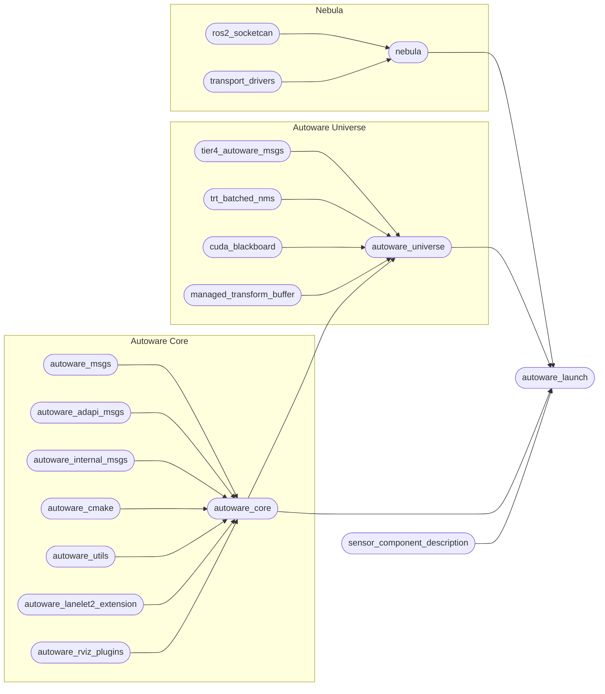

# Repository structure

## Overview

!!! info "`repositories/*.repos` files"

    Visit for more information: [Working with .repos files](repos-files.md){ .md-button }

Autoware has the following repository structure defined by the [`autoware.repos`](https://github.com/autowarefoundation/autoware/blob/main/repositories/autoware.repos) file:

!!! note

    Some repositories are omitted to keep the diagram simple.

## Important repositories

Here is an overview of the most important repositories:

### `autoware_core`

- Contains high-quality, well-tested packages essential for self-driving.
- It has sensing, perception, localization, planning, control packages.
- Maintained by the Autoware Foundation.

### `autoware_universe`

- Contains experimental, cutting-ege packages useful for self-driving.
- It has sensing, perception, localization, planning, control packages.
- Maintained by the Autoware Foundation and the community.
  - Hosted under autowarefoundation organization. But through the `CODEOWNERS` mechanism, the community can also maintain the repository.

### `autoware_msgs`

- Contains the message definitions for **inter-component** communication. (e.g., perception to planning)
- Can also be used by simulation software to communicate with Autoware.

### `autoware_internal_msgs`

- Contains the message definitions for **intra-component** communication. (e.g., within perception)

### `autoware_adapi_msgs`

- Contains the message definitions for **external API communication** between Autoware and **outside systems**  
  (e.g., vehicle HMI, remote operators, fleet management systems, simulators, or user applications)

### `autoware_launch`

- Contains launch files for Autoware.
- Able to launch multiple configurations of Autoware such as planning simulation, end-to-end simulation, rosbag-replay simulation, etc.

### `autoware_tools`

- Contains many useful tools for Autoware development.
- These are not expected to run during self-driving. Although some tools are helpful for diagnostics and debugging.
- Pulled by the [`repositories/tools.repos`](https://github.com/autowarefoundation/autoware/blob/main/repository/tools.repos).

### `autoware_utils`

- Contains many sub-packages for common utilities such as `autoware_utils_math`, `autoware_utils_geometry`, `autoware_utils_system`, etc.
