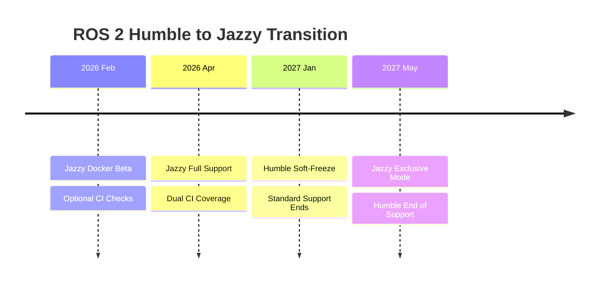
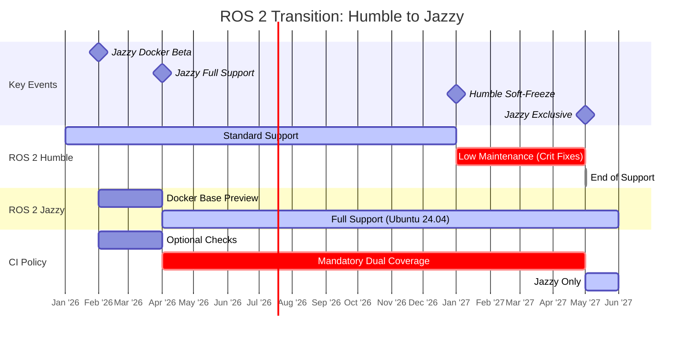

# ROS 2 Humble to Jazzy transition

Tracked in [Support ROS 2 Jazzy Jalisco #6695](https://github.com/autowarefoundation/autoware/issues/6695).

- ROS 2 Humble will reach the end of life on May 2027.
- ROS 2 Jazzy has been released in May 2024 and will be supported until May 2029.

This timeline is for Autoware's transition:

- **From:** Ubuntu 22.04 | ROS 2 **Humble**
- **To:** Ubuntu 24.04 | ROS 2 **Jazzy**

