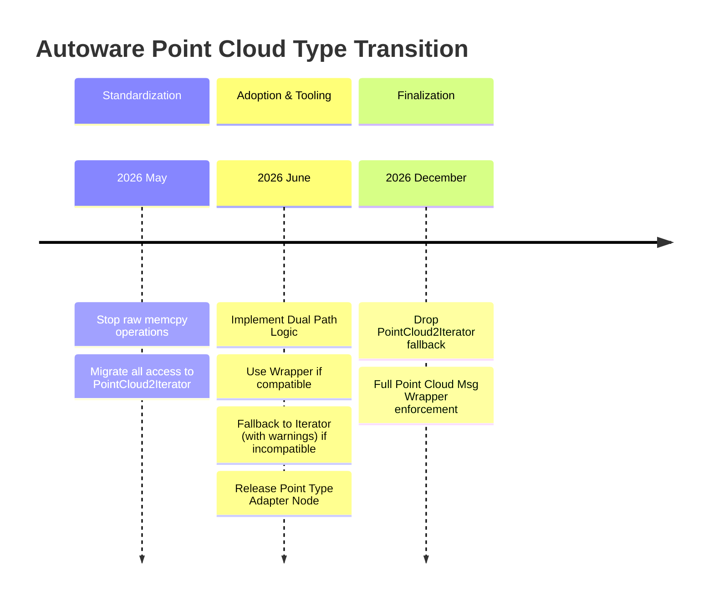
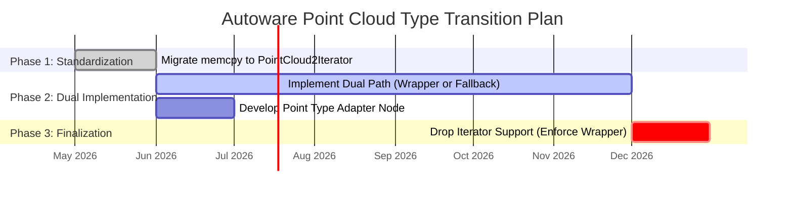

# Point cloud type transition

Tracked under [this issue](https://github.com/autowarefoundation/autoware/issues/6708).

Autoware transitions from using raw memcpy operations and using [PointCloud2Iterator<>](https://github.com/ros2/common_interfaces/blob/jazzy/sensor_msgs/include/sensor_msgs/point_cloud2_iterator.hpp) to using [Point Cloud Message Wrapper](https://gitlab.com/ApexAI/point_cloud_msg_wrapper).

This way the point cloud messages can be edited in-place with a `std::vector<>`-like wrapper.

The only downside is that this requires strong type definitions for the point cloud message fields.

We have already made the compatibility requirements for `PointXYZIRC` and `PointXYZIRCAEDT` types with [this PR](https://github.com/autowarefoundation/autoware_universe/pull/6996).

Now we need to start using this wrapper in the rest of the codebase.

We also need to provide a tool to convert point cloud messages from outside types to the Autoware expected types.

Reference implementation of [Point Type Adapter Node can be found here](https://gitlab.com/autowarefoundation/autoware.auto/AutowareAuto/-/blob/master/src/tools/point_type_adapter/src/point_type_adapter_node.cpp).

## Transition

1. **2026 May:** Switch all memcpy usages to `PointCloud2Iterator<>`.
2. **2026 June:** Add two paths for the codebase: check the full compatibility of the point type with the expected point type.
   - If compatible, use the wrapper.
   - If not compatible, use `PointCloud2Iterator<>` and print warnings.
3. **2026 June:** Add a node that converts point cloud messages from outside types to the Autoware expected types.
4. **2026 December:** Drop the `PointCloud2Iterator<>` usage.

!!! warning

    Under construction.
