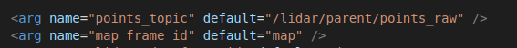
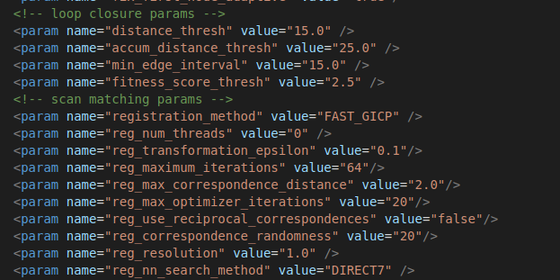
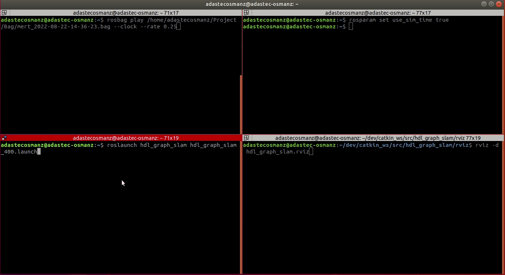
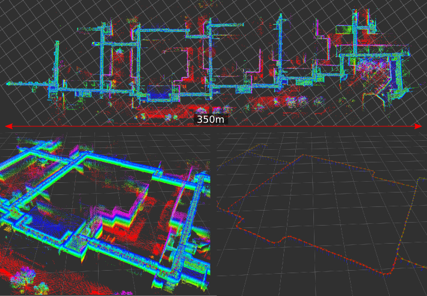
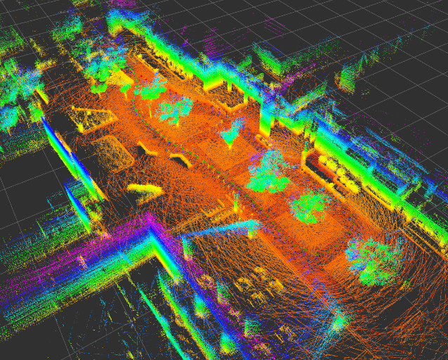
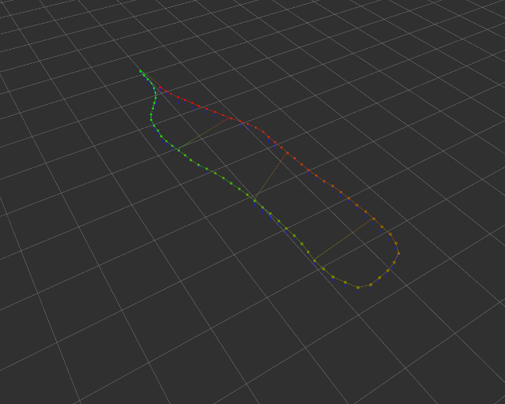
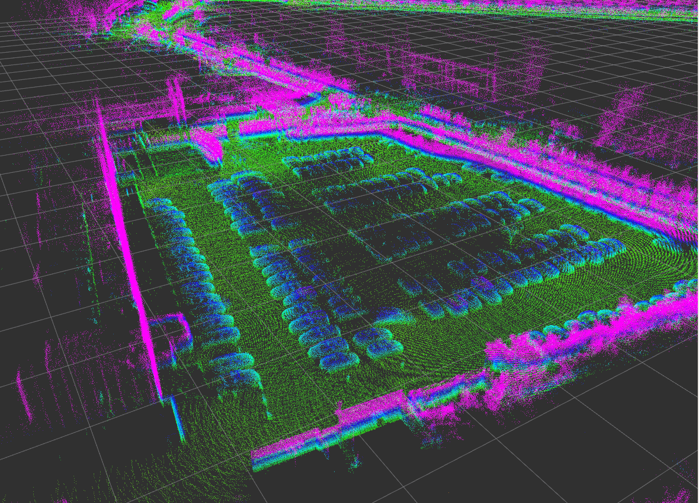
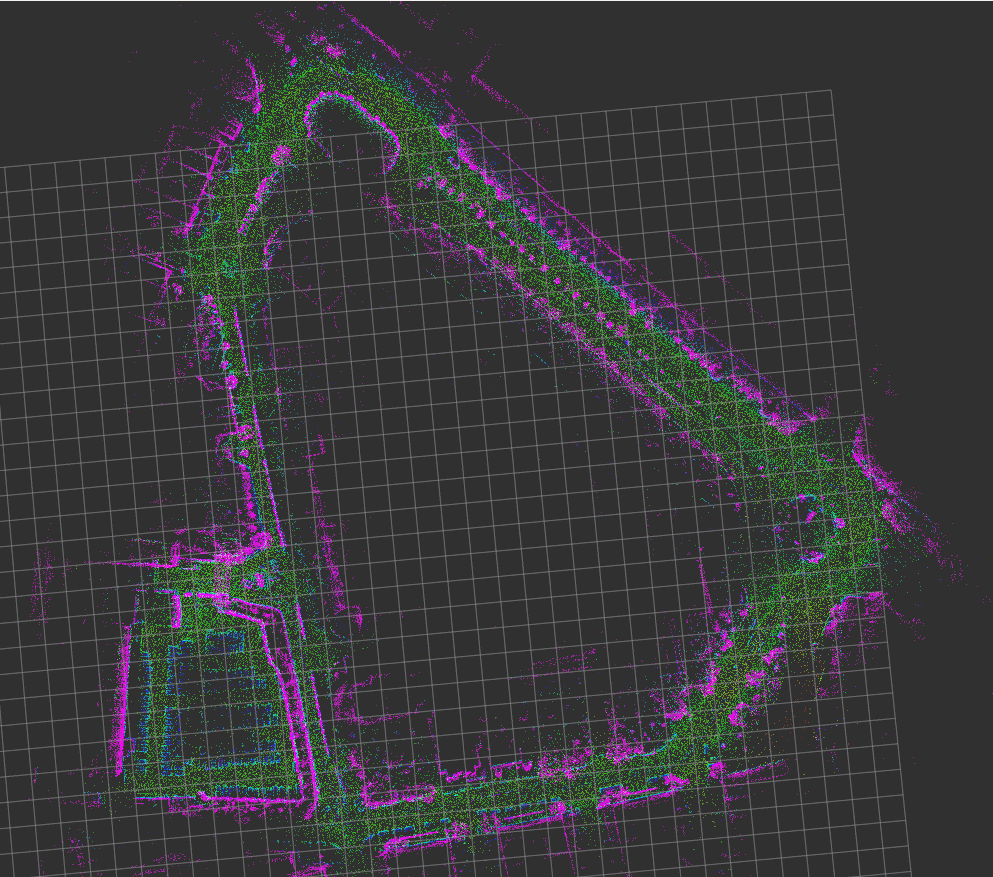

# hdl_graph_slam

## Repository Information

### Original Repository link

<https://github.com/koide3/hdl_graph_slam>

### Required Sensors

- LIDAR [Velodyne, Ouster, RoboSense]

### ROS Compatibility

- ROS 1

### Dependencies

- ROS
- PCL
- g2o
- OpenMP

The following ROS packages are required:

- geodesy
- nmea_msgs
- pcl_ros
- [ndt_omp](https://github.com/koide3/ndt_omp)
- [fast_gicp](https://github.com/SMRT-AIST/fast_gicp)

## Build & Run

### 1) Build

```bash
# for melodic
sudo apt-get install ros-melodic-geodesy ros-melodic-pcl-ros ros-melodic-nmea-msgs ros-melodic-libg2o
cd catkin_ws/src
git clone https://github.com/koide3/ndt_omp.git -b melodic
git clone https://github.com/SMRT-AIST/fast_gicp.git --recursive
git clone https://github.com/koide3/hdl_graph_slam

cd .. && catkin_make -DCMAKE_BUILD_TYPE=Release

# for noetic
sudo apt-get install ros-noetic-geodesy ros-noetic-pcl-ros ros-noetic-nmea-msgs ros-noetic-libg2o

cd catkin_ws/src
git clone https://github.com/koide3/ndt_omp.git
git clone https://github.com/SMRT-AIST/fast_gicp.git --recursive
git clone https://github.com/koide3/hdl_graph_slam

cd .. && catkin_make -DCMAKE_BUILD_TYPE=Release
```

### 2) Set parameter

- Set lidar topic on `launch/hdl_graph_slam_400.launch`



- Set registration settings on `launch/hdl_graph_slam_400.launch`



(Do not forget to rebuild after setting parameters.)

### 3) Run

```bash
rosparam set use_sim_time true
roslaunch hdl_graph_slam hdl_graph_slam_400.launch
```

```bash
roscd hdl_graph_slam/rviz
rviz -d hdl_graph_slam.rviz
```

```bash
rosbag play --clock hdl_400.bag
```

Save the generated map by:

```bash
rosservice call /hdl_graph_slam/save_map "resolution: 0.05
destination: '/full_path_directory/map.pcd'"
```

<p align="center">

## Example Result



[](https://github.com/koide3/hdl_graph_slam/actions/workflows/build.yml) on melodic & noetic

## Example2 (Outdoor)

Bag file (recorded in an outdoor environment):

- [hdl_400.bag.tar.gz](http://www.aisl.cs.tut.ac.jp/databases/hdl_graph_slam/hdl_400.bag.tar.gz) (raw data, about 900MB)

```bash
rosparam set use_sim_time true
roslaunch hdl_graph_slam hdl_graph_slam_400.launch
```

```bash
roscd hdl_graph_slam/rviz
rviz -d hdl_graph_slam.rviz
```

```bash
rosbag play --clock hdl_400.bag
```

 

 

## Papers

Kenji Koide, Jun Miura, and Emanuele Menegatti, A Portable 3D LIDAR-based System for Long-term and Wide-area People Behavior Measurement, Advanced Robotic Systems, 2019 [[link]](https://www.researchgate.net/publication/331283709_A_Portable_3D_LIDAR-based_System_for_Long-term_and_Wide-area_People_Behavior_Measurement).

## Contact

Kenji Koide, k.koide@aist.go.jp, <https://staff.aist.go.jp/k.koide>

Active Intelligent Systems Laboratory, Toyohashi University of Technology, Japan [\[URL\]](http://www.aisl.cs.tut.ac.jp)  
Mobile Robotics Research Team, National Institute of Advanced Industrial Science and Technology (AIST), Japan [\[URL\]](https://unit.aist.go.jp/rirc/en/team/smart_mobility.html)
