# **SC-A-LOAM**

## **What is SC-A-LOAM?** 
- A real-time LiDAR SLAM package that integrates A-LOAM and ScanContext.

## **Repository Information**

   ### **Original Repository link**
   https://github.com/gisbi-kim/SC-A-LOAM

   ### **Required Sensors**

   - LIDAR [VLP-16, HDL-32, HDL-64, Ouster OS1-64]

   ### **Prerequisites (dependencies)**
   - ROS  
   - GTSAM version 4.x.

   - If GTSAM is not installed, follow the steps below.
     ```
       wget -O ~/Downloads/gtsam.zip https://github.com/borglab/gtsam/archive/4.0.2.zip    
       cd ~/Downloads/ && unzip gtsam.zip -d ~/Downloads/                                  
       cd ~/Downloads/gtsam-4.0.2/                                                        
       mkdir build && cd build
       cmake -DGTSAM_BUILD_WITH_MARCH_NATIVE=OFF ..
       sudo make install -j8
        
     ```

   ### **ROS Compatibility**
   - ROS 1
    
## **Install Steps**

- First, install the abovementioned dependencies and follow below lines.      
     ```                                                                       
      mkdir -p ~/catkin_scaloam_ws/src                                  
      cd ~/catkin_scaloam_ws/src                                    
      git clone https://github.com/gisbi-kim/SC-A-LOAM.git          
      cd ../
      catkin_make                                                                      
      source ~/catkin_scaloam_ws/devel/setup.bash                   

     ```
 ## **Parameter Settings**  

- After downloading the repo, we will replace the lidar topic name from the launch file with the lidar topic name in our bag file. For this, we first need to learn the name of the topic in our bag file.   

   ### **1- Getting topic name from bag file**
      - Open terminal 

     <p align="center">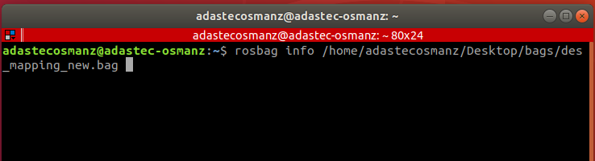</p>

      - rosbag info /home/adastecosmanz/.../bagname.bag

     <p align="center"></p> 

      - Look at the lidar directory under the topic title.  # For this bag topic name (lidar/parent/points_raw)

   ### **2- Changing the topic name**
    - Go to the launch file in the directory.

      home/user/catkin_scaloam_ws/src/SC-A-LOAM/launch/aloam_mulran.launch 
        
     - Let's replace the lidar topic name with the topic name in our own bag file. You can reach the topic name from the marked area in the picture.

     <p align="center"></p>
 
      - Do not forget to save the changes.

   ### **3- Scan Context parameters** 
   
      - If the doubling or loop is not closer, change the scan context parameters.
      - You can adjust the scan context settings with the parameters in the marked area.

    <p align="center"></p>


   ### **How to use?** 
      - Open new terminal
   
      - Start master (roscore) 
    
      - Play bag file `rosbag play /home/user/.../bagname.bag --clock --pause`
   
      - `roslaunch aloam_velodyne aloam_mulran.launch` 
     
    <p align="center">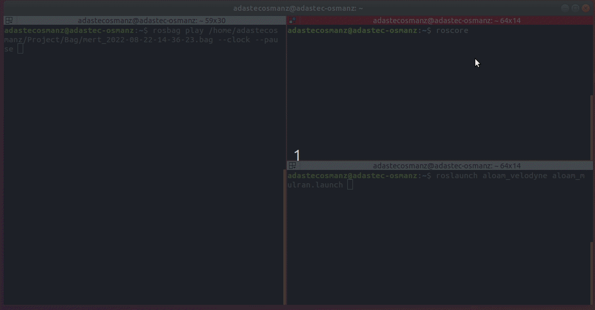
   
      - Screen output
    <p align="center">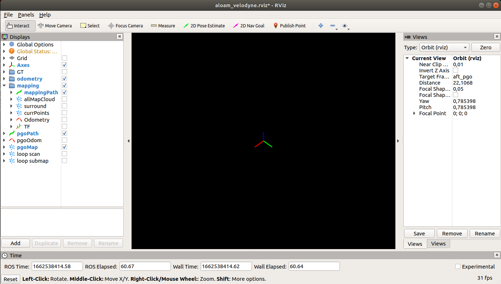</p>
  
      - We play the bag file by pressing the space bar in the bag terminal.


    <p align="center">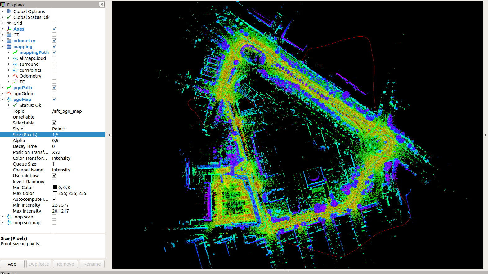</<p align="center">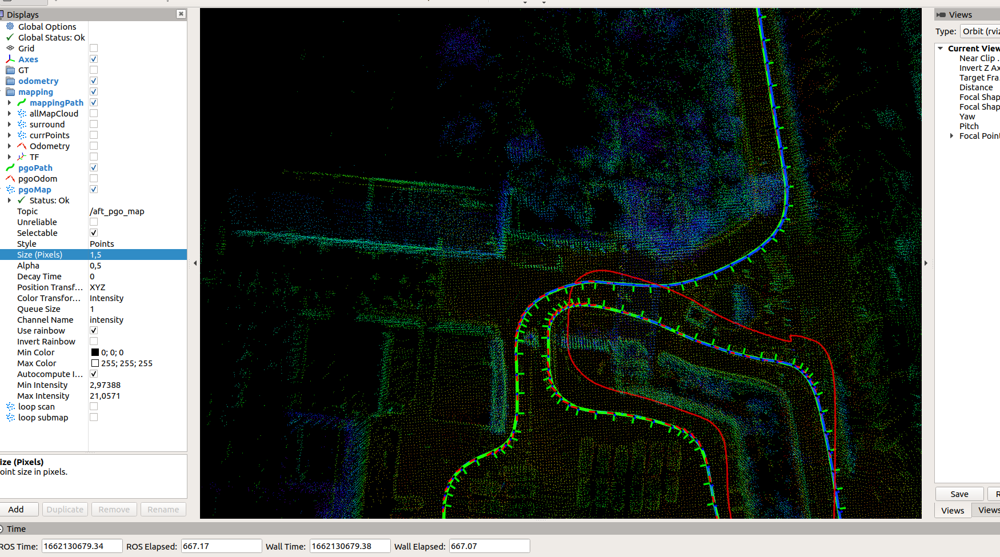</p>
    <p align="center">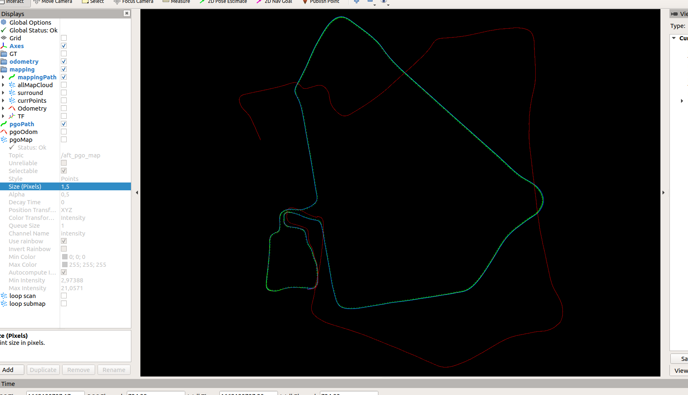</p>

    - As seen above, mapping was performed without doubling. If the doubling or loop is not closer, change the scan context parameters and map again.
    - Below you can see examples of maps that are not fully closed or doubled.

    <p align="center">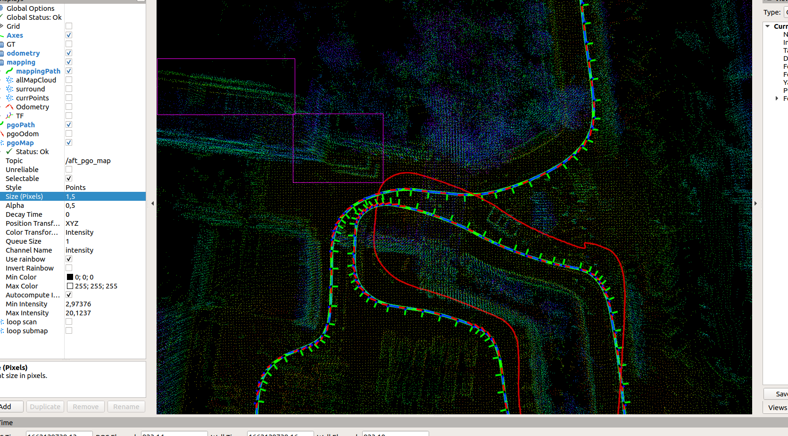</<p align="center"></p>


    ## Example Results 

    ### Riverside 01, MulRan dataset 
     - The MulRan dataset provides lidar scans (Ouster OS1-64, horizontally mounted, 10Hz) and consumer level gps (U-Blox EVK-7P, 4Hz) data.
     - About how to use (publishing data) data: see here https://github.com/irapkaist/file_player_mulran
     - example videos on Riverside 01 sequence. 
    1. with consumer level GPS-based altitude stabilization: https://youtu.be/FwAVX5TVm04
    2. without the z stabilization: https://youtu.be/okML_zNadhY 
    - example result:

      <p align="center">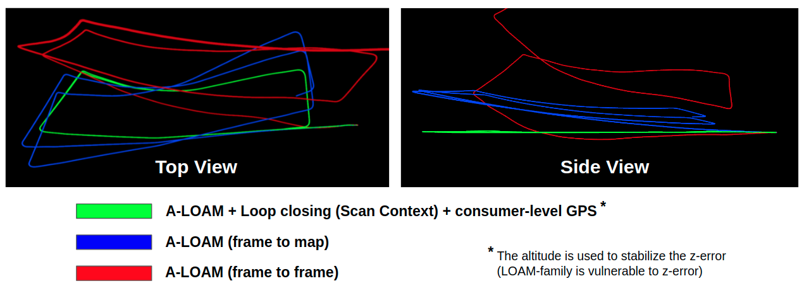</p>

    ### KITTI 05 
    - For KITTI (HDL-64 sensor), run using the command 
      ```
      roslaunch aloam_velodyne aloam_velodyne_HDL_64.launch # for KITTI dataset setting
      ```
    - To publish KITTI scans, you can use mini-kitti publisher, a simple python script: https://github.com/gisbi-kim/mini-kitti-publisher
    - example video (no GPS used here): https://youtu.be/hk3Xx8SKkv4
    - example result: 
     
      <p align="center">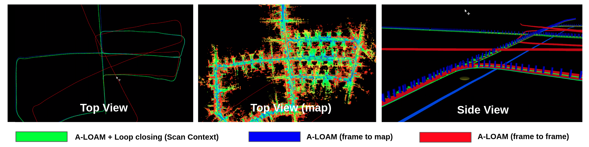</p>  

   ## **Saving the PCD file**
      - You can learn the map topic under pgoMap.

    <p align="center">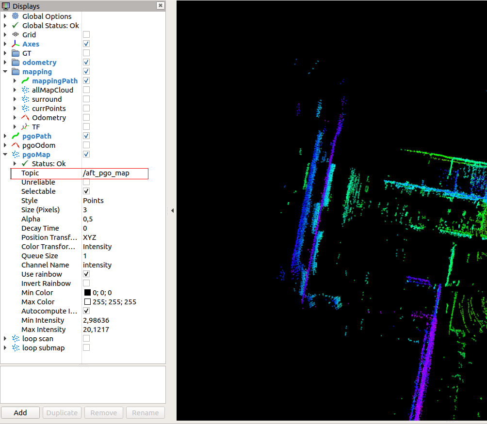</p>


    ```                                                          
     rosrun pcl_ros pointcloud_to_pcd input:=/map_topic_name
      
    ```
    <p align="center">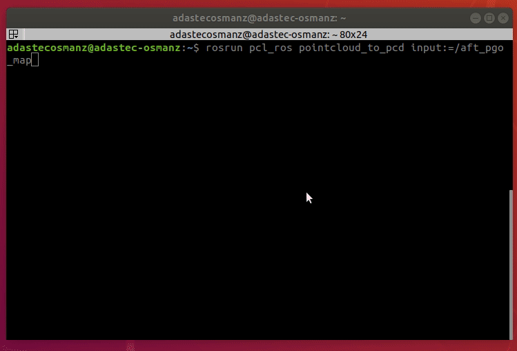

      - You can access the pcd file from the home directory.

  ## Contact 
  - Maintainer: paulgkim@kaist.ac.kr