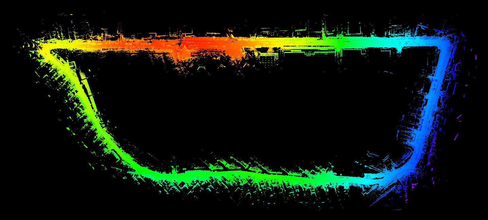
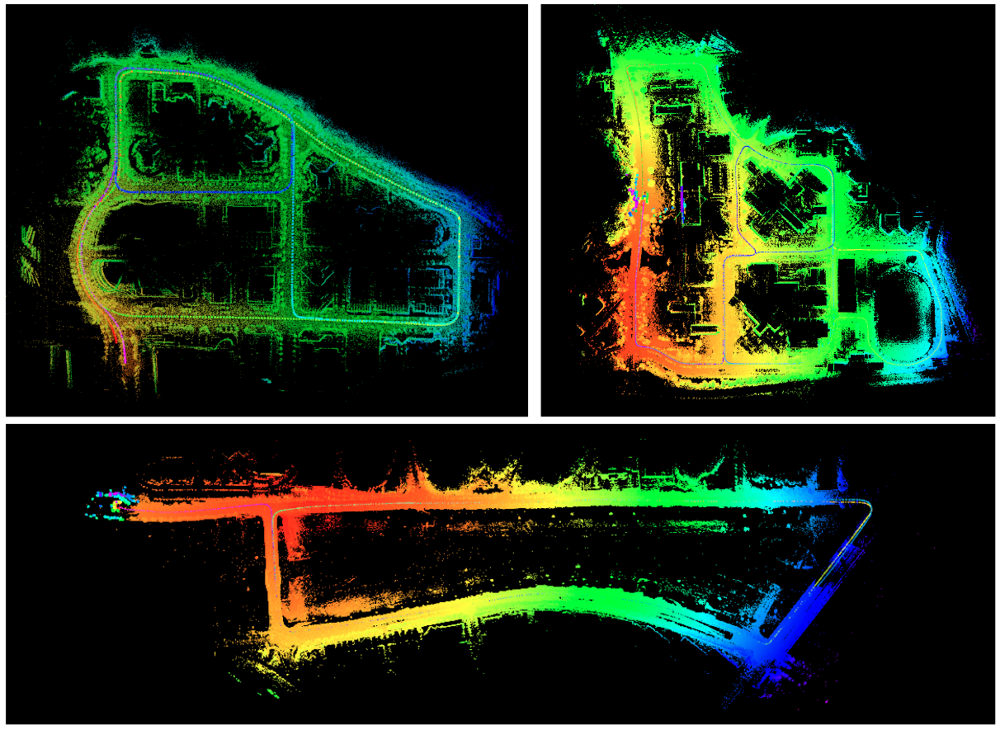
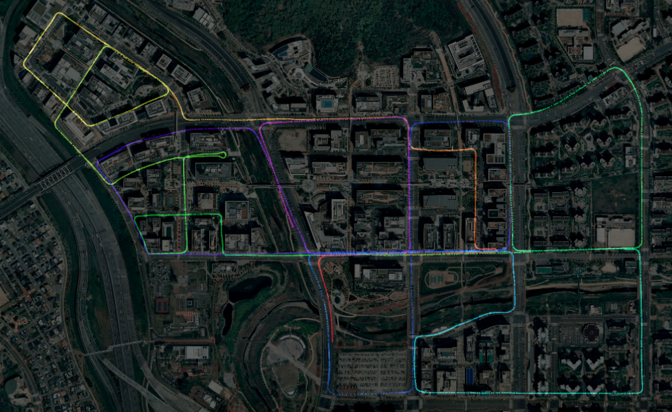

# SC-LeGO-LOAM

## Repository Information

### Original Repository link

<https://github.com/irapkaist/SC-LeGO-LOAM>

### Required Sensors

- LIDAR [VLP-16, HDL-32E, VLS-128, Ouster OS1-16, Ouster OS1-64]
- IMU [9-AXIS]

### ROS Compatibility

- ROS 1

### Dependencies

- ROS
- PCL
- Gtsam

```
wget -O ~/Downloads/gtsam.zip https://github.com/borglab/gtsam/archive/4.0.0-alpha2.zip
cd ~/Downloads/ && unzip gtsam.zip -d ~/Downloads/
cd ~/Downloads/gtsam-4.0.0-alpha2/
mkdir build && cd build
cmake ..
sudo make install
```

## Build & Run

### 1) Build

```
cd ~/catkin_ws/src
git clone https://github.com/irapkaist/SC-LeGO-LOAM.git
cd ..
catkin_make
```

### 2) Set parameters

- Set imu and lidar topic on `include/utility.h`
- Set lidar properties on `include/utility.h`
- Set scancontex settings on `include/Scancontext.h`

(Do not forget to rebuild after setting parameters.)

### 3) Run

```
source devel/setup.bash
roslaunch lego_loam run.launch
```

## Example Result

<p align="center"></p>

## Other Examples

- <a href="https://youtu.be/MtQ8-PiBK3E?t=194"> Video 1: DCC (MulRan dataset)</a>
- <a href="https://youtu.be/p-NsVs8GATA?t=436"> Video 2: Riverside (MulRan dataset) </a>
- <a href="https://youtu.be/bEqCehMJ_Hk"> Video 3: KAIST (MulRan dataset) </a>

<p align="center"></p>
<p align="center"></p>

## MulRan dataset

- If you want to reproduce the results as the above video, you can download the <a href="https://sites.google.com/view/mulran-pr/home"> MulRan dataset </a> and use the <a href="https://sites.google.com/view/mulran-pr/tool"> ROS topic publishing tool </a>.

## Cite SC-LeGO-LOAM

```
@INPROCEEDINGS { gkim-2018-iros,
  author = {Kim, Giseop and Kim, Ayoung},
  title = { Scan Context: Egocentric Spatial Descriptor for Place Recognition within {3D} Point Cloud Map },
  booktitle = { Proceedings of the IEEE/RSJ International Conference on Intelligent Robots and Systems },
  year = { 2018 },
  month = { Oct. },
  address = { Madrid }
}
```

and

```
@inproceedings{legoloam2018,
  title={LeGO-LOAM: Lightweight and Ground-Optimized Lidar Odometry and Mapping on Variable Terrain},
  author={Shan, Tixiao and Englot, Brendan},
  booktitle={IEEE/RSJ International Conference on Intelligent Robots and Systems (IROS)},
  pages={4758-4765},
  year={2018},
  organization={IEEE}
}
```

## Contact

- Maintainer: Giseop Kim (`paulgkim@kaist.ac.kr`)
