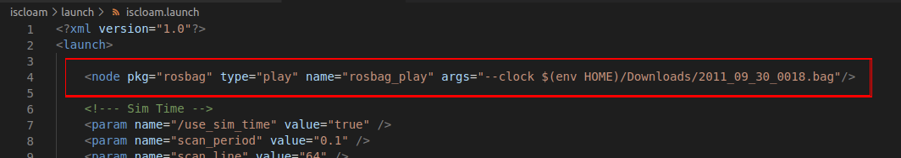
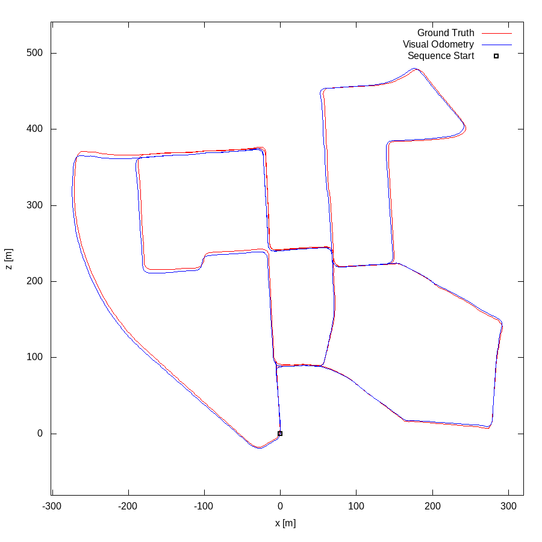
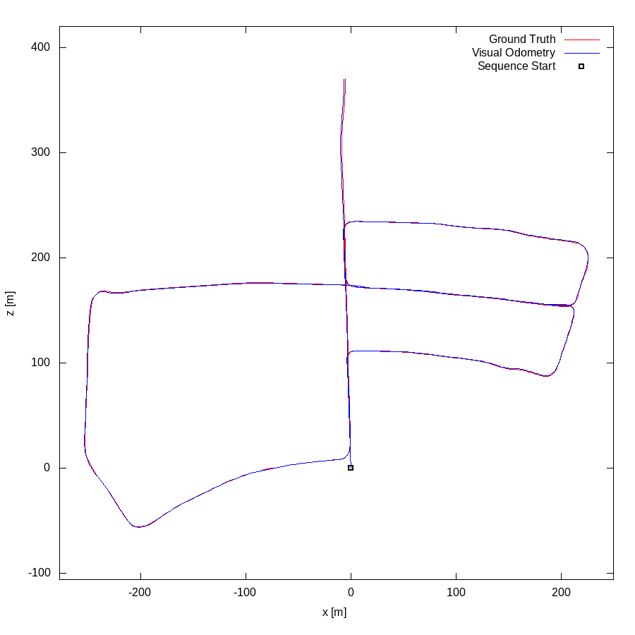

# ISCLOAM

## Repository Information

### Original Repository link

[https://github.com/wh200720041/iscloam](https://github.com/wh200720041/iscloam)

### Required Sensors

- LIDAR [Velodyne]

### ROS Compatibility

- ROS 1

### Dependencies

- Ubuntu 64-bit 18.04
- ROS Melodic [ROS Installation](http://wiki.ros.org/ROS/Installation)
- Ceres Solver [Ceres Installation](http://ceres-solver.org/installation.html)
- PCL [PCL Installation](https://pointclouds.org/downloads/)
- Gtsam [GTSAM Installation](https://gtsam.org/get_started/)
- OpenCV [OPENCV Installation](https://opencv.org/releases/)
- Trajectory visualization

For visualization purpose, this package uses hector trajectory sever, you may install the package by

```bash
sudo apt-get install ros-melodic-hector-trajectory-server
```

## Build and Run

### 1. Clone repository

```bash
cd ~/catkin_ws/src
git clone https://github.com/wh200720041/iscloam.git
cd ..
catkin_make -j1
source ~/catkin_ws/devel/setup.bash
```

### 2. Set Parameter

Change the bag location and sensor parameters on launch files.

<p></p>

### 3. Launch

```bash
roslaunch iscloam iscloam.launch
```

if you would like to generate the map of environment at the same time, you can run

```bash
roslaunch iscloam iscloam_mapping.launch
```

Note that the global map can be very large, so it may takes a while to perform global optimization, some lag is expected between trajectory and map since they are running in separate thread. More CPU usage will happen when loop closure is identified.

## Example Result

Watch demo video at [Video Link](https://youtu.be/Kfi6CFK4Ke4)

### Ground Truth Comparison

Green: ISCLOAM Red: Ground Truth

<p>


</p>

                      KITTI sequence 00                                  KITTI sequence 05

## Citation

If you use this work for your research, you may want to cite the paper below, your citation will be appreciated

```bash
@inproceedings{wang2020intensity,
  author={H. {Wang} and C. {Wang} and L. {Xie}},
  booktitle={2020 IEEE International Conference on Robotics and Automation (ICRA)},
  title={Intensity Scan Context: Coding Intensity and Geometry Relations for Loop Closure Detection},
  year={2020},
  volume={},
  number={},
  pages={2095-2101},
  doi={10.1109/ICRA40945.2020.9196764}
}
```

## Acknowledgements

Thanks for [A-LOAM](https://github.com/HKUST-Aerial-Robotics/A-LOAM) and LOAM(J. Zhang and S. Singh. LOAM: Lidar Odometry and Mapping in Real-time) and [LOAM_NOTED](https://github.com/cuitaixiang/LOAM_NOTED).

**Author:** [Wang Han](http://wanghan.pro), Nanyang Technological University, Singapore
