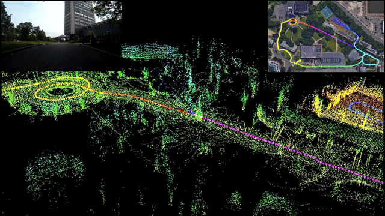
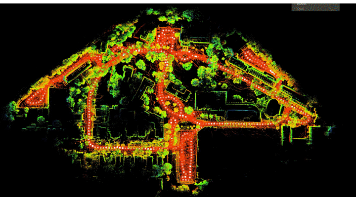
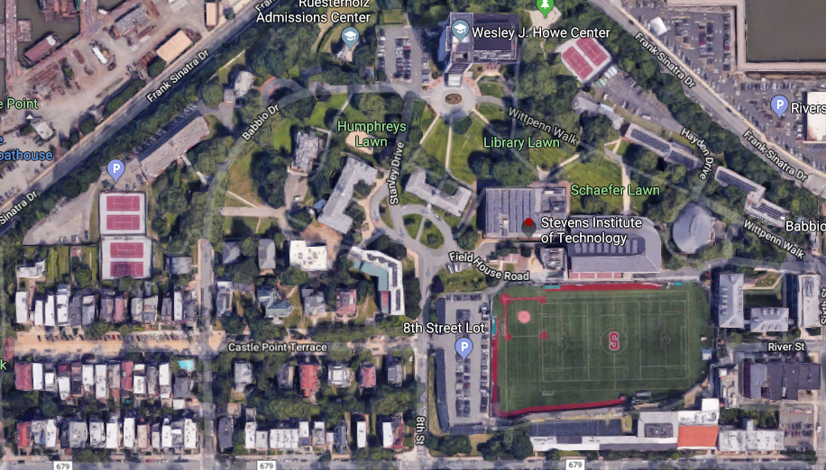

# LeGO-LOAM-BOR


## Repository Information


### Original Repository link
[https://github.com/facontidavide/LeGO-LOAM-BOR](https://github.com/facontidavide/LeGO-LOAM-BOR)

### Required Sensors
- LIDAR [VLP-16, HDL-32E, VLS-128, Ouster OS1-16, Ouster OS1-64]
- IMU [9-AXIS]

### ROS Compatibility
- ROS 1

### Dependencies
 - ROS Melodic [ROS Installation](http://wiki.ros.org/ROS/Installation)
 - PCL [PCL Installation](https://pointclouds.org/downloads/)
 - Gtsam [GTSAM Installation](https://gtsam.org/get_started/)

```bash
wget -O ~/Downloads/gtsam.zip https://github.com/borglab/gtsam/archive/4.0.0-alpha2.zip
cd ~/Downloads/ && unzip gtsam.zip -d ~/Downloads/
cd ~/Downloads/gtsam-4.0.0-alpha2/
mkdir build && cd build
cmake ..
sudo make install
```


## Build & Run
### 1) Build
```bash
cd ~/catkin_ws/src
git clone https://github.com/facontidavide/LeGO-LOAM-BOR.git
cd ..
catkin_make
```

### 2) Set parameters
- Set parameters on `LeGo-LOAM/loam_config.yaml`

### 3) Run
```bash
source devel/setup.bash
roslaunch lego_loam_bor run.launch rosbag:=/path/to/your/rosbag lidar_topic:=/velodyne_points
```

## Example Result
<p></p>

<p></p>

<p></p>


## Cite *LeGO-LOAM*

Thank you for citing our *LeGO-LOAM* paper if you use any of this code: 
```bash
@inproceedings{legoloam2018,
  title={LeGO-LOAM: Lightweight and Ground-Optimized Lidar Odometry and Mapping on Variable Terrain},
  author={Tixiao Shan and Brendan Englot},
  booktitle={IEEE/RSJ International Conference on Intelligent Robots and Systems (IROS)},
  pages={4758-4765},
  year={2018},
  organization={IEEE}
}
```
