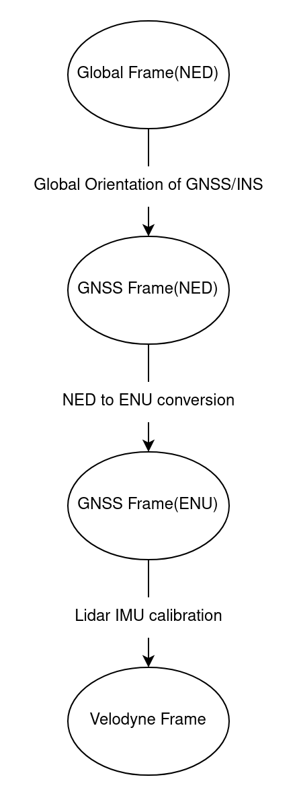
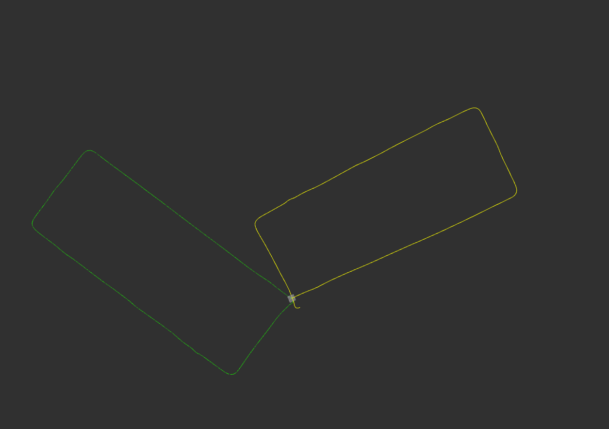
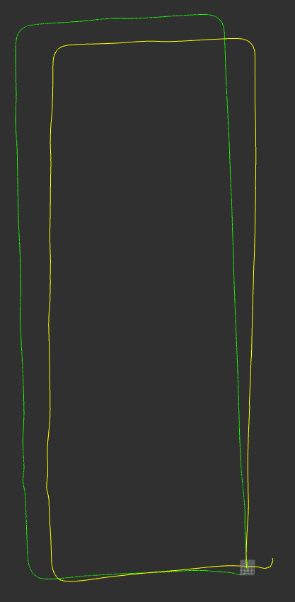
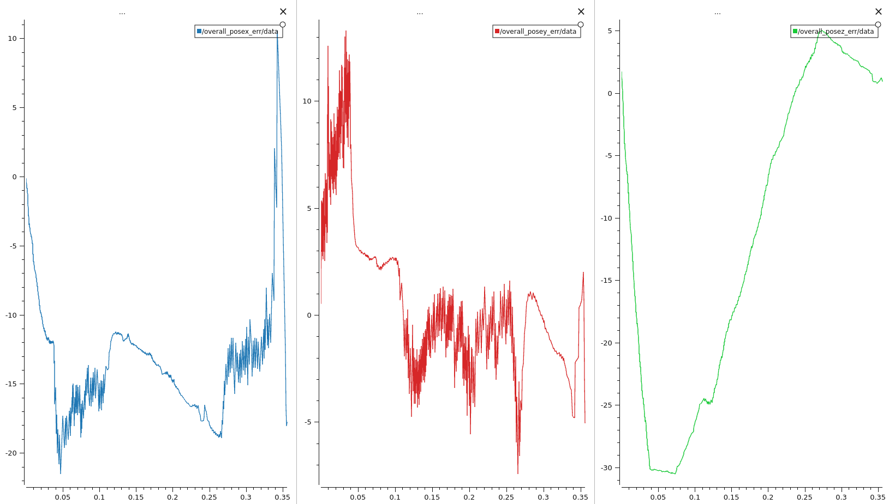
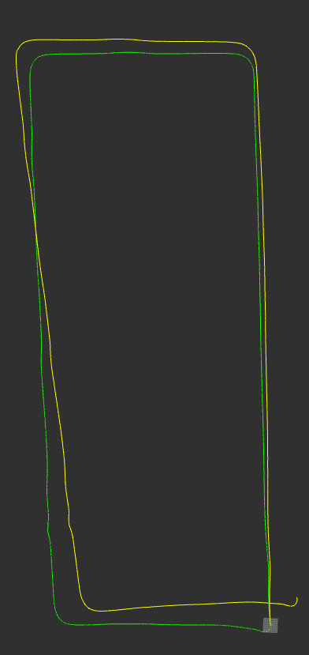
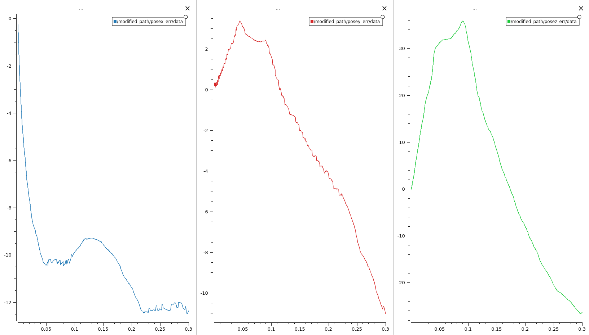

# Comparing Open Source SLAM Algorithms

In order to compare SLAM algorithms their trajectory errors can be
compared in terms of positions and orientations, thus ground truth
should be generated and GNSS/INS can be used for this purpose.

## Setup

We have used a mapping kit which contains Velodyne VLP16 LiDAR and
Applanix LVX GNSS/INS sensors. With using this kit we could collect
data for ground truth and SLAM algorithms simultaneously. Since ground
truth is generated by GNSS/INS, it should be transformed to LiDAR frame.
Additionally, average positional error in the postprocessed GNSS/INS data
is 0.06 meters.

### Transform

To calculate error's of slam algorithms ground truth trajectory and
slam trajectories must be in the same frame. Hence, whether ground
truth or slam trajectory should rotate and translate to the other's
frame.

Tf tree of this transform is:

To perform necessary rotation and translation firstly transform matrices
are calculated then transforms applied on GNSS/INS positions by using
calculated transform matrices.

Before transformation:

## Results

RViz output of both of the ground truth and slam trajectories and
the graphs of the positional errors in meters of the slam algorithms
are depicted below.

|                         SLAM Algorithm                          |                    Trajectory After Transformation                     |                             Position Error Graphs                              |        Average Position Error (meters)         |
| :-------------------------------------------------------------: | :--------------------------------------------------------------------: | :----------------------------------------------------------------------------: | :--------------------------------------------: |
|   [hdl_graph_slam](https://github.com/koide3/hdl_graph_slam)    |        |  | x:11.903188   y: 3.887582   z: 13.905123 |
| [lidarslam_ros2](https://github.com/rsasaki0109/lidarslam_ros2) |  |       | x: 8.949974   y: 2.818557   z: 16.495759 |

## TODO

- Transform between GNSS/INS trajectory and SLAM trajectory
  will be implemented using ros tf.
- SLAM algorithms tested with IMU data.
- Remaining SLAM algorithms will be tested.
