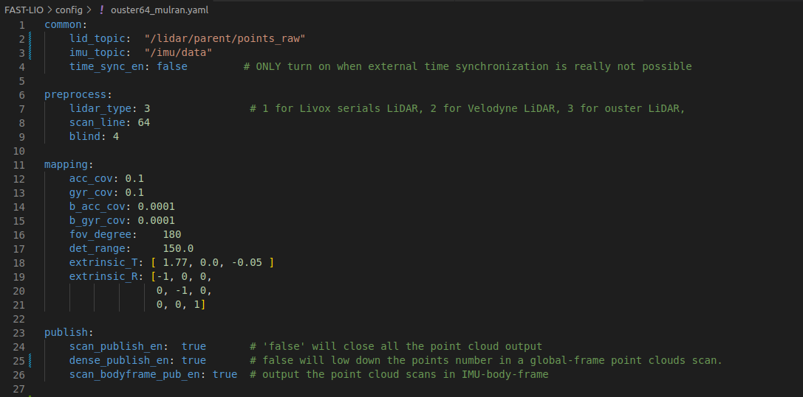
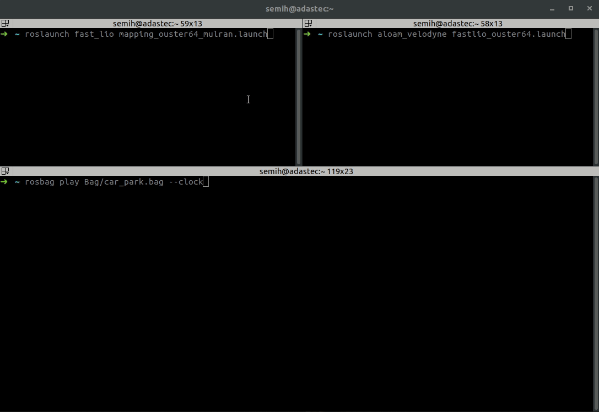
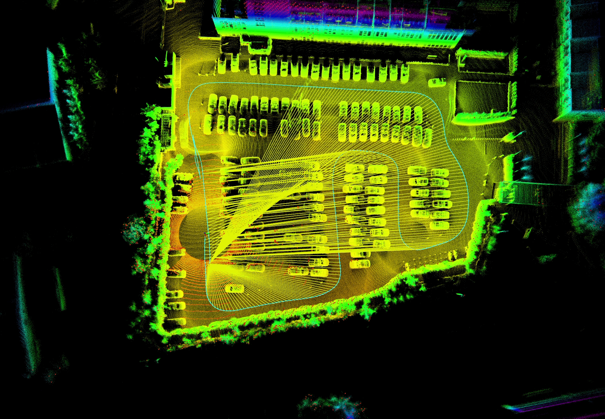
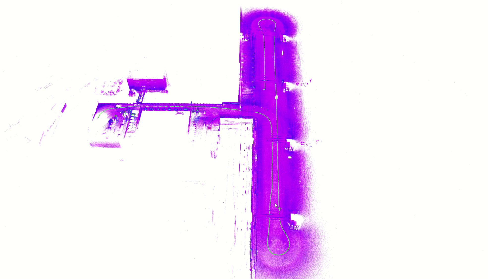
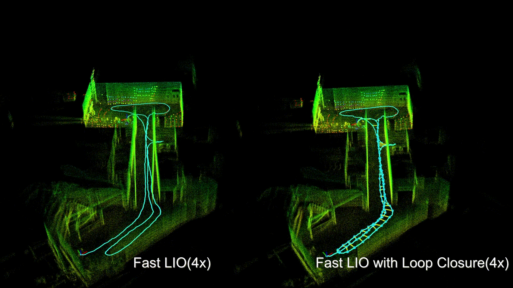

# FAST_LIO_LC

## Repository Information

### Original Repository link

[https://github.com/yanliang-wang/FAST_LIO_LC](https://github.com/yanliang-wang/FAST_LIO_LC)

### Required Sensors

- LIDAR [Velodyne, Ouster, Livox]
- IMU [6-AXIS, 9-AXIS]
- GPS [Optional]

### ROS Compatibility

- ROS 1

### Dependencies

- Ubunutu 18.04
- ROS Melodic
- PCL >= 1.8, Follow [PCL Installation](https://pointclouds.org/downloads/#linux).
- Eigen >= 3.3.4, Follow [Eigen Installation](http://eigen.tuxfamily.org/index.php?title=Main_Page).
- GTSAM >= 4.0.0, Follow [GTSAM Installation](https://gtsam.org/get_started).

```bash
  wget -O ~/Downloads/gtsam.zip https://github.com/borglab/gtsam/archive/4.0.0-alpha2.zip
  cd ~/Downloads/ && unzip gtsam.zip -d ~/Downloads/
  cd ~/Downloads/gtsam-4.0.0-alpha2/
  mkdir build && cd build
  cmake ..
  sudo make install
```

## Build & Run

### 1) Build

```bash
    mkdir -p ~/ws_fastlio_lc/src
    cd ~/ws_fastlio_lc/src
    git clone https://github.com/gisbi-kim/FAST_LIO_SLAM.git
    git clone https://github.com/Livox-SDK/livox_ros_driver
    cd ..
    catkin_make
```

### 2) Set parameters

- After downloading the repository, change topic and sensor settings on the config file (`workspace/src/FAST_LIO_LC/FAST_LIO/config/ouster64_mulran.yaml`) with the lidar topic name in your bag file.

 

- For imu-lidar compatibility, extrinsic matrices from calibration must be changed.

<p> </p>

- To enable auto-save, `pcd_save_enable` must be `1` from the launch file (`workspace/src/FAST_LIO_LC/FAST_LIO/launch/mapping_ouster64_mulran.launch`).

### 3) Run

- For Ouster OS1-64

      # open new terminal: run FAST-LIO
      roslaunch fast_lio mapping_ouster64.launch

      # open the other terminal tab: run SC-PGO
      roslaunch aloam_velodyne fastlio_ouster64.launch

      # play bag file in the other terminal
      rosbag play RECORDED_BAG.bag --clock

<p> </p>

## Example Result

<p> </p>
<p> </p>

## Other Examples

<p> </p>

## Example dataset

Check original repository link for example dataset.

## Contact

- Maintainer: Yanliang Wang (`wyl410922@qq.com`)

## Acknowledgements

- Thanks for [FAST_LIO](https://github.com/hku-mars/FAST_LIO) authors.

<!-- In this project, the LIO module refers to FAST-LIO and the pose graph optimization refers to FAST_LIO_SLAM.

Many thanks for their work. -->
