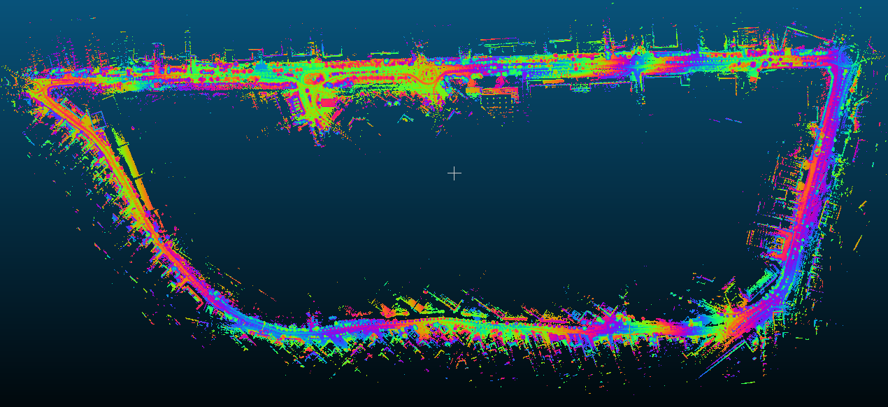
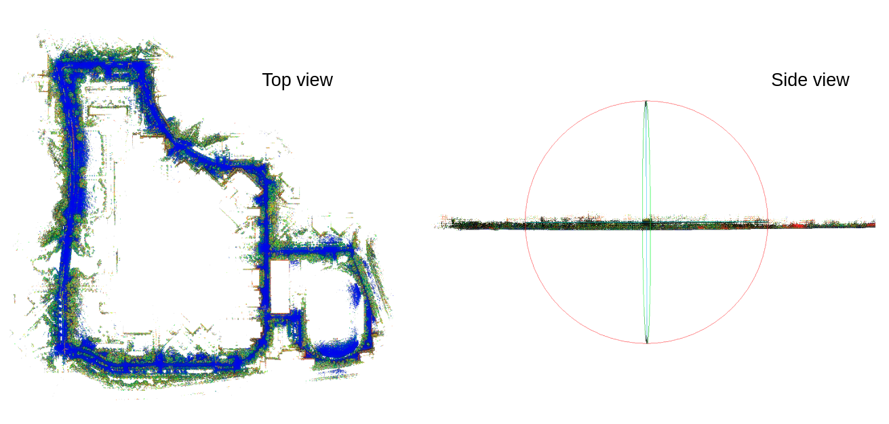
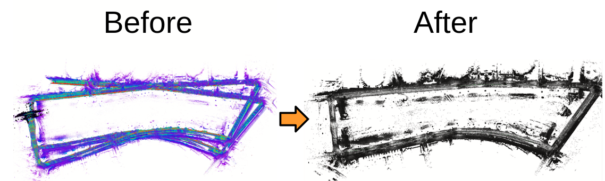

# FAST_LIO_SLAM


## What is FAST_LIO_SLAM?

- FAST_LIO_SLAM is the integration of FAST_LIO and SC-PGO which is scan context based loop detection and GTSAM based pose-graph optimization.


## Repository Information

### Original Repository link

[https://github.com/gisbi-kim/FAST_LIO_SLAM](https://github.com/gisbi-kim/FAST_LIO_SLAM)

### Required Sensors

- LIDAR [Livox, Velodyne, Ouster]
- IMU [6-AXIS, 9-AXIS]
- GPS [OPTIONAL]

### ROS Compatibility

- ROS 1

### Dependencies

- ROS
- PCL
- Gtsam

```bash
wget -O ~/Downloads/gtsam.zip https://github.com/borglab/gtsam/archive/4.0.0-alpha2.zip
cd ~/Downloads/ && unzip gtsam.zip -d ~/Downloads/
cd ~/Downloads/gtsam-4.0.0-alpha2/
mkdir build && cd build
cmake ..
sudo make install
```

- PCL >= 1.8, Follow [PCL Installation](https://pointclouds.org/downloads/#linux).
- Eigen >= 3.3.4, Follow [Eigen Installation](http://eigen.tuxfamily.org/index.php?title=Main_Page).

## Build & Run

### 1) Build

```bash
    mkdir -p ~/catkin_fastlio_slam/src
    cd ~/catkin_fastlio_slam/src
    git clone https://github.com/gisbi-kim/FAST_LIO_SLAM.git
    git clone https://github.com/Livox-SDK/livox_ros_driver
    cd ..
    catkin_make
    source devel/setup.bash
```

### 2) Set parameters

- Set imu and lidar topic on `Fast_LIO/config/ouster64.yaml`

### 3) Run

```bash
    # terminal 1: run FAST-LIO2
    roslaunch fast_lio mapping_ouster64.launch

    # open the other terminal tab: run SC-PGO
    cd ~/catkin_fastlio_slam
    source devel/setup.bash
    roslaunch aloam_velodyne fastlio_ouster64.launch

    # play bag file in the other terminal
    rosbag play xxx.bag -- clock --pause
```

## Example Result

<p></p>

<p></p>

## Other Examples

- [Tutorial video 1](https://youtu.be/nu8j4yaBMnw) (using KAIST 03 sequence of [MulRan dataset](https://sites.google.com/view/mulran-pr/dataset))

  - Example result captures
    <p></p>
  - [download the KAIST03 pcd map](https://www.dropbox.com/s/w599ozdg7h6215q/KAIST03.pcd?dl=0) made by FAST-LIO-SLAM, 500MB

- [Example Video 2](https://youtu.be/94mC05PesvQ) (Riverside 02 sequence of [MulRan dataset](https://sites.google.com/view/mulran-pr/dataset))
  - Example result captures
    <p></p>
  - [download the Riverisde02 pcd map](https://www.dropbox.com/s/1aolth7ry4odxo4/Riverside02.pcd?dl=0) made by FAST-LIO-SLAM, 400MB

## Acknowledgements

- Thanks for [FAST_LIO](https://github.com/hku-mars/FAST_LIO) authors.
- You may have an interest in [this version of FAST-LIO + Loop closure](https://github.com/yanliang-wang/FAST_LIO_LC), implemented by [yanliang-wang](https://github.com/yanliang-wang)
- Maintainer: Giseop Kim (`paulgkim@kaist.ac.kr`)
