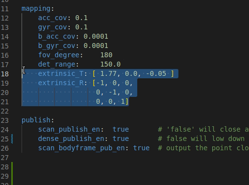
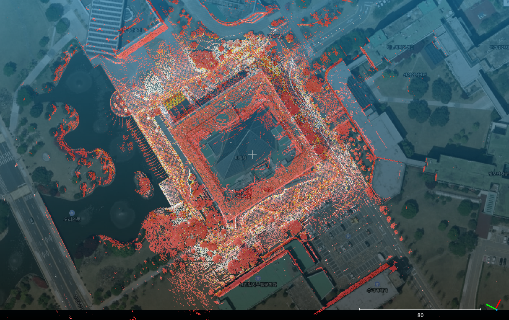
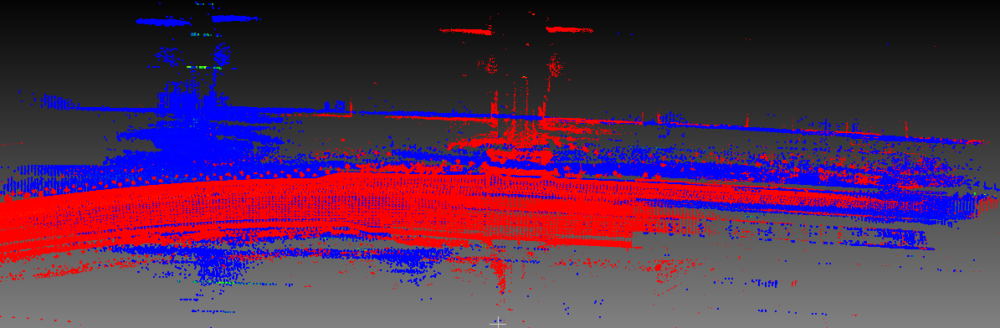
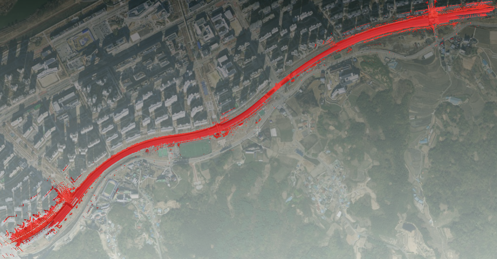

# IA-LIO-SAM

## What is IA-LIO-SAM?

- IA_LIO_SLAM is created for data acquisition in unstructured environment and it is a framework for Intensity and Ambient Enhanced Lidar Inertial Odometry via Smoothing and Mapping that achieves highly accurate robot trajectories and mapping.

## Repository Information

### Original Repository link

[https://github.com/minwoo0611/IA_LIO_SAM](https://github.com/minwoo0611/IA_LIO_SAM)

### Required Sensors

- LIDAR [Velodyne, Ouster]
- IMU [9-AXIS]
- GNSS

### ROS Compatibility

- ROS 1

### Dependencies

- [ROS](http://wiki.ros.org/ROS/Installation) (tested with Kinetic and Melodic)

  - `for ROS melodic:`

    ```bash
    sudo apt-get install -y ros-melodic-navigation
    sudo apt-get install -y ros-melodic-robot-localization
    sudo apt-get install -y ros-melodic-robot-state-publisher
    ```

  - `for ROS kinetic:`

    ```bash
    sudo apt-get install -y ros-kinetic-navigation
    sudo apt-get install -y ros-kinetic-robot-localization
    sudo apt-get install -y ros-kinetic-robot-state-publisher
    ```

- [GTSAM](https://github.com/borglab/gtsam/releases) (Georgia Tech Smoothing and Mapping library)

  ```bash
  wget -O ~/Downloads/gtsam.zip https://github.com/borglab/gtsam/archive/4.0.2.zip
  cd ~/Downloads/ && unzip gtsam.zip -d ~/Downloads/
  cd ~/Downloads/gtsam-4.0.2/
  mkdir build && cd build
  cmake -DGTSAM_BUILD_WITH_MARCH_NATIVE=OFF ..
  sudo make install -j8
  ```

## Build & Run

### 1) Build

```bash
    mkdir -p ~/catkin_ia_lio/src
    cd ~/catkin_ia_lio/src
    git clone https://github.com/minwoo0611/IA_LIO_SAM
    cd ..
    catkin_make
```

### 2) Set parameters

- After downloading the repository, change topic and sensor settings on the config file (`workspace/src/IA_LIO_SAM/config/params.yaml`)

- For imu-lidar compatibility, extrinsic matrices from calibration must be changed.

<p> </p>

- To enable autosave, `savePCD` must be `true` on the `params.yaml` file (`workspace/src/IA_LIO_SAM/config/params.yaml`).

### 3) Run

      # open new terminal: run IA_LIO
      source devel/setup.bash
      roslaunch lio_sam mapping_ouster64.launch

      # play bag file in the other terminal
      rosbag play RECORDED_BAG.bag --clock

## Sample dataset images

<p>
    
    
    
</p>

## Example dataset

Check original repo link for example dataset.

## Contact

- Maintainer: Kevin Jung (`Github: minwoo0611`)

## Paper

Thank you for citing IA-LIO-SAM(./config/doc/KRS-2021-17.pdf) if you use any of this code.

Part of the code is adapted from [LIO-SAM (IROS-2020)](https://github.com/TixiaoShan/LIO-SAM).

```bash
@inproceedings{legoloam2018shan,
  title={LeGO-LOAM: Lightweight and Ground-Optimized Lidar Odometry and Mapping on Variable Terrain},
  author={Shan, Tixiao and Englot, Brendan},
  booktitle={IEEE/RSJ International Conference on Intelligent Robots and Systems (IROS)},
  pages={4758-4765},
  year={2018},
  organization={IEEE}
}
```

## Acknowledgements

- IA-LIO-SAM is based on LIO-SAM (T. Shan, B. Englot, D. Meyers, W. Wang, C. Ratti, and D. Rus. LIO-SAM: Tightly-coupled Lidar Inertial Odometry via Smoothing and Mapping).
