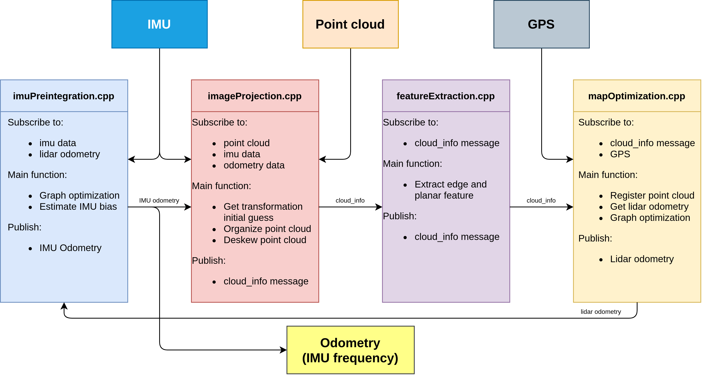
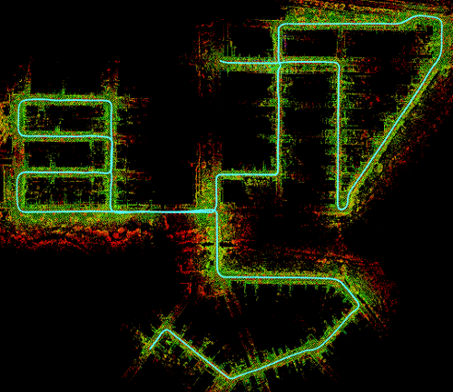

# LIO_SAM

## What is LIO_SAM?

- A framework that achieves highly accurate, real-time mobile robot trajectory estimation and map-building. It formulates lidar-inertial odometry atop a factor graph, allowing a multitude of relative and absolute measurements, including loop closures, to be incorporated from different sources as factors into the system


## Repository Information

### Original Repository link

[https://github.com/TixiaoShan/LIO-SAM](https://github.com/TixiaoShan/LIO-SAM)

### Required Sensors

- LIDAR [Livox, Velodyne, Ouster]
- IMU [9-AXIS]
- GPS [OPTIONAL]

<p></p>

### ROS Compatibility

- ROS 1
- [For ROS 2](https://github.com/TixiaoShan/LIO-SAM/tree/ros2)

### Dependencies

- ROS
- PCL
- [Gtsam](https://gtsam.org/get_started/) (Georgia Tech Smoothing and Mapping library)

  ```bash
  sudo add-apt-repository ppa:borglab/gtsam-release-4.0
  sudo apt install libgtsam-dev libgtsam-unstable-dev
  ```

```bash
  sudo apt-get install -y ros-melodic-navigation
  sudo apt-get install -y ros-melodic-robot-localization
  sudo apt-get install -y ros-melodic-robot-state-publisher
```

## Build & Run

### 1) Build

```bash
    mkdir -p ~/catkin_lio_sam/src
    cd ~/catkin_lio_sam/src
    git clone https://github.com/TixiaoShan/LIO-SAM.git
    cd ..
    catkin_make
    source devel/setup.bash
```

### 2) Set parameters

- Set topics and sensor settings on `lio_sam/config/params.yaml`

### 3) Run

```bash
    # Run the Launch File
      roslaunch lio_sam run.launch

    # Play bag file in the other terminal
      rosbag play xxx.bag --clock
```

## Example Result

<p></p>

## Paper

Thank you for citing LIO-SAM (IROS-2020) if you use any of this code.

```bash
@inproceedings{liosam2020shan,
  title={LIO-SAM: Tightly-coupled Lidar Inertial Odometry via Smoothing and Mapping},
  author={Shan, Tixiao and Englot, Brendan and Meyers, Drew and Wang, Wei and Ratti, Carlo and Rus Daniela},
  booktitle={IEEE/RSJ International Conference on Intelligent Robots and Systems (IROS)},
  pages={5135-5142},
  year={2020},
  organization={IEEE}
}
```

Part of the code is adapted from [LeGO-LOAM](https://github.com/RobustFieldAutonomyLab/LeGO-LOAM).

```bash
@inproceedings{legoloam2018shan,
  title={LeGO-LOAM: Lightweight and Ground-Optimized Lidar Odometry and Mapping on Variable Terrain},
  author={Shan, Tixiao and Englot, Brendan},
  booktitle={IEEE/RSJ International Conference on Intelligent Robots and Systems (IROS)},
  pages={4758-4765},
  year={2018},
  organization={IEEE}
}
```

## Acknowledgements

- LIO-SAM is based on LOAM (J. Zhang and S. Singh. LOAM: Lidar Odometry and Mapping in Real-time).
