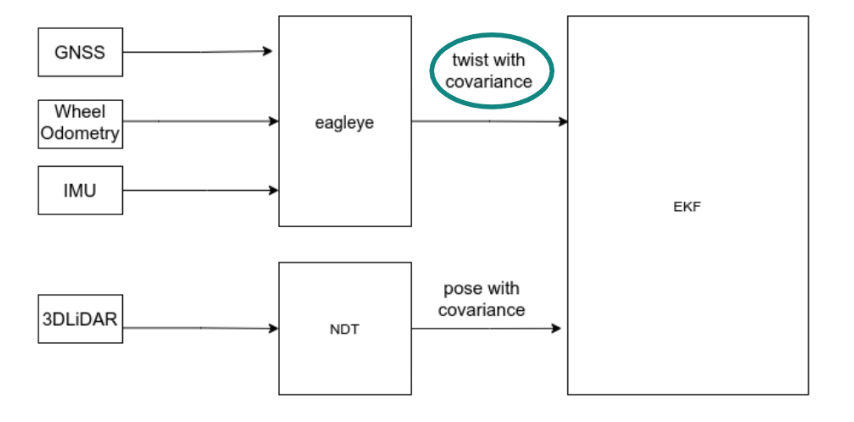
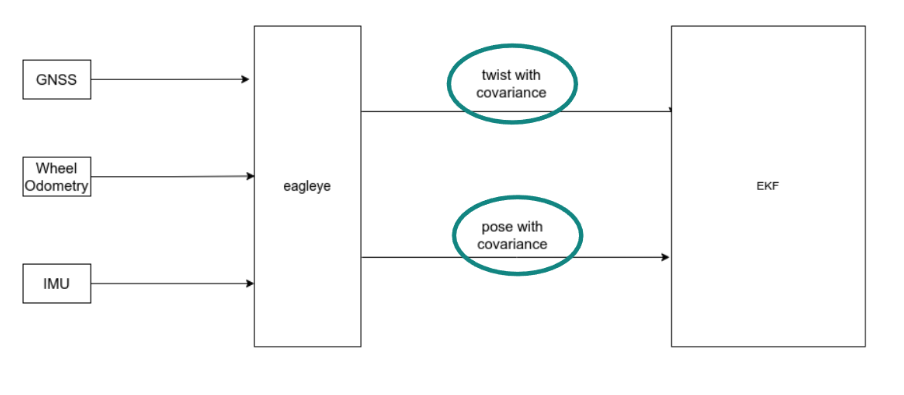

# Eagleye Integration Guide

This page will show you how to set up [eagleye](https://github.com/MapIV/eagleye), which is integrated into autoware.

Discussions during the integration are as follows.
https://github.com/orgs/autowarefoundation/discussions/3257

## What is Eagleye?

Eagleye provides a cost-effective alternative to LiDAR and point cloud-based localization by using low-cost GNSS and IMU sensors to provide vehicle position and orientation.

Autoware users will be able to choose between their existing LiDAR and point cloud-based localization stacks or GNSS/IMU-based eagleye localizer, depending on their specific needs and operating environment.

There are two ways to utilize eagleye results with the autoware localization stack.

1. Feed only Twist into the EKF localizer.



2. Feed both Twist and Pose from eagleye into the EKF localizer.(twist can also be used with regular gyro_odometry
)



Note that RTK positioning is required for localization using the eagleye pose alone. RTK positioning is not required for twist.

## Behavior when eagleye is executed by autoware

 eagleye estimates are largely based on the following

### Static Estimation
eagleye needs to be stationary for about 3~5 seconds (yaw_rate_offset_stop.estimated_interval in eagleye_config.yaml) after startup. Static estimation is performed even in environments where GNSS is not received. At this point the yaw rate offset is corrected.

### Movement Estimation
Next, it needs to travel in a straight line for about 20~30 seconds (heading.estimated_minimum_interval and velocity_scale_factor.estimated_minimum_interval) and the wheel speed scale factor and azimuth angle are estimated. At this point, the estimation of twist is complete and pose will begin to be output.

## eagleye setup

### gnss ros drivers setting

In eagleye, it is necessary to obtain velocity information from GNSS, in addition to NavSatFix.

ex
 - [ublox_gps](https://github.com/KumarRobotics/ublox/tree/humble-devel/ublox_gps)

This ROS driver publishes sensor_msgs/msg/NavSatFix and geometry_msgs/msg/TwistWithCovarianceStamped required for eagleye with default settings

https://github.com/KumarRobotics/ublox/blob/humble-devel/ublox_msgs/msg/NavPVT.msg

 - [septentrio_gnss_driver](https://github.com/septentrio-gnss/septentrio_gnss_driver/tree/ros2)

Set `publish.navsatfix` and `publish.twist` in the parameter `yaml` file to `true`

https://github.com/septentrio-gnss/septentrio_gnss_driver/blob/ros2/config/gnss.yaml#L90

### eagleye topic setting

You must specify input topics.
Input topics include GNSS latitude/longitude height information, GNSS speed information, IMU information, and vehicle speed information

```
    # Topic
    twist:
      twist_type: 1 # TwistStamped : 0, TwistWithCovarianceStamped: 1
      twist_topic: /sensing/vehicle_velocity_converter/twist_with_covariance
    imu_topic: /sensing/imu/tamagawa/imu_raw
    gnss:
      velocity_source_type: 2 # rtklib_msgs/RtklibNav: 0, nmea_msgs/Sentence: 1, ublox_msgs/NavPVT: 2, geometry_msgs/TwistWithCovarianceStamped: 3
      velocity_source_topic: /sensing/gnss/ublox/navpvt
      llh_source_type: 2 # rtklib_msgs/RtklibNav: 0, nmea_msgs/Sentence: 1, sensor_msgs/NavSatFix: 2
      llh_source_topic: /sensing/gnss/ublox/nav_sat_fix
```

https://github.com/MapIV/autoware_launch/blob/3f04a9dd7bc4a4c49d4ec790e3f6b9958ab822da/autoware_launch/config/localization/eagleye_config.param.yaml#L7-L16

Also, GNSS and IMU must be set to frequency yaml

```
    common:
      imu_rate: 50
      gnss_rate: 5
```

https://github.com/MapIV/autoware_launch/blob/3f04a9dd7bc4a4c49d4ec790e3f6b9958ab822da/autoware_launch/config/localization/eagleye_config.param.yaml#L36

### eagleye parameter tuning

See below for parameter description.

The following are the basic parameters that do not need to be changed except those mentioned above.

https://github.com/MapIV/eagleye/tree/autoware-main/eagleye_rt/config

Below are the parameters for converting navsatfix to pose.

https://github.com/MapIV/eagleye/blob/autoware-main/eagleye_util/fix2pose/launch/fix2pose.xml

### Autoware Setting for Eagleye

Please refer to the following PR when introducing eagleye to your autoware.
You need to install eagleye related packages and change the launcher.
Four files are required in the autoware localization launcher to run eagleye: `eagleye_rt.launch.xml`, `eagleye_config.yaml`, `gnss_converter.launch.xml` and `fix2pose.launch.xml`.

https://github.com/autowarefoundation/autoware/pull/3261

### Usage of eagleye in autoware

eagleye has a function for position estimation as pose_estimator and a function for twist correction as twist_estimator.

localization launch  | twist estimator | pose estimator
-- | -- | --
tier4_localization_launch| gyro_odometry | ndt
map4_localization_launch/eagleye_twist_localization_launch| eagleye_rt(gyro/odom/gnss fusion) | ndt
map4_localization_launch/eagleye_pose_twist_localization_launch| eagleye_rt(gyro/odom/gnss fusion) | eagleye_rt(gyro/odom/gnss fusion)

Switching requires switching the localization module in `autoware.launch.xml` and the `pose_estimator_mode` parameter in `map4_localization_component.launch.xml`.

#### eagleye as pose_estimator

In the sample autoware, you can set pose_estimator to gnss by setting `pose_estimator_mode:=gnss` in `map4_localization_component.launch.xml`.

- Note that it does not match the map, so be careful when using maps that are out of georeference.
- In the case of a single GNSS antenna, initial position estimation takes several tens of seconds to complete after starting to run in an environment where GNSS positioning is available.

ref
https://github.com/autowarefoundation/autoware_launch/pull/200


#### eagleye as twist_estimator

In the sample autoware, you can set pose_estimator to gnss by setting `pose_estimator_mode:=lidar` in `map4_localization_component.launch.xml`.

- Unlike eagleye position estimation, eagleye twist estimation first outputs uncorrected raw values when activated, and then outputs corrected twists as soon as estimation is complete.


ref
https://github.com/autowarefoundation/autoware.universe/pull/2848

