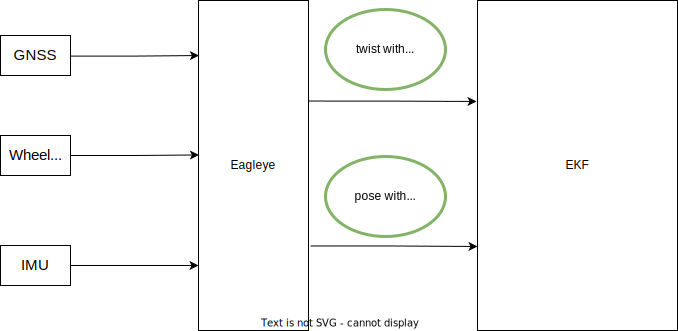

# Using Eagleye in Autoware

This page will show you how to set up [Eagleye](https://github.com/MapIV/eagleye) in order to use it with Autoware.
For the details of the integration proposal, please refer to [this](https://github.com/orgs/autowarefoundation/discussions/3257) Discussion.

## What is Eagleye?

Eagleye is an open-source GNSS/IMU-based localizer initially developed by [MAP IV. Inc](https://map4.jp/).
Eagleye provides a cost-effective alternative to LiDAR and point cloud-based localization by using low-cost GNSS and IMU sensors to provide vehicle position, orientation, and altitude information.  
Using GNSS Doppler velocity, Eagleye can also compensate for wheel speed and IMU angular velocity bias to achieve more accurate speed and heading estimation.

With the addition of Eagleye integration into Autoware, users will be able to choose between their existing LiDAR and point cloud-based localization stacks or GNSS/IMU-based Eagleye localizer, depending on their specific needs and operating environment.

There are two ways to utilize Eagleye results in the Autoware localization stack:

1. Feed only twist into the EKF localizer.


2. Feed both twist and pose from Eagleye into the EKF localizer (twist can also be used with regular `gyro_odometry`).


Note that RTK positioning is only required for localization using the Eagleye pose. RTK positioning is not required for twist.

## Behavior when Eagleye is executed by Autoware

On startup, Eagleye will perform static and dynamic initialization.

### Static initialization

Eagleye needs to be stationary for about 3~5 seconds, according to the parameter `yaw_rate_offset_stop.estimated_interval` in `eagleye_config.yaml`, after startup for the yaw rate offset to be estimated.
Static initialization is performed even in environments where GNSS is not received.

### Dynamic initialization

Next, it needs to travel in a straight line for about 20~30 seconds, as defined by the parameter `heading.estimated_minimum_interval` and `velocity_scale_factor.estimated_minimum_interval`, in order to estimate the wheel speed scale factor and azimuth angle. Once the dynamic initialization is completed, Eagleye will begin to output both twist and pose.

## Eagleye setup

### GNSS ROS driver setting

In addition to latitude, longitude, and height information (`sensor_msgs/msg/NavSatFix`), Eagleye also requires velocity information from GNSS.
The settings needed for each GNSS ROS driver are as follows:

- [ublox_gps](https://github.com/KumarRobotics/ublox/tree/humble-devel/ublox_gps): This ROS driver publishes `sensor_msgs/msg/NavSatFix` and `geometry_msgs/msg/TwistWithCovarianceStamped` required by Eagleye with default settings. Therefore, no additional settings are required.
- [septentrio_gnss_driver](https://github.com/septentrio-gnss/septentrio_gnss_driver/tree/ros2): Set `publish.navsatfix` and `publish.twist` in the config file [`gnss.yaml`](https://github.com/septentrio-gnss/septentrio_gnss_driver/blob/ros2/config/gnss.yaml#L90) to `true`

### Eagleye topic setting

You must correctly specify input topics for GNSS latitude, longitude, and height information, GNSS speed information, IMU information, and vehicle speed information in the [`eagleye_config.yaml`](https://github.com/MapIV/autoware_launch/blob/3f04a9dd7bc4a4c49d4ec790e3f6b9958ab822da/autoware_launch/config/localization/eagleye_config.param.yaml#L7-L16).

```yaml
# Topic
twist:
  twist_type: 1 # TwistStamped : 0, TwistWithCovarianceStamped: 1
  twist_topic: /sensing/vehicle_velocity_converter/twist_with_covariance
imu_topic: /sensing/imu/tamagawa/imu_raw
gnss:
  velocity_source_type: 2 # rtklib_msgs/RtklibNav: 0, nmea_msgs/Sentence: 1, ublox_msgs/NavPVT: 2, geometry_msgs/TwistWithCovarianceStamped: 3
  velocity_source_topic: /sensing/gnss/ublox/navpvt
  llh_source_type: 2 # rtklib_msgs/RtklibNav: 0, nmea_msgs/Sentence: 1, sensor_msgs/NavSatFix: 2
  llh_source_topic: /sensing/gnss/ublox/nav_sat_fix
```

Also, the frequency of GNSS and IMU must be set in [`eagleye_config.yaml`](https://github.com/MapIV/autoware_launch/blob/3f04a9dd7bc4a4c49d4ec790e3f6b9958ab822da/autoware_launch/config/localization/eagleye_config.param.yaml#L36)

```yaml
common:
  imu_rate: 50
  gnss_rate: 5
```

### Eagleye parameter tuning

The basic parameters that do not need to be changed except those mentioned above, i.e., topic names and sensors' frequency, are described below [here](https://github.com/MapIV/eagleye/tree/autoware-main/eagleye_rt/config).
Additionally, the parameters for converting NavSatFix to pose is listed in [`fix2pose.yaml`](https://github.com/MapIV/eagleye/blob/autoware-main/eagleye_util/fix2pose/launch/fix2pose.xml).

### Autoware setting for Eagleye

Please refer to [this PR](https://github.com/autowarefoundation/autoware/pull/3261) when introducing Eagleye to your Autoware setup.
You need to install Eagleye-related packages and change Autoware's launcher.
Four files are required in the Autoware localization launcher to run Eagleye: `eagleye_rt.launch.xml`, `eagleye_config.yaml`, `gnss_converter.launch.xml` and `fix2pose.launch.xml`.

### Usage of Eagleye in Autoware

Eagleye has a function for position estimation and a function for twist estimation, namely `pose_estimator` and `twist_estimator`, respectively.

| localization launch                                               | twist estimator                   | pose estimator                    |
| ----------------------------------------------------------------- | --------------------------------- | --------------------------------- |
| `tier4_localization_launch`                                       | `gyro_odometry`                   | NDT                               |
| `map4_localization_launch/eagleye_twist_localization_launch`      | eagleye_rt(gyro/odom/gnss fusion) | NDT                               |
| `map4_localization_launch/eagleye_pose_twist_localization_launch` | eagleye_rt(gyro/odom/gnss fusion) | eagleye_rt(gyro/odom/gnss fusion) |

Enabling Eagleye in Autoware requires switching the localization module in `autoware.launch.xml` and the `pose_estimator_mode` parameter in `map4_localization_component.launch.xml`.
When using Eagleye, comment out `tier4_localization_component.launch.xml` and start `map4_localization_component.launch.xml`.

```xml
  <!-- Localization -->
  <group if="$(var launch_localization)">
    <include file="$(find-pkg-share autoware_launch)/launch/components/map4_localization_component.launch.xml"/>
    <!-- <include file="$(find-pkg-share autoware_launch)/launch/components/tier4_localization_component.launch.xml"/> -->
  </group>
```

#### Eagleye as a pose estimator

In Autoware, you can set the pose estimator to GNSS by setting `pose_estimator_mode:=gnss` in `map4_localization_component.launch.xml`.
Note that the output position might not appear to be in the point cloud maps if you are using maps that are not properly georeferenced.
In the case of a single GNSS antenna, initial position estimation (dynamic initialization) can take several seconds to complete after starting to run in an environment where GNSS positioning is available.

#### Eagleye as a twist estimator

In Autoware, you can set the pose estimator to NDT by setting `pose_estimator_mode:=lidar` in `map4_localization_component.launch.xml`.
Unlike Eagleye position estimation, Eagleye twist estimation first outputs uncorrected raw values when activated, and then outputs corrected twists as soon as static initialization is complete.
