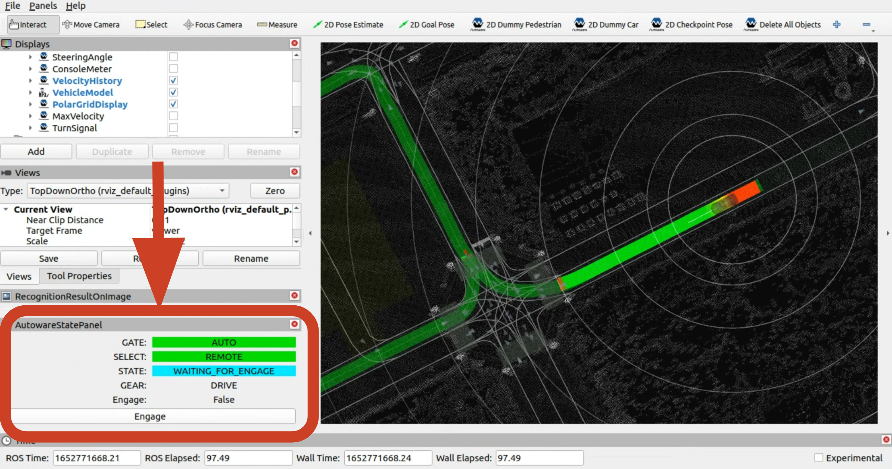

# Integrating Autoware with your vehicle

## 1. Prepare your real vehicle hardware

Prerequisites for the vehicle:

- An onboard computer that satisfies the [Autoware installation prerequisites](../installation/autoware/source-installation.md#prerequisites)
- The following devices attached
  - Drive-by-wire interface
  - LiDAR
  - Optional: Inertial measurement unit
  - Optional: Camera
  - Optional: GNSS

## 2. Create maps

You need both a pointcloud map and a vector map in order to use Autoware.

### Create a pointcloud map

Use third-party tools such as a LiDAR-based SLAM (Simultaneous Localization And Mapping) package to create a pointcloud map in the `.pcd` format.
Some examples are:

- [HDL](https://github.com/koide3/hdl_graph_slam)
- [LIO-SAM](https://github.com/TixiaoShan/LIO-SAM)
- [LiDAR-SLAM (ROS 2)](https://github.com/rsasaki0109/lidarslam_ros2)

### Create vector map

Use third-party tools such as [TIER IV's Vector Map Builder](https://tools.tier4.jp/) to create a Lanelet2 format `.osm` file.

## 3. Create your Autoware meta-repository

Create your Autoware meta-repository.
One easy way is to fork [autowarefoundation/autoware](https://github.com/autowarefoundation/autoware) and clone it.
For how to fork a repository, refer to [GitHub Docs](https://docs.github.com/en/get-started/quickstart/fork-a-repo).

```bash
git clone https://github.com/YOUR_NAME/autoware.git
```

If you set up multiple types of vehicles, adding a suffix like "autoware.vehicle_A" or "autoware.vehicle_B" is recommended.

## 4. Create the description packages of your vehicle

Next, you need to create description packages that define the vehicle and sensor configuration of your vehicle.

Create the following two packages:

- YOUR_VEHICLE_launch (see [here](https://github.com/autowarefoundation/sample_vehicle_launch) for example)
- YOUR_SENSOR_KIT_launch (see [here](https://github.com/autowarefoundation/sample_sensor_kit_launch) for example)

Once created, you need to update the `autoware.repos` file of your cloned Autoware repository to refer to these two description packages.

```diff
-  # sensor_kit
-  sensor_kit/sample_sensor_kit_launch:
-    type: git
-    url: https://github.com/autowarefoundation/sample_sensor_kit_launch.git
-    version: main
-  # vehicle
-  vehicle/sample_vehicle_launch:
-    type: git
-    url: https://github.com/autowarefoundation/sample_vehicle_launch.git
-    version: main
+  # sensor_kit
+  sensor_kit/YOUR_SENSOR_KIT_launch:
+    type: git
+    url: https://github.com/YOUR_NAME/YOUR_SENSOR_KIT_launch.git
+    version: main
+  # vehicle
+  vehicle/YOUR_VEHICLE_launch:
+    type: git
+    url: https://github.com/YOUR_NAME/YOUR_VEHICLE_launch.git
+    version: main
```

### Adapt YOUR_VEHICLE_launch for autoware launching system

#### At YOUR_VEHICLE_description

Define URDF and parameters in the vehicle description package (refer to the [sample vehicle description package](https://github.com/autowarefoundation/sample_vehicle_launch/tree/main/sample_vehicle_description) for an example).

#### At YOUR_VEHICLE_launch

Create a launch file (refer to the [sample vehicle launch package](https://github.com/autowarefoundation/sample_vehicle_launch/tree/main/sample_vehicle_launch) for example).
If you have multiple vehicles with the same hardware setup, you can specify `vehicle_id` to distinguish them.

### Adapt YOUR_SENSOR_KIT_description for autoware launching system

#### At YOUR_SENSOR_KIT_description

Define URDF and extrinsic parameters for all the sensors here (refer to the [sample sensor kit description package](https://github.com/autowarefoundation/sample_sensor_kit_launch/tree/main/sample_sensor_kit_description) for example).
Note that you need to calibrate extrinsic parameters for all the sensors beforehand.

#### At YOUR_SENSOR_KIT_launch

Create `launch/sensing.launch.xml` that launches the interfaces of all the sensors on the vehicle. (refer to the [sample sensor kit launch package](https://github.com/autowarefoundation/sample_sensor_kit_launch/tree/main/sample_sensor_kit_launch) for example).

!!! note

    At this point, you are now able to run Autoware's Planning Simulator to do a basic test of your vehicle and sensing packages.
    To do so, you need to build and install Autoware using your cloned repository. Follow the [steps for either Docker or source installation](../installation/) (starting from the dependency installation step) and then run the following command:

    ```bash
    ros2 launch autoware_launch planning_simulator.launch.xml vehicle_model:=YOUR_VEHICLE sensor_kit:=YOUR_SENSOR_KIT map_path:=/PATH/TO/YOUR/MAP
    ```

## 5. Create a `vehicle_interface` package

You need to create an interface package for your vehicle.
The package is expected to provide the following two functions.

1. Receive command messages from `vehicle_cmd_gate` and drive the vehicle accordingly
2. Send vehicle status information to Autoware

You can find detailed information about the requirements of the `vehicle_interface` package in the [Vehicle Interface design documentation](../design/autoware-interfaces/components/vehicle-interface.md).
You can also refer to TIER IV's [pacmod_interface repository](https://github.com/tier4/pacmod_interface) as an example of a vehicle interface package.

## 6. Launch Autoware

This section briefly explains how to run your vehicle with Autoware.

### Install Autoware

Follow the [installation steps of Autoware](../installation/).

### Launch Autoware

Launch Autoware with the following command:

```bash
ros2 launch autoware_launch autoware.launch.xml vehicle_model:=YOUR_VEHICLE sensor_kit:=YOUR_SENSOR_KIT map_path:=/PATH/TO/YOUR/MAP
```

### Set initial pose

If GNSS is available, Autoware automatically initializes the vehicle's pose.

If not, you need to set the initial pose using the RViz GUI.

1. Click the 2D Pose estimate button in the toolbar, or hit the P key
2. In the 3D View pane, click and hold the left mouse button, and then drag to set the direction for the initial pose.

### Set goal pose

Set a goal pose for the ego vehicle.

1. Click the 2D Nav Goal button in the toolbar, or hit the G key
2. In the 3D View pane, click and hold the left mouse button, and then drag to set the direction for the goal pose.
   If successful, you will see the calculated planning path on RViz.

### Engage

In your terminal, execute the following command.

```bash
source ~/autoware.YOURS/install/setup.bash
ros2 topic pub /autoware.YOURS/engage autoware_auto_vehicle_msgs/msg/Engage "engage: true" -1
```

You can also engage via RViz with "AutowareStatePanel".
The panel can be found in `Panels > Add New Panel > tier4_state_rviz_plugin > AutowareStatePanel`.

{: style="height:360px;width:640px"}

Now the vehicle should drive along the calculated path!

## 7. Tune parameters for your vehicle & environment

You may need to tune your parameters depending on the domain in which you will operate your vehicle.

If you have any issues or questions, feel free to create an [Autoware Foundation GitHub Discussion](https://github.com/orgs/autowarefoundation/discussions) in the Q&A category!
