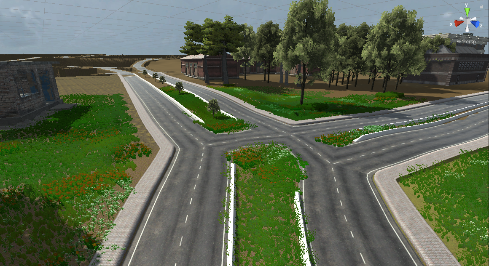

# How to integrate your vehicle in AWSIM environment

## Overview

[AWSIM](https://github.com/tier4/AWSIM) is an open-source simulator designed by TIER IV for
training and evaluating autonomous driving systems.
It provides a realistic virtual environment for simulating various real-world scenarios, enabling
users to test and refine their autonomous systems before deployment on actual vehicles.

## Setup Unity Project

To add your environment and vehicle to the AWSIM simulation,
you need to set up the [Unity](https://unity.com/) environment on your computer.
Please follow the steps on the [`Setup Unity Project`](https://tier4.github.io/AWSIM/GettingStarted/SetupUnityProject/)
documentation page
to set up the Unity environment on your computer.

<figure markdown>
  { align=center }
  <figcaption>
  AWSIM Unity Setup
  </figcaption>
</figure>

## New Vehicle Integration

To incorporate your vehicle into the AWSIM environment,
you'll need a 3D model file (.dae, .fbx) of your vehicle.
Please refer to the steps on the [`Add New Vehicle
documentation page`](https://tier4.github.io/AWSIM/Components/Vehicle/AddNewVehicle/AddAVehicle/) to add your own vehicle to the AWSIM
project environment. During these steps, you'll configure
your sensor URDF design on your vehicle.
Our tutorial vehicle is shown in the AWSIM environment in the following image.

<figure markdown>
  { align=center }
  <figcaption>
  Tutorial vehicle in AWSIM Unity Environment
  </figcaption>
</figure>

## Environment Integration

Creating custom 3D environments for AWSIM is feasible,
but it's recommended to adhere to the .fbx file format.
Materials and textures should be stored in separate directories
for seamless integration with Unity. This format facilitates material
importation and replacement during import.
Please refer to the steps on the
[`Add Environment documentation page`](https://tier4.github.io/AWSIM/Components/Environment/AddNewEnvironment/AddEnvironment/)
to add your custom environment to the AWSIM project environment.

<figure markdown>
  { align=center }
  <figcaption>
  Tutorial vehicle AWSIM Unity Environment
  </figcaption>
</figure>

## Others

Additionally, you can incorporate traffic and NPCs,
generate point cloud maps using lanelet2 maps, and
perform other tasks by following the relevant
documentation steps provided in the [`AWSIM documentation`](https://tier4.github.io/AWSIM/).
