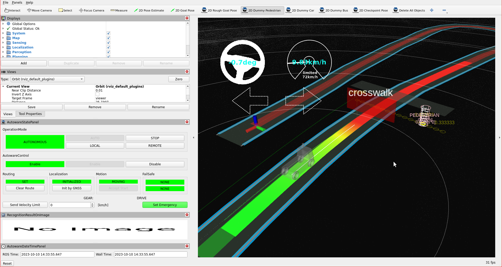

# Crosswalk attribute

Behavior velocity planner's [crosswalk module](https://autowarefoundation.github.io/autoware.universe/main/planning/behavior_velocity_crosswalk_module/) plans velocity
to stop or decelerate for pedestrians approaching or walking on a crosswalk.
In order to operate that, we will add crosswalk attribute to our lanelet2 map.

## Creating a crosswalk attribute

In order to create a crosswalk on your map, please follow these steps:

1. Click `Abstraction` button on top panel.
2. Select `Crosswalk` from the panel.
3. Click and draw crosswalk on your pointcloud map.

You can see these steps in the crosswalk creating demonstration video:


### Testing created crosswalk with planning simulator

After the completing of creating the map, we need to save it.
To that please click `File` --> `Export Lanelet2Maps` then download.

After the download is finished,
we need to put lanelet2 map and pointcloud map on the same location.
The directory structure should be like this:

```diff
+ <YOUR-MAP-DIRECTORY>/
+  ├─ pointcloud_map.pcd
+  └─ lanelet2_map.osm
```

If your .osm or .pcd map file's name is different from these names,
you need to update autoware.launch.xml:

```diff
  <!-- Map -->
-  <arg name="lanelet2_map_file" default="lanelet2_map.osm" description="lanelet2 map file name"/>
+  <arg name="lanelet2_map_file" default="<YOUR-LANELET-MAP-NAME>.osm" description="lanelet2 map file name"/>
-  <arg name="pointcloud_map_file" default="pointcloud_map.pcd" description="pointcloud map file name"/>
+  <arg name="pointcloud_map_file" default="<YOUR-POINTCLOUD-MAP-NAME>.pcd" description="pointcloud map file name"/>
```

Now we are ready to launch the planning simulator:

```bash
ros2 launch autoware_launch planning_simulator.launch.xml map_path:=<YOUR-MAP-FOLDER-DIR> vehicle_model:=<YOUR-VEHICLE-MODEL> sensor_model:=<YOUR-SENSOR-KIT>
```

Example for tutorial_vehicle:

```bash
ros2 launch autoware_launch planning_simulator.launch.xml map_path:=$HOME/Files/autoware_map/tutorial_map/ vehicle_model:=tutorial_vehicle sensor_model:=tutorial_vehicle_sensor_kit vehicle_id:=tutorial_vehicle
```

1. Click `2D Pose Estimate` button on rviz or press `P` and give a pose for initialization.
2. Click `2D Goal Pose` button on rviz or press `G` and give a pose for goal point.
3. We need to add pedestrians to crosswalk, so activate interactive pedestrians from `Tool Properties` panel on rviz.
4. After that, please press `Shift`, then click right click button for inserting pedestrians.
5. You can control inserted pedestrian via dragging right click.

Crosswalk markers on rviz:

<figure markdown>
  { align=center }
  <figcaption>
    Crosswalk test on the created map.
  </figcaption>
</figure>

You can check your crosswalk elements in the planning simulator as this demonstration video:


