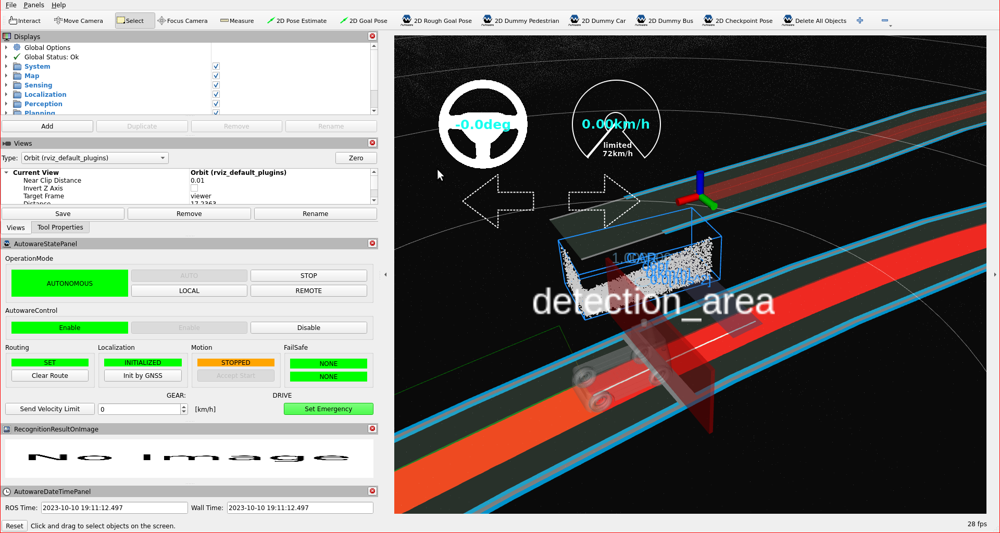

# Detection area element

Behavior velocity planner's [detection area](https://autowarefoundation.github.io/autoware_universe/main/planning/behavior_velocity_detection_area_module/) plans velocity
when if pointcloud is detected in a detection area defined on a map, the stop planning will be executed at the predetermined point.
In order to operate that, we will add a detection area element to our lanelet2 map.

## Creating a detection area element

In order to create a detection area on your map, please follow these steps:

1. Click `Lanelet2Maps` button on top panel.
2. Select `Detection Area` from the panel.
3. Please select lanelet which stop line to be added.
4. Click and insert `Detection Area` on your pointcloud map.
5. You can change the dimensions of the detection area with clicking points on the corners of the detection area. For more information, you can check the demonstration video.

You can see these steps in the detection area creating demonstration video:


### Testing created detection area with planning simulator

After the completing of creating the map, we need to save it.
To that please click `File` --> `Export Lanelet2Maps` then download.

After the download is finished,
we need to put lanelet2 map and pointcloud map on the same location.
The directory structure should be like this:

```diff
+ <YOUR-MAP-DIRECTORY>/
+  ├─ pointcloud_map.pcd
+  └─ lanelet2_map.osm
```

If your .osm or .pcd map file's name is different from these names,
you need to update autoware.launch.xml:

```diff
  <!-- Map -->
-  <arg name="lanelet2_map_file" default="lanelet2_map.osm" description="lanelet2 map file name"/>
+  <arg name="lanelet2_map_file" default="<YOUR-LANELET-MAP-NAME>.osm" description="lanelet2 map file name"/>
-  <arg name="pointcloud_map_file" default="pointcloud_map.pcd" description="pointcloud map file name"/>
+  <arg name="pointcloud_map_file" default="<YOUR-POINTCLOUD-MAP-NAME>.pcd" description="pointcloud map file name"/>
```

Now we are ready to launch the planning simulator:

```bash
ros2 launch autoware_launch planning_simulator.launch.xml map_path:=<YOUR-MAP-FOLDER-DIR> vehicle_model:=<YOUR-VEHICLE-MODEL> sensor_model:=<YOUR-SENSOR-KIT>
```

Example for tutorial_vehicle:

```bash
ros2 launch autoware_launch planning_simulator.launch.xml map_path:=$HOME/Files/autoware_map/tutorial_map/ vehicle_model:=tutorial_vehicle sensor_model:=tutorial_vehicle_sensor_kit vehicle_id:=tutorial_vehicle
```

1. Click `2D Pose Estimate` button on rviz or press `P` and give a pose for initialization.
2. Click `2D Goal Pose` button on rviz or press `G` and give a pose for goal point.
3. We need to add pedestrians to detection area, so activate interactive pedestrians from `Tool Properties` panel on rviz.
4. After that, please press `Shift`, then click right click button for inserting pedestrians.
5. You can control inserted pedestrian via dragging right click. So, you should put pedestrian on the detection area for testing.

Stop detection area on rviz:

<figure markdown>
  { align=center }
  <figcaption>
    Detection area test on the created map.
  </figcaption>
</figure>

You can check your detection area elements in the planning simulator as this demonstration video:


