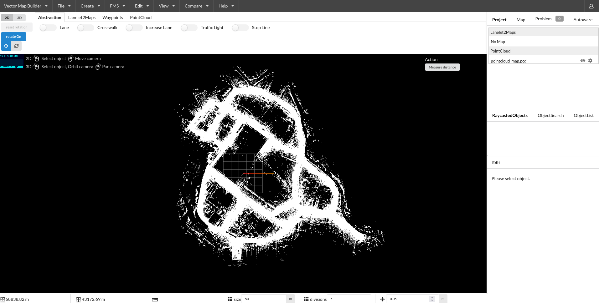

# Creating a Lanelet

At this page, we will explain how to create a simple lanelet on your pointcloud map.

## Creating a Lanelet2

Firstly, we need to import our pointcloud map to vector map builder tool:

1. Please click `File`.
2. Then, click `Import PCD`.
3. Click `Browse` and select your .pcd file.

You will display the point cloud on your vector map builder tool after the upload is complete:

<figure markdown>
  { align=center }
  <figcaption>
    Uploaded pointcloud map file on vector map builder
  </figcaption>
</figure>

Now, we are ready to create lanelet2 map on our pointcloud map:

1. Please click `Create`.
2. Then, click `Create Lanelet2Maps`.
3. Please fill your map name
4. Please fill your MGRS zone. (At tutorial_vehicle, MGRS grid zone: 35T - MGRS 100,000-meter square: PF)
5. Click `Create`.
