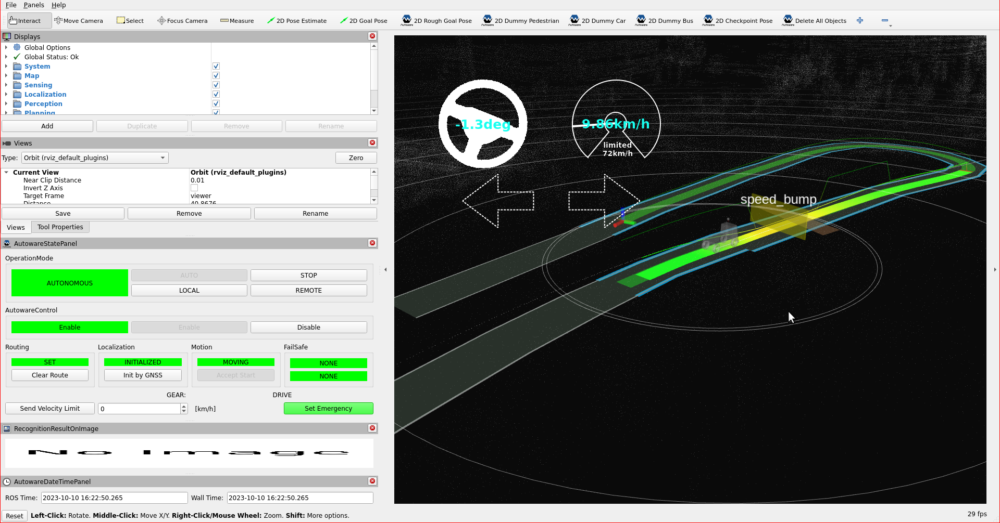

# Speed bump

Behavior velocity planner's [speed bump module](https://autowarefoundation.github.io/autoware_universe/main/planning/behavior_velocity_crosswalk_module/) plans velocity
to slow down before speed bump for comfortable and safety driving.
In order to operate that, we will add speed bumps to our lanelet2 map.

## Creating a speed bump element

In order to create a speed bump on your pointcloud map, please follow these steps:

1. Select `Linestring` from Lanelet2Maps section.
2. Click and draw polygon for speed bump.
3. Then please disable `Linestring` from Lanelet2Maps section.
4. CLick `Change to Polygon` from the `Action` panel.
5. Please select this Polygon and enter `speed_bump` as the type.
6. Then, please click lanelet which speed bump to be added.
7. Select `Create General Regulatory ELement`.
8. Go to this element, and please enter `speed_bump` as subtype.
9. Click `Add refers` and type your created speed bump polygon ID.

You can see these steps in the speed bump creating demonstration video:


### Testing created the speed bump element with planning simulator

After the completing of creating the map, we need to save it.
To that please click `File` --> `Export Lanelet2Maps` then download.

After the download is finished,
we need to put lanelet2 map and pointcloud map on the same location.
The directory structure should be like this:

```diff
+ <YOUR-MAP-DIRECTORY>/
+  ├─ pointcloud_map.pcd
+  └─ lanelet2_map.osm
```

If your .osm or .pcd map file's name is different from these names,
you need to update autoware.launch.xml:

```diff
  <!-- Map -->
-  <arg name="lanelet2_map_file" default="lanelet2_map.osm" description="lanelet2 map file name"/>
+  <arg name="lanelet2_map_file" default="<YOUR-LANELET-MAP-NAME>.osm" description="lanelet2 map file name"/>
-  <arg name="pointcloud_map_file" default="pointcloud_map.pcd" description="pointcloud map file name"/>
+  <arg name="pointcloud_map_file" default="<YOUR-POINTCLOUD-MAP-NAME>.pcd" description="pointcloud map file name"/>
```

!!! note

    The speed bump module not enabled default. To enable that, please uncomment it your [behavior_velocity_planner.param.yaml](https://github.com/autowarefoundation/autoware_launch/blob/main/autoware_launch/config/planning/scenario_planning/lane_driving/behavior_planning/behavior_velocity_planner/behavior_velocity_planner.param.yaml).

Now we are ready to launch the planning simulator:

```bash
ros2 launch autoware_launch planning_simulator.launch.xml map_path:=<YOUR-MAP-FOLDER-DIR> vehicle_model:=<YOUR-VEHICLE-MODEL> sensor_model:=<YOUR-SENSOR-KIT>
```

Example for tutorial_vehicle:

```bash
ros2 launch autoware_launch planning_simulator.launch.xml map_path:=$HOME/Files/autoware_map/tutorial_map/ vehicle_model:=tutorial_vehicle sensor_model:=tutorial_vehicle_sensor_kit vehicle_id:=tutorial_vehicle
```

1. Click `2D Pose Estimate` button on rviz or press `P` and give a pose for initialization.
2. Click `2D Goal Pose` button on rviz or press `G` and give a pose for goal point.
3. You can see the speed bump marker on the rviz screen.

Speed bump markers on rviz:

<figure markdown>
  { align=center }
  <figcaption>
    Speed bump test on the created map.
  </figcaption>
</figure>

You can check your speed bump elements in the planning simulator as this demonstration video:


