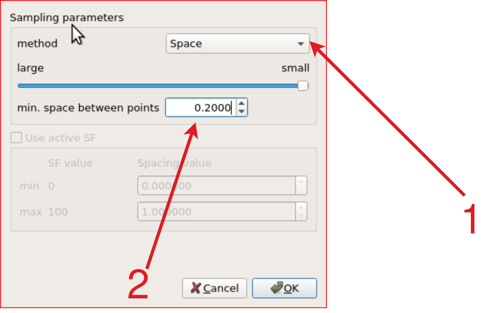

# Pointcloud map downsampling

## Overview

In some cases, for example,
when your created point cloud map is either too dense or too large (i.e., exceeding 300 MB),
you may want to downsample it for improved computational and memory efficiency.
Also, you can consider using dynamic map loading with partial loading,
please check [map_loader package](https://github.com/autowarefoundation/autoware.universe/tree/main/map/map_loader) for more information.

At tutorial_vehicle implementation we will use the whole map,
so we will downsample it with using [CloudCompare](https://www.cloudcompare.org/main.html).

## Installing CloudCompare

You can install it by snap:

```bash
sudo snap install cloudcompare
```

Please check the [official page](https://www.cloudcompare.org/release/index.html#CloudCompare)
for installing options.

## Downsampling a pointcloud map

There are three [subsampling methods on CloudCompare](https://www.cloudcompare.org/doc/wiki/index.php/Edit%5CSubsample),
we are using `Space` method for subsampling, but you can use other methods if you want.

1. Please open CloudCompare and drag your pointcloud to here, then you can select your pointcloud map by just clicking on the map at the DB tree panel.
2. Then you can click `subsample` button on the top panel.

<figure markdown>
  { align=center }
  <figcaption>
    CloudCompare
  </figcaption>
</figure>

1. Please select on your subsample method, we will use space for tutorial_vehicle.
2. Then you can select options. For example, we need to determine minimum space between points. (Please be careful in this section, subsampling is depending on your map size, computer performance, etc.) We will set this value 0.2 for tutorial_vehicle's map.

<figure markdown>
  { align=center width="512" }
  <figcaption>
    Pointcloud subsampling
  </figcaption>
</figure>

- After the subsampling process is finished,
  you should select pointcloud on the DB Tree panel as well.

<figure markdown>
  { align=center width="360" }
  <figcaption>
    Select your downsampled pointcloud
  </figcaption>
</figure>

Now,
you can save your downsampled pointcloud with `ctrl + s`
or you can click save button from `File` bar.
Then, this pointcloud can be used by autoware.
