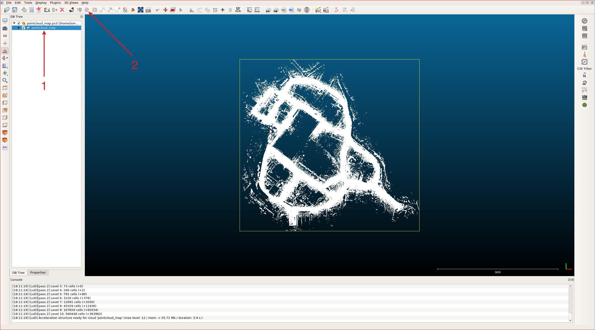

# Pointcloud map preprocessing

## Overview

Pointcloud map used in Autoware should be downsampled with a voxel size of around 0.1 to 0.2 meters
to minimize the computational costs and memory bandwidth load.
Also,
you may consider
using dynamic map loading with partial loading
if your map is still too large to handle as a single file
(~2 GB in PCD size).
Please check [map_loader package](https://github.com/autowarefoundation/autoware.universe/tree/main/map/map_loader) for more information.

At tutorial_vehicle implementation we will use the whole map,
so we will downsample it with using [CloudCompare](https://www.cloudcompare.org/main.html).

## Installing CloudCompare

You can install it by snap:

```bash
sudo snap install cloudcompare
```

Please check the [official page](https://www.cloudcompare.org/release/index.html#CloudCompare)
for installing options.

## Outlier filtering a pointcloud map

We will use SOR (Statistical Outlier Filter) for our mapping process. [Statistical Outlier Removal (SOR)](https://www.cloudcompare.org/doc/wiki/index.php/SOR_filter)
is a method for detecting and removing anomalous data (points far from their neighbors) points from a data set.
It works by computing the
mean and standard deviation of the data points, and then identifying any points that fall outside a
certain number of standard deviations from the mean. These points are then flagged as outliers and
removed from the pointcloud.

1. Please open CloudCompare and drag your point cloud here. Then, you can select your point cloud map by clicking on it in the DB tree panel or on the map.
2. Then you can click `SOR` filter button on the top panel.

<figure markdown>
  { align=center }
  <figcaption>
    CloudCompare
  </figcaption>
</figure>

- The SOR parameter filters panel will appear. You can change these parameters according to your map
  specifications. Please refer to [the documentation](https://www.cloudcompare.org/doc/wiki/index.php/SOR_filter) for more information about these parameters.
  We will use the default parameters for our documentation.

<figure markdown>
  { align=center }
  <figcaption>
    SOR Filter parameters
  </figcaption>
</figure>

- After the filtering process is finished,
  you should select pointcloud on the DB Tree panel as well.

<figure markdown>
  { align=center width="360" }
  <figcaption>
    Select your cleaned pointcloud
  </figcaption>
</figure>

Now,
you can save your downsampled pointcloud with `ctrl + s`
or you can click save button from `File` bar.
Then, this pointcloud can be used by autoware.

|            RAW Pointcloud Map             |         SOR Filtered Pointcloud Map          |
| :---------------------------------------: | :------------------------------------------: |
|  |  |

## Downsampling a pointcloud map

There are three [subsampling methods on CloudCompare](https://www.cloudcompare.org/doc/wiki/index.php/Edit%5CSubsample),
we are using `Space` method for subsampling, but you can use other methods if you want.

1. Please open CloudCompare and drag your point cloud here. Then, you can select your point cloud map by clicking on it in the DB tree panel or on the map.
2. Then you can click `subsample` button on the top panel.

<figure markdown>
  { align=center }
  <figcaption>
    CloudCompare
  </figcaption>
</figure>

1. Please select on your subsample method, we will use space for tutorial_vehicle.
2. Then you can select options. For example, we need to determine minimum space between points. (Please be careful in this section, subsampling is depending on your map size, computer performance, etc.) We will set this value 0.2 for tutorial_vehicle's map.

<figure markdown>
  { align=center width="512" }
  <figcaption>
    Pointcloud subsampling
  </figcaption>
</figure>

- After the subsampling process is finished,
  you should select pointcloud on the DB Tree panel as well.

<figure markdown>
  { align=center width="360" }
  <figcaption>
    Select your downsampled pointcloud
  </figcaption>
</figure>

Now,
you can save your downsampled pointcloud with `ctrl + s`
or you can click save button from `File` bar.
Then, this pointcloud can be used by autoware.

|         RAW Pointcloud Map          |     (0.2 Space) Sub-sampled Pointcloud Map     |
| :---------------------------------: | :--------------------------------------------: |
|  |  |

## Dynamic object removal

The dynamic [object removal package](https://github.com/davutcanakbas/dynamic_object_removal), provided by the [`Localization & Mapping WG`](https://github.com/orgs/autowarefoundation/discussions/categories/working-group-meetings?discussions_q=is%3Aopen+category%3A%22Working+group+meetings%22+label%3A%22Meeting%3A+localization_mapping_wg%22),
removes dynamic objects from a point cloud using the output of the lidar-centerpoint package.
Please refer to [the package documentation](https://github.com/davutcanakbas/dynamic_object_removal/blob/main/README.md) for more information. Also, if you want to learn how
to use this package with the LIO-SAM mapping method, you can follow this documentation:
[Create LIO-SAM map with object removal](https://gist.github.com/StepTurtle/4e74492489073c053883888be57bb1e4).
