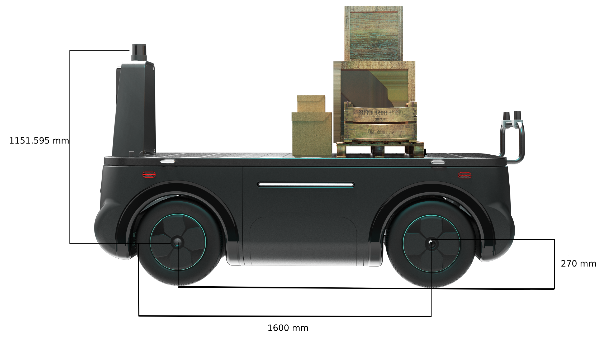

# Starting with TIER IV's CalibrationTools

## Overview

Autoware expects to have multiple sensors attached to the vehicle as input to perception,
localization,
and planning stack.
These sensors must be calibrated correctly,
and their positions must be defined at `sensor_kit_description` and `individual_params` packages.
In order to do that, we will use TIER IV' [CalibrationTools](https://github.com/tier4/CalibrationTools) repository.

## Setting of sensor_kit_base_link position according to the base_link

In previous section (creating the vehicle and sensor model),
we mentioned about `sensors_calibration.yaml`.
This file stores `sensor_kit_base_link` (child frame) position and orientation according to the
`base_link` (parent frame).
We need to update this relative position
(all values were initially set equal to zero when file is created)
with using CAD data of our vehicle.

<figure markdown>
  { align=center }
  <figcaption>
  Our tutorial_vehicle base_link to sensor_kit_base_link transformation.
  </figcaption>
</figure>

So, our `sensors_calibration.yaml` file for our tutorial_vehicle should be like this:

```yaml
base_link:
  sensor_kit_base_link:
    x: 1.600000 # meter
    y: 0.0
    z: 1.421595 # 1.151595m + 0.270m
    roll: 0.0
    pitch: 0.0
    yaw: 0.0
```

You need to update this transformation value according to the `sensor_kit_base_link` frame.
You can also use CAD values for GNSS/INS and IMU position in `sensor_kit_calibration.yaml` file.

## Installing TIER IV's CalibrationTools repositories on autoware

After completing previous steps (creating your own autoware,
creating a vehicle and sensor model etc.)
we are ready to calibrate sensors which prepared their pipeline in creating the sensor model section.

Firstly, we will clone CalibrationTools repositories in own autoware.

```bash
cd <YOUR-OWN-AUTOWARE-DIRECTORY> # for example: cd autoware.tutorial_vehicle
wget https://raw.githubusercontent.com/tier4/CalibrationTools/tier4/universe/calibration_tools.repos
vcs import src < calibration_tools.repos
rosdep install -y --from-paths src --ignore-src --rosdistro $ROS_DISTRO
```

Then build the all packages
after the all necessary changes are made on sensor model and vehicle model.

```bash
colcon build --symlink-install --cmake-args -DCMAKE_BUILD_TYPE=Release
```

## Usage of CalibrationTools

The CalibrationTools repository has several packages
for calibrating different sensor pairs such as lidar-lidar,
camera-lidar, ground-lidar etc. In order to calibrate our sensors,
we will modify `extrinsic_calibration_package` for our sensor kit.

For tutorial_vehicle,
completed launch files when created following tutorial sections can be found [here](https://github.com/leo-drive/calibration_tools_tutorial_vehicle/tree/tier4/universe/sensor/extrinsic_calibration_manager/launch/tutorial_vehicle_sensor_kit).

- [Manual Calibration](./manual-calibration.md)
- [Lidar-Lidar Calibration](./lidar-lidar-calibration.md)
  - [Ground Plane-Lidar Calibration](./ground-lidar-calibration.md)
- [Intrinsic Camera Calibration](./intrinsic-camera-calibration.md)
- [Lidar-Camera Calibration](./lidar-camera-calibration.md)

## Other packages you can check out

### Camera calibration

#### Intrinsic Calibration

- Navigation2 provides a [good tutorial for camera internal calibration](https://navigation.ros.org/tutorials/docs/camera_calibration.html).
- [AutoCore](https://autocore.ai/) provides a [light-weight tool](https://github.com/autocore-ai/calibration_tools/tree/main/camera_intrinsic_calib).

### Lidar-lidar calibration

#### Lidar-Lidar Calibration tool from Autocore

[LL-Calib on GitHub](https://github.com/autocore-ai/calibration_tools/tree/main/lidar-lidar-calib), provided by [AutoCore](https://autocore.ai/), is a lightweight toolkit for online/offline 3D LiDAR to LiDAR calibration. It's based on local mapping and "GICP" method to derive the relation between main and sub lidar. Information on how to use the tool, troubleshooting tips and example rosbags can be found at the above link.

### Lidar-camera calibration

Developed by MathWorks, The Lidar Camera Calibrator app enables you to interactively estimate the rigid transformation between a lidar sensor and a camera.

<https://ww2.mathworks.cn/help/lidar/ug/get-started-lidar-camera-calibrator.html>

SensorsCalibration toolbox v0.1: One more open source method for Lidar-camera calibration.
This is a project for LiDAR to camera calibration,including automatic calibration and manual calibration

<https://github.com/PJLab-ADG/SensorsCalibration/blob/master/lidar2camera/README.md>

Developed by [AutoCore](https://autocore.ai/), an easy-to-use lightweight toolkit for Lidar-camera-calibration is proposed. Only in three steps, a fully automatic calibration will be done.

<https://github.com/autocore-ai/calibration_tools/tree/main/lidar-cam-calib-related>

### Lidar-IMU calibration

Developed by [APRIL Lab](https://github.com/APRIL-ZJU) at Zhejiang University in China, the LI-Calib calibration tool is a toolkit for calibrating the 6DoF rigid transformation and the time offset between a 3D LiDAR and an IMU, based on continuous-time batch optimization.
IMU-based cost and LiDAR point-to-surfel (surfel = surface element) distance are minimized jointly, which renders the calibration problem well-constrained in general scenarios.

[AutoCore](https://autocore.ai/) has forked the original LI-Calib tool and overwritten the Lidar input for more general usage. Information on how to use the tool, troubleshooting tips and example rosbags can be found at the [LI-Calib fork on GitHub](https://github.com/autocore-ai/calibration_tools/tree/main/li_calib).
