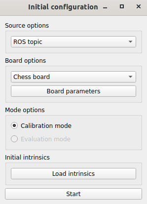
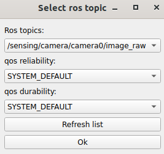
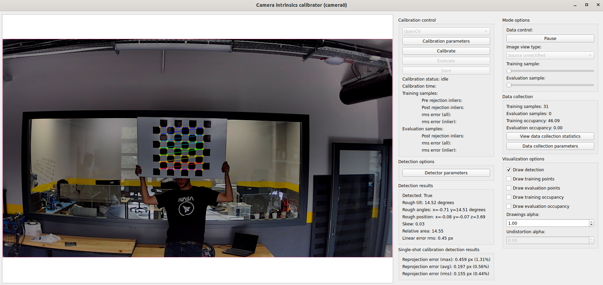

# Intrinsic camera calibration

## Overview

Intrinsic camera calibration is the process
of determining the internal parameters of a camera
which will be used when projecting 3D information into images.
These parameters include focal length, optical center, and lens distortion coefficients.
In order to perform camera Intrinsic calibration,
we will use TIER IV's [Intrinsic Camera Calibrator](https://github.com/tier4/CalibrationTools/blob/tier4/universe/sensor/docs/how_to_intrinsic_camera.md) tool.
First of all, we need a calibration board which can be dot, chess or apriltag grid board.
In this tutorial, we will use this 7x7 chess board consisting of 7 cm squares:

<figure markdown>
  { width="500"}
  <figcaption>
    Our 7x7 calibration chess board for this tutorial section.
  </figcaption>
</figure>

Here are some calibration board samples from [Intrinsic Camera Calibrator](https://github.com/tier4/CalibrationTools/blob/tier4/universe/sensor/docs/how_to_intrinsic_camera.md) page:

- Chess boards ([6x8 example](https://github.com/tier4/CalibrationTools/blob/tier4/universe/sensor/docs/resource/checkerboard_8x6.pdf))
- Circle dot boards ([6x8 example](https://github.com/tier4/CalibrationTools/blob/tier4/universe/sensor/docs/resource/circle_8x6.pdf))
- Apriltag grid board ([3x4 example](https://github.com/tier4/CalibrationTools/blob/tier4/universe/sensor/docs/resource/apriltag_grid_3x4.pdf))

If you want to use bag file for a calibration process,
the bag file must include `image_raw` topic of your camera sensor,
but you can perform calibration with real time.
(recommended)

??? note "ROS 2 Bag example for intrinsic camera calibration process"

    ```sh

    Files:             rosbag2_2023_09_18-16_19_08_0.db3
    Bag size:          12.0 GiB
    Storage id:        sqlite3
    Duration:          135.968s
    Start:             Sep 18 2023 16:19:08.966 (1695043148.966)
    End:               Sep 18 2023 16:21:24.934 (1695043284.934)
    Messages:          4122
    Topic information: Topic: /sensing/camera/camera0/image_raw | Type: sensor_msgs/msg/Image | Count: 2061 | Serialization Format: cdr

    ```

## Intrinsic camera calibration

Unlike other calibration packages in our tutorials,
this package does not need to create an initialization file.
So we can start with launching intrinsic calibrator package.

```bash
cd <YOUR-OWN-AUTOWARE-DIRECTORY>
source install/setup.bash
```

After that, we will launch intrinsic calibrator:

```bash
ros2 launch intrinsic_camera_calibrator calibrator.launch.xml
```

Then, initial configuration and camera intrinsic calibration panels will show up.
We set initial configurations for our calibration.

<figure markdown>
  { width="200"}
  <figcaption>
    Initial configuration panel
  </figcaption>
</figure>

We set our image source (it can be "ROS topic", "ROS bag" or "Image files")
from the source options section.
We will calibrate our camera with "ROS topic" source.
After selecting an image source from this panel, we need to configure "Board options" as well.
The calibration board can be "Chess board", "Dot board" or "Apriltag".
Also, we need to select board parameters,
to do that, click the "Board parameters" button and set row, column, and cell size.

After the setting of image source and board parameters, we are ready for the calibration process.
Please click the start button, you will see "Topic configuration" panel.
Please select the appropriate camera raw topic for the calibration process.

<figure markdown>
  { width="200"}
  <figcaption>
    Topic configuration panel
  </figcaption>
</figure>

Then you are ready to calibration.
Please collect data with different X-Y axis, sizes and skews.
You can see your collected data statistics with the clicking view data collection statistics.
For more information,
please refer to [Intrinsic Camera Calibrator](https://github.com/tier4/CalibrationTools/blob/tier4/universe/sensor/docs/how_to_intrinsic_camera.md) page.

<figure markdown>
  { align=center}
  <figcaption>
    Intrinsic calibrator interface
  </figcaption>
</figure>

After the data collection is completed,
you can click the "Calibrate" button to perform the calibration process.
After the calibration is completed,
you will see data visualization for the calibration result statistics.
You can observe your calibration results with changing "Image view type "Source unrectified"
to "Source rectified".
If your calibration is successful (there should be no distortion in the rectified image),
you can save your calibration results with "Save" button.
The output will be named as `<YOUR-CAMERA-NAME>_info.yaml`.
So, you use this file with your camera driver directly.

Here is the video
for demonstrating the intrinsic camera calibration process on tutorial_vehicle:

