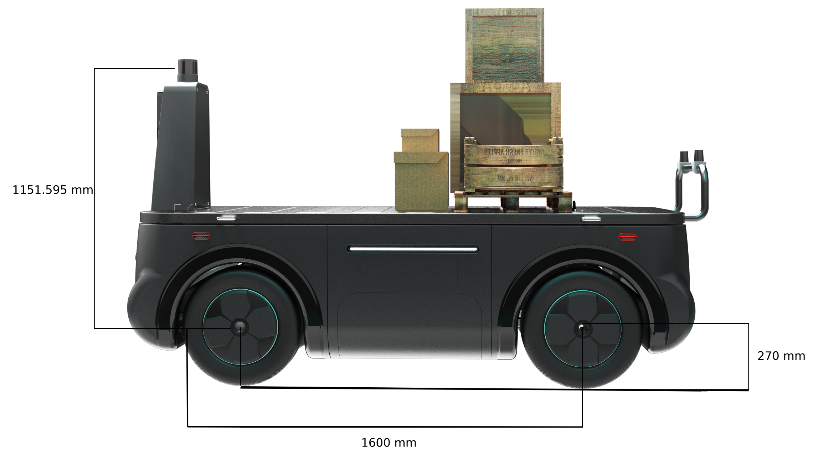

# Starting with TIER IV's CalibrationTools

## Overview

Autoware expects to have multiple sensors attached to the vehicle as input to perception,
localization,
and planning stack.
These sensors must be calibrated correctly,
and their positions must be defined at `sensor_kit_description` and `individual_params` packages.
In this tutorial,
we will use TIER IV's [CalibrationTools](https://github.com/tier4/CalibrationTools) repository for the calibration.

## Setting of sensor_kit_base_link position with respect to the base_link

In previous section (creating the vehicle and sensor model),
we mentioned about `sensors_calibration.yaml`.
This file stores `sensor_kit_base_link` (child frame) position and orientation with respect to the
`base_link` (parent frame).
We need to update this relative position
(all values were initially set equal to zero when file is created)
with using CAD data of our vehicle.

<figure markdown>
  { align=center }
  <figcaption>
  Our tutorial_vehicle base_link to sensor_kit_base_link transformation.
  </figcaption>
</figure>

So, our `sensors_calibration.yaml` file for our tutorial_vehicle should be like this:

```yaml
base_link:
  sensor_kit_base_link:
    x: 1.600000 # meter
    y: 0.0
    z: 1.421595 # 1.151595m + 0.270m
    roll: 0.0
    pitch: 0.0
    yaw: 0.0
```

You need to update this transformation value with respect to the `sensor_kit_base_link` frame.
You can also use CAD values for GNSS/INS and IMU position in `sensor_kit_calibration.yaml` file.
(Please don't forget
to update the sensor_kit_calibration.yaml file in both the sensor_kit_launch and individual_params packages)

## Installing TIER IV's CalibrationTools repositories on autoware

After completing previous steps (creating your own autoware,
creating a vehicle and sensor model etc.)
we are ready to calibrate sensors which prepared their pipeline in creating the sensor model section.

Firstly, we will clone CalibrationTools repositories in own autoware.

```bash
cd <YOUR-OWN-AUTOWARE-DIRECTORY> # for example: cd autoware.tutorial_vehicle
wget https://raw.githubusercontent.com/tier4/CalibrationTools/tier4/universe/calibration_tools.repos
vcs import src < calibration_tools.repos
rosdep install -y --from-paths src --ignore-src --rosdistro $ROS_DISTRO
```

Then build the all packages
after the all necessary changes are made on sensor model and vehicle model.

```bash
colcon build --symlink-install --cmake-args -DCMAKE_BUILD_TYPE=Release
```

## Usage of CalibrationTools

The CalibrationTools repository has several packages
for calibrating different sensor pairs such as lidar-lidar,
camera-lidar, ground-lidar etc. In order to calibrate our sensors,
we will modify `extrinsic_calibration_package` for our sensor kit.

For tutorial_vehicle,
completed launch files when created following tutorial sections can be found [here](https://github.com/leo-drive/calibration_tools_tutorial_vehicle/tree/tutorial_vehicle/sensor/extrinsic_calibration_manager/launch/tutorial_vehicle_sensor_kit).

- [Manual Calibration](../extrinsic-manual-calibration)
- [Lidar-Lidar Calibration](../lidar-lidar-calibration)
  - [Ground Plane-Lidar Calibration](../ground-lidar-calibration)
- [Intrinsic Camera Calibration](../intrinsic-camera-calibration)
- [Lidar-Camera Calibration](../lidar-camera-calibration)
