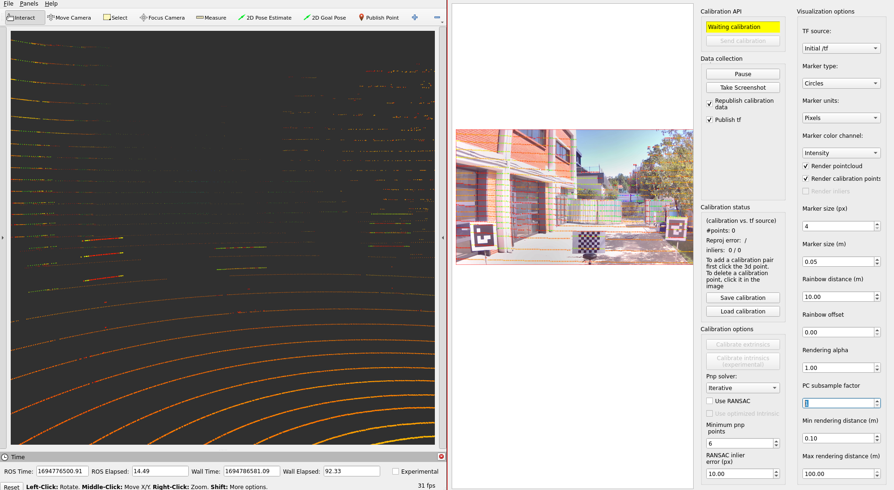
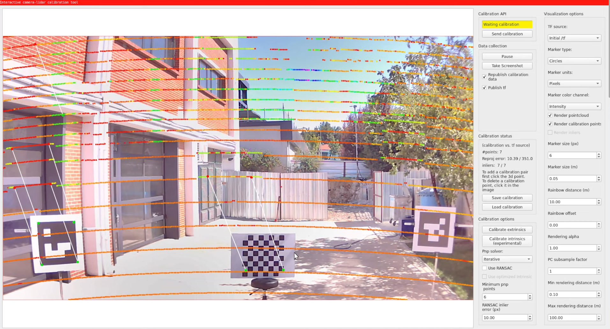
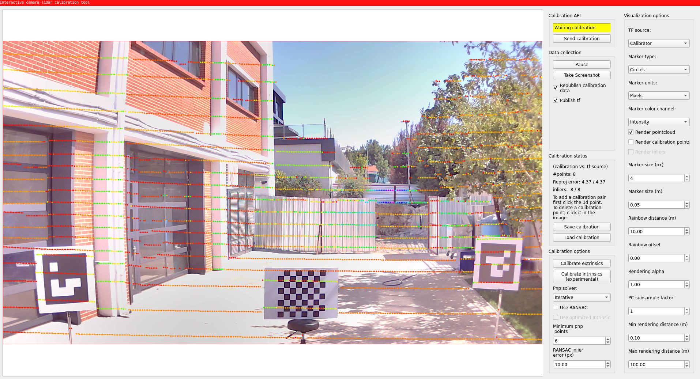

# Lidar-Camera calibration

## Overview

Lidar-camera calibration is a crucial process in the field of autonomous driving and robotics,
where both lidar sensors and cameras are used for perception.
The goal of calibration is
to accurately align the data from these different sensors
in order to create a comprehensive and coherent representation of the environment
by projecting lidar point onto camera image.
At this tutorial,
we will explain [TIER IV's interactive camera calibrator](https://github.com/tier4/CalibrationTools/blob/tier4/universe/sensor/docs/how_to_extrinsic_interactive.md).
Also, If you have aruco marker boards for calibration,
another [Lidar-Camera calibration method](https://github.com/tier4/CalibrationTools/blob/tier4/universe/sensor/docs/how_to_extrinsic_tag_based.md) is included in TIER IV's CalibrationTools repository.

!!! warning

    You need to apply [intrinsic calibration](../intrinsic-camera-calibration/index.md) before starting lidar-camera extrinsic calibration process. Also,
    please obtain the initial calibration results from the [Manual Calibration](../extrinsic-manual-calibration/index.md) section.
    This is crucial for obtaining accurate results from this tool.
    We will utilize the initial calibration parameters that were calculated
    in the previous step of this tutorial.
    To apply these initial values in the calibration tools,
    please update your sensor calibration files within the individual parameter package.

Your bag file must include calibration lidar topic and camera topics.
Camera topics can be compressed or raw topics,
but remember
we will update interactive calibrator launch argument `use_compressed` according to the topic type.

??? note "ROS 2 Bag example of our calibration process (there is only one camera mounted) If you have multiple cameras, please add camera_info and image topics as well."

    ```sh

    Files:             rosbag2_2023_09_12-13_57_03_0.db3
    Bag size:          5.8 GiB
    Storage id:        sqlite3
    Duration:          51.419s
    Start:             Sep 12 2023 13:57:03.691 (1694516223.691)
    End:               Sep 12 2023 13:57:55.110 (1694516275.110)
    Messages:          2590
    Topic information: Topic: /sensing/lidar/top/pointcloud_raw | Type: sensor_msgs/msg/PointCloud2 | Count: 515 | Serialization Format: cdr
    Topic: /sensing/camera/camera0/image_raw | Type: sensor_msgs/msg/Image | Count: 780 | Serialization Format: cdr
    Topic: /sensing/camera/camera0/camera_info | Type: sensor_msgs/msg/CameraInfo | Count: 780 | Serialization Format: cdr

    ```

## Lidar-Camera calibration

### Creating launch files

We start with creating launch file four our vehicle like "Extrinsic Manual Calibration"
process:

```bash
cd <YOUR-OWN-AUTOWARE-DIRECTORY>/src/autoware/calibration_tools/sensor
cd extrinsic_calibration_manager/launch
cd <YOUR-OWN-SENSOR-KIT-NAME> # i.e. for our guide, it will ve cd tutorial_vehicle_sensor_kit which is created in manual calibration
touch interactive.launch.xml interactive_sensor_kit.launch.xml
```

### Modifying launch files according to your sensor kit

We will be modifying these `interactive.launch.xml` and `interactive_sensor_kit.launch.xml` by using TIER IV's sample sensor kit aip_xx1.
So,
you should copy the contents of these two files from [aip_xx1](https://github.com/tier4/CalibrationTools/tree/tier4/universe/sensor/extrinsic_calibration_manager/launch/aip_xx1) to your created files.

Then we will continue with adding vehicle_id and sensor model names to the `interactive.launch.xml`.
(Optionally, values are not important. These parameters will be overridden by launch arguments)

```diff
  <arg name="vehicle_id" default="default"/>

  <let name="sensor_model" value="aip_x1"/>
  <?xml version="1.0" encoding="UTF-8"?>
  <launch>
-   <arg name="vehicle_id" default="default"/>
+   <arg name="vehicle_id" default="<YOUR_VEHICLE_ID>"/>
+
-   <arg name="sensor_model" default="aip_x1"/>
+   <let name="sensor_model" value="<YOUR_SENSOR_KIT_NAME>"/>
```

If you want to use concatenated pointcloud as an input cloud
(the calibration process will initiate the logging simulator,
resulting in the construction of the lidar pipeline and the appearance of the concatenated point cloud),
you must set `use_concatenated_pointcloud` value as `true`.

```diff
-   <arg name="use_concatenated_pointcloud" default="false"/>
+   <arg name="use_concatenated_pointcloud" default="true"/>
```

The final version of the file (interactive.launch.xml) for tutorial_vehicle should be like this:

??? note "Sample interactive.launch.xml file for tutorial vehicle"

    ```xml
    <?xml version="1.0" encoding="UTF-8"?>
    <launch>
      <arg name="vehicle_id" default="tutorial_vehicle"/>
      <let name="sensor_model" value="tutorial_vehicle_sensor_kit"/>
      <arg name="camera_name"/>
      <arg name="rviz" default="false"/>
      <arg name="use_concatenated_pointcloud" default="true"/>

      <group>
        <push-ros-namespace namespace="sensor_kit"/>
        <include file="$(find-pkg-share extrinsic_calibration_manager)/launch/$(var sensor_model)/interactive_sensor_kit.launch.xml" if="$(var rviz)">
          <arg name="vehicle_id" value="$(var vehicle_id)"/>
          <arg name="camera_name" value="$(var camera_name)"/>
        </include>
      </group>

    <!-- You can change the config file path -->
    <node pkg="rviz2" exec="rviz2" name="rviz2" output="screen" args="
    -d $(find-pkg-share extrinsic_calibration_manager)/config/x2/extrinsic_interactive_calibrator.rviz" if="$(var rviz)"/>
    </launch>

    ```

After the completing of interactive.launch.xml file,
we will be ready to implement interactive_sensor_kit.launch.xml for the own sensor model.

Optionally, (don't forget, these parameters will be overridden by launch arguments)
you can modify sensor_kit and vehicle_id as `interactive.launch.xml`over this xml snippet.
We will set parent_frame for calibration as `sensor_kit_base_link``:

The default camera input topic of interactive calibrator is compressed image.
If you want to use raw image instead of compressed image,
you need to update image_topic variable for your camera sensor topic.

```diff
    ...
-   <let name="image_topic" value="/sensing/camera/$(var camera_name)/image_raw"/>
+   <let name="image_topic" value="/sensing/camera/$(var camera_name)/image_compressed"/>
    ...
```

After updating your topic name,
you need to add the use_compressed parameter (default value is `true`)
to the interactive_calibrator node with a value of `false`.

```diff
   ...
   <node pkg="extrinsic_interactive_calibrator" exec="interactive_calibrator" name="interactive_calibrator" output="screen">
     <remap from="pointcloud" to="$(var pointcloud_topic)"/>
     <remap from="image" to="$(var image_compressed_topic)"/>
     <remap from="camera_info" to="$(var camera_info_topic)"/>
     <remap from="calibration_points_input" to="calibration_points"/>
+    <param name="use_compressed" value="false"/>
   ...
```

Then you can customize pointcloud topic for each camera.
For example, if you want to calibrate camera_1 with left lidar,
then you should change launch file like this:

```diff
    <let name="pointcloud_topic" value="/sensing/lidar/top/pointcloud_raw" if="$(eval &quot;'$(var camera_name)' == 'camera0' &quot;)"/>
-   <let name="pointcloud_topic" value="/sensing/lidar/top/pointcloud_raw" if="$(eval &quot;'$(var camera_name)' == 'camera1' &quot;)"/>
+   <let name="pointcloud_topic" value="/sensing/lidar/left/pointcloud_raw" if="$(eval &quot;'$(var camera_name)' == 'camera1' &quot;)"/>
    <let name="pointcloud_topic" value="/sensing/lidar/top/pointcloud_raw" if="$(eval &quot;'$(var camera_name)' == 'camera2' &quot;)"/>
    <let name="pointcloud_topic" value="/sensing/lidar/top/pointcloud_raw" if="$(eval &quot;'$(var camera_name)' == 'camera3' &quot;)"/>
    <let name="pointcloud_topic" value="/sensing/lidar/top/pointcloud_raw" if="$(eval &quot;'$(var camera_name)' == 'camera4' &quot;)"/>
    <let name="pointcloud_topic" value="/sensing/lidar/top/pointcloud_raw" if="$(eval &quot;'$(var camera_name)' == 'camera5' &quot;)"/>
    ...
```

The interactive_sensor_kit.launch.xml launch file for tutorial_vehicle should be this:

??? note "i.e. [`interactive_sensor_kit.launch.xml`](https://github.com/leo-drive/tutorial_vehicle_calibration_tools/blob/tutorial_vehicle/sensor/extrinsic_calibration_manager/launch/tutorial_vehicle_sensor_kit/interactive_sensor_kit.launch.xml) for tutorial_vehicle"

    ```xml
    <?xml version="1.0" encoding="UTF-8"?>
    <launch>
        <arg name="vehicle_id" default="tutorial_vehicle"/>
        <let name="sensor_model" value="tutorial_vehicle_sensor_kit"/>
        <let name="parent_frame" value="sensor_kit_base_link"/>

        <!-- extrinsic_calibration_client -->
        <arg name="src_yaml" default="$(find-pkg-share individual_params)/config/$(var vehicle_id)/$(var sensor_model)/sensor_kit_calibration.yaml"/>
        <arg name="dst_yaml" default="$(env HOME)/sensor_kit_calibration.yaml"/>


        <arg name="camera_name"/>

        <let name="image_topic" value="/sensing/camera/$(var camera_name)/image_raw"/>
        <let name="image_topic" value="/sensing/camera/traffic_light/image_raw" if="$(eval &quot;'$(var camera_name)' == 'traffic_light_left_camera' &quot;)"/>

        <let name="use_compressed" value="false"/>

        <let name="image_compressed_topic" value="/sensing/camera/$(var camera_name)/image_raw/compressed"/>
        <let name="image_compressed_topic" value="/sensing/camera/traffic_light/image_raw/compressed" if="$(eval &quot;'$(var camera_name)' == 'traffic_light_left_camera' &quot;)"/>

        <let name="camera_info_topic" value="/sensing/camera/$(var camera_name)/camera_info"/>
        <let name="camera_info_topic" value="/sensing/camera/traffic_light/camera_info" if="$(eval &quot;'$(var camera_name)' == 'traffic_light_left_camera' &quot;)"/>

        <let name="pointcloud_topic" value="/sensing/lidar/top/pointcloud_raw" if="$(eval &quot;'$(var camera_name)' == 'camera0' &quot;)"/>
        <let name="pointcloud_topic" value="/sensing/lidar/top/pointcloud_raw" if="$(eval &quot;'$(var camera_name)' == 'camera1' &quot;)"/>
        <let name="pointcloud_topic" value="/sensing/lidar/top/pointcloud_raw" if="$(eval &quot;'$(var camera_name)' == 'camera2' &quot;)"/>
        <let name="pointcloud_topic" value="/sensing/lidar/top/pointcloud_raw" if="$(eval &quot;'$(var camera_name)' == 'camera3' &quot;)"/>
        <let name="pointcloud_topic" value="/sensing/lidar/top/pointcloud_raw" if="$(eval &quot;'$(var camera_name)' == 'camera4' &quot;)"/>
        <let name="pointcloud_topic" value="/sensing/lidar/top/pointcloud_raw" if="$(eval &quot;'$(var camera_name)' == 'camera5' &quot;)"/>
        <let name="pointcloud_topic" value="/sensing/lidar/top/pointcloud_raw" if="$(eval &quot;'$(var camera_name)' == 'traffic_light_left_camera' &quot;)"/>

        <let name="calibrate_sensor" value="false"/>
        <let name="calibrate_sensor" value="true" if="$(eval &quot;'$(var camera_name)' == 'camera0' &quot;)"/>
        <let name="calibrate_sensor" value="true" if="$(eval &quot;'$(var camera_name)' == 'camera1' &quot;)"/>
        <let name="calibrate_sensor" value="true" if="$(eval &quot;'$(var camera_name)' == 'camera2' &quot;)"/>
        <let name="calibrate_sensor" value="true" if="$(eval &quot;'$(var camera_name)' == 'camera3' &quot;)"/>
        <let name="calibrate_sensor" value="true" if="$(eval &quot;'$(var camera_name)' == 'camera4' &quot;)"/>
        <let name="calibrate_sensor" value="true" if="$(eval &quot;'$(var camera_name)' == 'camera5' &quot;)"/>
        <let name="calibrate_sensor" value="true" if="$(eval &quot;'$(var camera_name)' == 'traffic_light_left_camera' &quot;)"/>

        <let name="camera_frame" value=""/>
        <let name="camera_frame" value="camera0/camera_link" if="$(eval &quot;'$(var camera_name)' == 'camera0' &quot;)"/>
        <let name="camera_frame" value="camera1/camera_link" if="$(eval &quot;'$(var camera_name)' == 'camera1' &quot;)"/>
        <let name="camera_frame" value="camera2/camera_link" if="$(eval &quot;'$(var camera_name)' == 'camera2' &quot;)"/>
        <let name="camera_frame" value="camera3/camera_link" if="$(eval &quot;'$(var camera_name)' == 'camera3' &quot;)"/>
        <let name="camera_frame" value="camera4/camera_link" if="$(eval &quot;'$(var camera_name)' == 'camera4' &quot;)"/>
        <let name="camera_frame" value="camera5/camera_link" if="$(eval &quot;'$(var camera_name)' == 'camera5' &quot;)"/>
        <let name="camera_frame" value="traffic_light_left_camera/camera_link" if="$(eval &quot;'$(var camera_name)' == 'traffic_light_left_camera' &quot;)"/>

        <node pkg="extrinsic_calibration_client" exec="extrinsic_calibration_client" name="extrinsic_calibration_client" output="screen" if="$(var calibrate_sensor)">
            <param name="src_path" value="$(var src_yaml)"/>
            <param name="dst_path" value="$(var dst_yaml)"/>
        </node>

        <!-- extrinsic_calibration_manager -->
        <node pkg="extrinsic_calibration_manager" exec="extrinsic_calibration_manager" name="extrinsic_calibration_manager" output="screen" if="$(var calibrate_sensor)">
            <param name="parent_frame" value="$(var parent_frame)"/>
            <param name="child_frames" value="
        [$(var camera_frame)]"/>
        </node>

        <!-- interactive calibrator -->
        <group if="$(var calibrate_sensor)">
            <push-ros-namespace namespace="$(var parent_frame)/$(var camera_frame)"/>

            <node pkg="extrinsic_interactive_calibrator" exec="interactive_calibrator" name="interactive_calibrator" output="screen">
                <remap from="pointcloud" to="$(var pointcloud_topic)"/>
                <remap from="image" to="$(var image_topic)"/>
                <remap from="camera_info" to="$(var camera_info_topic)"/>
                <remap from="calibration_points_input" to="calibration_points"/>

                <param name="camera_parent_frame" value="$(var parent_frame)"/>
                <param name="camera_frame" value="$(var camera_frame)"/>
                <param name="use_compressed" value="$(var use_compressed)"/>
            </node>

            <include file="$(find-pkg-share intrinsic_camera_calibration)/launch/optimizer.launch.xml"/>
        </group>
    </launch>

    ```

### Lidar-camera calibration process with interactive camera-lidar calibrator

After completing interactive.launch.xml and interactive_sensor_kit.launch.xml launch files for own sensor kit;
now we are ready to calibrate our lidars.
First of all, we need to build extrinsic_calibration_manager package:

```bash
colcon build --symlink-install --cmake-args -DCMAKE_BUILD_TYPE=Release --packages-select extrinsic_calibration_manager
```

So, we are ready to launch and use interactive lidar-camera calibrator.

```bash
ros2 launch extrinsic_calibration_manager calibration.launch.xml mode:=interactive sensor_model:=<OWN-SENSOR-KIT> vehicle_model:=<OWN-VEHICLE-MODEL> vehicle_id:=<VEHICLE-ID> camera_name:=<CALIBRATION-CAMERA>
```

For tutorial vehicle:

```bash
ros2 launch extrinsic_calibration_manager calibration.launch.xml mode:=interactive sensor_model:=tutorial_vehicle_sensor_kit vehicle_model:=tutorial_vehicle vehicle_id:=tutorial_vehicle
```

Then, we need to play our bag file.

```bash
ros2 bag play <rosbag_path> --clock -l -r 0.2 \
--remap /tf:=/null/tf /tf_static:=/null/tf_static # if tf is recorded
```

You will be shown a manual interactive calibrator rqt window and Rviz2.
You must add your lidar sensor point cloud to Rviz2, then we can publish points for the calibrator.



- After that, Let's start by pressing the `Publish Point`
  button and selecting points on the point cloud that are also included in the projected image.
  Then,
  you need to click on the image point that corresponds to the projected lidar point on the image.
  You will see matched calibration points.



- The red points indicate selected lidar points and green ones indicate selected image points.
  You must match the minimum 6 points to perform calibration.
  If you have a wrong match, you can remove this match by just clicking on them.
  After selecting points on image and lidar, you are ready to calibrate.
  If selected point match size is greater than 6, "Calibrate extrinsic" button will be enabled.
  Click this button and change tf source `Initial /tf` to `Calibrator` to see calibration results.



After the completion of the calibration,
you need to save your calibration results via "Save calibration" button.
The saved format is json,
so you need
to update calibration params at `sensor_kit_calibration.yaml` on `individual_params` and `sensor_kit_description` packages.

??? note "Sample calibration output"

    ```json
    {
        "header": {
            "stamp": {
                "sec": 1694776487,
                "nanosec": 423288443
            },
            "frame_id": "sensor_kit_base_link"
        },
        "child_frame_id": "camera0/camera_link",
        "transform": {
            "translation": {
                "x": 0.054564283153017916,
                "y": 0.040947512210503106,
                "z": -0.071735410952332
            },
            "rotation": {
                "x": -0.49984112274024817,
                "y": 0.4905405357176159,
                "z": -0.5086269994990131,
                "w": 0.5008267267391722
            }
        },
        "roll": -1.5517347113946862,
        "pitch": -0.01711459479043047,
        "yaw": -1.5694590141484235
    }
    ```

Here is the video
for demonstrating the lidar-camera calibration process on tutorial_vehicle:

