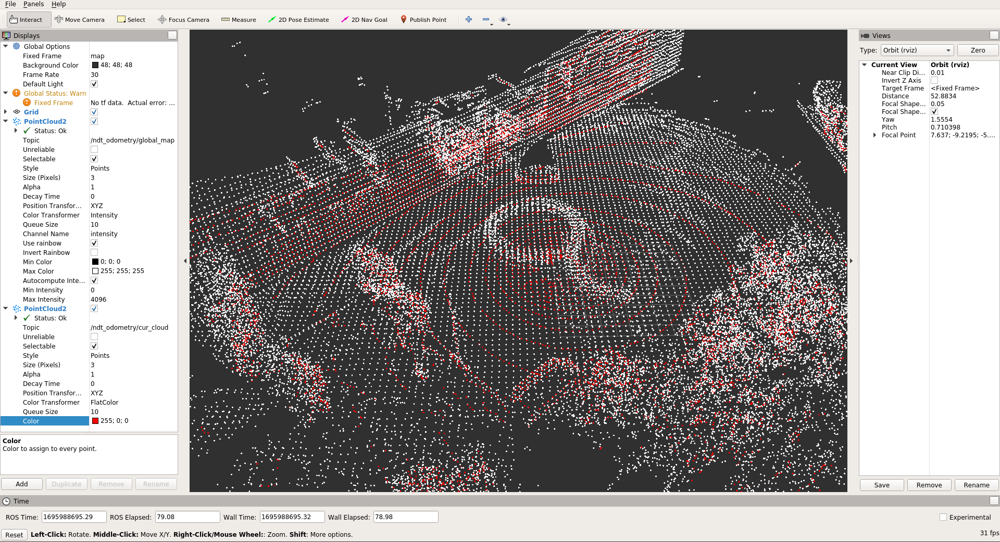

# Lidar-Imu Calibration

## Overview

Lidar-Imu calibration is important for localization and mapping algorithms
which used in autonomous driving. In this tutorial, we will calibrate the
lidar and imu sensors with using [OA-LICalib](https://github.com/leo-drive/OA-LICalib)
tool which is developed by [APRIL Lab](https://github.com/APRIL-ZJU)
at Zhejiang University in China.

OA-LICalib is calibration method for the LiDAR-Inertial systems
within a continuous-time batch optimization, where intrinsic of both sensors,
the time offset between sensors and the spatial-temporal extrinsic between sensors
are calibrated comprehensively without explicit hand-crafted targets.

!!! warning

    So, we are providing a docker image which has ROS 1 and all necessary packages.
    This calibration tool is developed with ROS 1, and it is not compatible with ROS 2.
    In the calibration instructions, we will ask you to install docker on your
    system.

??? note "ROS 2 Bag example of our calibration process for tutorial_vehicle"

    ```sh

    Files:             rosbag2_2023_08_18-14_42_12_0.db3
    Bag size:          12.4 GiB
    Storage id:        sqlite3
    Duration:          202.140s
    Start:             Aug 18 2023 14:42:12.586 (1692358932.586)
    End:               Aug 18 2023 14:45:34.727 (1692359134.727)
    Messages:          22237
    Topic information: Topic: /sensing/gnss/sbg/ros/imu/data | Type: sensor_msgs/msg/Imu | Count: 20215 | Serialization Format: cdr
                       Topic: /sensing/lidar/top/pointcloud_raw | Type: sensor_msgs/msg/PointCloud2 | Count: 2022 | Serialization Format: cdr
    ```

## Data Collection and Preparation

For Lidar-Imu calibration, there is a need for a ROS 1 bag file which contains
`sensor_msgs/PointCloud2` and `sensor_msgs/Imu` messages.
To obtain good results as a result of the calibration process,
you need to move the sensors in all 6 axes (x, y, z, roll, pitch, yaw) while collecting data.
Therefore, holding the sensors in your hand while data collection will get better results,
but you can also collect data on the vehicle. If you are collecting data on the vehicle,
you should draw figures of eights and grids.

<figure markdown>
  { align=center }
  <figcaption>
    Lidar - IMU Calibration Data Collection
  </figcaption>
</figure>

Moreover, the calibration accuracy is affected by the data collection environment.
You should collect your data in a place that contains a lot of flat surfaces,
and indoor spaces are the best locations under these conditions.
However, you can also achieve good results outdoors.
When collecting data, make sure to draw figures of eights and grids,
capturing data from every angle.

### Converting ROS 2 Bag to ROS 1 Bag

If you collected your calibration data in ROS 2,
you can convert it to ROS 1 bag file with the following instructions:

- Split your ROS 2 bag file if it contains non-standard message topics
  (you can only select `sensor_msgs/PointCloud2` and `sensor_msgs/Imu` messages),
  and convert your split ROS 2 bag file to ROS 1 bag.

Create a yaml file with name `out.yaml` which contains your lidar and imu topics:

```yaml
output_bags:
  - uri: splitted_bag
    topics: [/your/imu/topic, /your/pointcloud/topic]
```

Split your ROS 2 bag file:

```sh
ros2 bag convert -i <YOUR-ROS2-BAG-FOLDER> -o out.yaml
```

Convert your split ROS 2 bag file to ROS 1 bag file:

```sh
# install bag converter tool (https://gitlab.com/ternaris/rosbags)
pip3 install rosbags

# convert bag
rosbags-convert <YOUR-SPLITTED-ROS2-BAG-FOLDER> --dst <OUTPUT-BAG-FILE>
```

## Lidar-Imu Calibration

As a first step, we need to install docker on our system. You can install docker
using [this link](https://docs.docker.com/engine/install/ubuntu/), or you can use
the following commands to install docker using the Apt repository.

Set up Docker's Apt repository:

```sh
# Add Docker's official GPG key:
sudo apt-get update
sudo apt-get install ca-certificates curl gnupg
sudo install -m 0755 -d /etc/apt/keyrings
curl -fsSL https://download.docker.com/linux/ubuntu/gpg | sudo gpg --dearmor -o /etc/apt/keyrings/docker.gpg
sudo chmod a+r /etc/apt/keyrings/docker.gpg

# Add the repository to Apt sources:
echo \
  "deb [arch="$(dpkg --print-architecture)" signed-by=/etc/apt/keyrings/docker.gpg] https://download.docker.com/linux/ubuntu \
  "$(. /etc/os-release && echo "$VERSION_CODENAME")" stable" | \
  sudo tee /etc/apt/sources.list.d/docker.list > /dev/null
sudo apt-get update
```

Install the Docker packages:

```sh
sudo apt-get install docker-ce docker-ce-cli containerd.io docker-buildx-plugin docker-compose-plugin
```

To check if docker is installed correctly, you can run the following command:

```sh
sudo docker run hello-world
```

Before finishing the installation, we need to add our user to the docker group.
This will allow us to run docker commands without sudo:

```sh
sudo groupadd docker
sudo usermod -aG docker $USER
```

!!! warning

    After running the above command, you need to logout and login again to be able
    to run docker commands without sudo.

After installing docker, we are ready to run the calibration tool. As a first step,
you should clone the calibration repository:

```sh
git clone https://github.com/leo-drive/OA-LICalib.git
```

Then, you need to build the docker image:

```sh
cd OA-LICalib/docker
sudo docker build -t oalicalib .
```

After building the docker image, you need to create a container from the image:

!!! warning

    You need to update REPO_PATH with the path to the cloned repository
    on your system.

```sh
export REPO_PATH="/path/to/OA-LICalib"
docker run -it --env="DISPLAY" --volume="$HOME/.Xauthority:/root/.Xauthority:rw" --volume="/tmp/.X11-unix:/tmp/.X11-unix:rw" --volume="$REPO_PATH:/root/calib_ws/src/OA-LICalib" calib:v1 bash
```

Before running the calibration tool, you should change some parameters from the
configuration file. You can find the configuration file in the `OA-LICalib/config`

Change the following parameters in the configuration file as your topics and
sensors:

- These are the lidar model options: VLP_16_packet, VLP_16_points, VLP_32E_points,
  VLS_128_points, Ouster_16_points, Ouster_32_points, Ouster_64_points,
  Ouster_128_points, RS_16

- `start_time` and `end_time` are the interval of the rosbag that you want to use

- `path_bag` is the path to the rosbag file, but you need to give the path inside
  the container, not your local system. For example,
  if you have a rosbag file in the `OA-LICalib/data` directory,
  you need to give the path as `/root/calib_ws/src/OA-LICalib/data/rosbag2_2023_08_18-14_42_12_0.bag`

```yaml
topic_lidar: /sensing/lidar/top/pointcloud_raw
topic_imu: /sensing/gnss/sbg/ros/imu/data

LidarModel: VLP_16_SIMU

selected_segment:
  - {
      start_time: 0,
      end_time: 40,
      path_bag: /root/calib_ws/src/OA-LICalib/data/rosbag2_2023_08_18-14_42_12_0.bag,
    }
```

After creating the container and changing parameters,
you can build and run the calibration tool:

```sh
cd /root/catkin_oa_calib
catkin_make -DCATKIN_WHITELIST_PACKAGES=""

source devel/setup.bash
roslaunch oalicalib li_calib.launch
```

After running the calibration tool, you can track the calibration process
with connecting to the container on other terminal. To connect to the container,
you can run the following command:

```sh
docker exec -it <container_name> bash
```

!!! warning

    You need to replace <container_name> with the name of your container.
    To see your container name, you can run `docker ps` command. This command's
    output should be something like this and you can find your container name
    in the last column:
    ```
    CONTAINER ID   IMAGE      COMMAND                  CREATED         STATUS         PORTS     NAMES
    adb8b559c06e   calib:v1   "/ros_entrypoint.sh …"   6 seconds ago   Up 5 seconds             your_awesome_container_name
    ```

After connecting to the container, you can see the calibration process
with running the Rviz. After running the Rviz, you need to add the following
topics to the Rviz:

- /ndt_odometry/global_map
- /ndt_odometry/cur_cloud

```sh
rviz
```

If `/ndt_odometry/global_map` looks distorted, you should tune ndt parameters
in the `OA-LICalib/config/simu.yaml` file.

<figure markdown>
  { align=center }
  <figcaption>
    Lidar - IMU Calibration RViz Screen
  </figcaption>
</figure>

To achieve better results, you can tune the parameters in the `config/simu.yaml` file. The parameters are explained below:

| Parameter                | Value                                                                                                   |
| ------------------------ | ------------------------------------------------------------------------------------------------------- |
| ndtResolution            | Resolution of NDT grid structure (VoxelGridCovariance)<br/>0,5 for indoor case and 1.0 for outdoor case |
| ndt_key_frame_downsample | Resolution parameter for voxel grid downsample function                                                 |
| map_downsample_size      | Resolution parameter for voxel grid downsample function                                                 |
| knot_distance            | time interval                                                                                           |
| plane_motion             | set true if you collect data from vehicle                                                               |
| gyro_weight              | gyrometer sensor output’s weight for trajectory estimation                                              |
| accel_weight             | accelerometer sensor output’s weight for trajectory estimation                                          |
| lidar_weight             | lidar sensor output’s weight for trajectory estimation                                                  |
