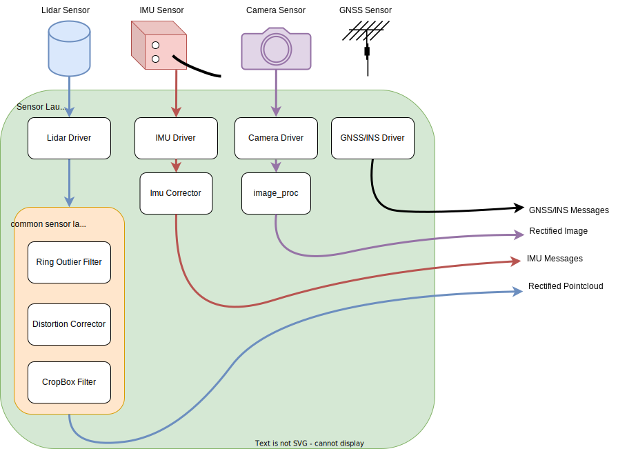
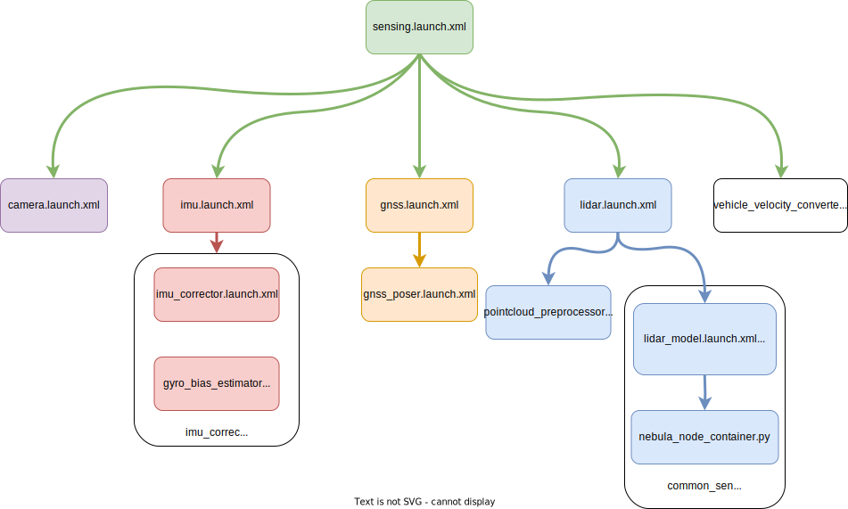

# Creating a sensor model for Autoware

## Introduction

This page introduces the following packages for the sensor model:

1. `common_sensor_launch`
2. `<YOUR-VEHICLE-NAME>_sensor_kit_description`
3. `<YOUR-VEHICLE-NAME>_sensor_kit_launch`

Previously,
we forked our sensor model at the [creating autoware repositories](../../creating-your-autoware-repositories/creating-autoware-repositories.md) page step.
For instance,
we created [tutorial_vehicle_sensor_kit_launch](https://github.com/leo-drive/tutorial_vehicle_sensor_kit_launch)
as an implementation example for the said step.
Please ensure that the <YOUR-VEHICLE-NAME>\_sensor_kit_launch repository is included in Autoware,
following the directory structure below:

```diff
<YOUR-OWN-AUTOWARE-DIR>/
  └─ src/
       └─ sensor_kit/
            └─ <YOUR-VEHICLE-NAME>_sensor_kit_launch/
                 ├─ common_sensor_launch/
                 ├─ <YOUR-VEHICLE-NAME>_sensor_kit_description/
                 └─ <YOUR-VEHICLE-NAME>_sensor_kit_launch/
```

If your forked Autoware meta-repository doesn't include `<YOUR-VEHICLE-NAME>_sensor_kit_launch` with the correct folder structure
as shown above,
please add your forked `<YOUR-VEHICLE-NAME>_sensor_kit_launch` repository to the autoware.repos file
and run the vcs import src < autoware.repos command in your terminal
to import the newly included repositories at autoware.repos file.

Now, we are ready to modify the following sensor model packages for our vehicle.
Firstly, we need to rename the description and launch packages:

```diff
<YOUR-VEHICLE-NAME>_sensor_kit_launch/
  ├─ common_sensor_launch/
- ├─ sample_sensor_kit_description/
+ ├─ <YOUR-VEHICLE-NAME>_sensor_kit_description/
- └─ sample_sensor_kit_launch/
+ └─ <YOUR-VEHICLE-NAME>_sensor_kit_launch/
```

After that,
we will change our package names in the package.xml file and CMakeLists.txt file of the sample_sensor_kit_description and sample_sensor_kit_launch packages.
So,
open the package.xml file and CMakeLists.txt file with any text editor or IDE of your preference
and perform the following changes:

Change the `<name>` attribute at `package.xml` file:

```diff
<package format="3">
- <name>sample_sensor_kit_description</name>
+ <name><YOUR-VEHICLE-NAME>_sensor_kit_description</name>
  <version>0.1.0</version>
  <description>The sensor_kit_description package</description>
  ...
  ...
```

Change the `project()` method at `CmakeList.txt` file.

```diff
  cmake_minimum_required(VERSION 3.5)
- project(sample_sensor_kit_description)
+ project(<YOUR-VEHICLE-NAME>_sensor_kit_description)

  find_package(ament_cmake_auto REQUIRED)
...
...
```

Remember to apply the name changes and project method for **BOTH**
`<YOUR-VEHICLE-NAME>_sensor_kit_description`and `<YOUR-VEHICLE-NAME>_sensor_kit_launch` ROS 2 packages.
Once finished, we can proceed to build said packages:

```bash
cd <YOUR-AUTOWARE-DIR>
colcon build --symlink-install --cmake-args -DCMAKE_BUILD_TYPE=Release --packages-up-to <YOUR-VEHICLE-NAME>_sensor_kit_description <YOUR-VEHICLE-NAME>_sensor_kit_launch
```

## Sensor description

The main purpose of this package is to describe the sensor frame IDs,
calibration parameters of all sensors, and their links with urdf files.

The folder structure of sensor_kit_description package is:

```diff
<YOUR-VEHICLE-NAME>_sensor_kit_description/
   ├─ config/
   │     ├─ sensor_kit_calibration.yaml
   │     └─ sensors_calibration.yaml
   └─ urdf/
         ├─ sensor_kit.xacro
         └─ sensors.xacro
```

Now, we will modify these files according to our sensor design.

### sensor_kit_calibration.yaml

This file defines the mounting positions and orientations of sensors with `sensor_kit_base_link` as the parent frame.
We can assume `sensor_kit_base_link` frame is bottom of your main Lidar sensor.
We must create this file with euler format as [x, y, z, roll, pitch, yaw].
Also, we will set these values with "0" until the [calibration steps](../calibrating-sensors/index.md).

We will define new frames for this file, and we will connect them `.xacro` files.
We recommend naming as if your lidar sensor frame as "velodyne_top",
you can add "\_base_link" to our calibration .yaml file.

So, the sample file must be like:

```yaml
sensor_kit_base_link:
  velodyne_top_base_link:
    x: 0.000000
    y: 0.000000
    z: 0.000000
    roll: 0.000000
    pitch: 0.000000
    yaw: 0.000000
  camera0/camera_link:
    x: 0.000000
    y: 0.000000
    z: 0.000000
    roll: 0.000000
    pitch: 0.000000
    yaw: 0.000000
  ...
  ...
```

This file for `tutorial_vehicle` was created for one camera, two lidars and one GNSS/INS sensors.

??? note "`sensor_kit_calibration.yaml` for tutorial_vehicle_sensor_kit_description"

    ```yaml
    sensor_kit_base_link:
      camera0/camera_link: # Camera
        x: 0.0
        y: 0.0
        z: 0.0
        roll: 0.0
        pitch: 0.0
        yaw: 0.0
      rs_helios_top_base_link: # Lidar
        x: 0.0
        y: 0.0
        z: 0.0
        roll: 0.0
        pitch: 0.0
        yaw: 0.0
      rs_bpearl_front_base_link: # Lidar
        x: 0.0
        y: 0.0
        z: 0.0
        roll: 0.0
        pitch: 0.0
        yaw: 0.0
      GNSS_INS/gnss_ins_link: # GNSS/INS
        x: 0.0
        y: 0.0
        z: 0.0
        roll: 0.0
        pitch: 0.0
        yaw: 0.0
    ```

### sensors_calibration.yaml

This file defines the mounting positions and orientations of `sensor_kit_base_link` (child frame)
with `base_link` as the parent frame.
At Autoware, `base_link` is on projection of the rear-axle center onto the ground surface.
For more information,
you can check [vehicle dimension](../../../../design/autoware-interfaces/components/vehicle-dimensions.md) page.
You can use CAD values for this, but we will fill the values with `0` for now.

```yaml
base_link:
  sensor_kit_base_link:
    x: 0.000000
    y: 0.000000
    z: 0.000000
    roll: 0.000000
    pitch: 0.000000
    yaw: 0.000000
```

Now, we are ready to implement .xacro files.
These files provide linking our sensor frames and adding sensor urdf files

### sensor_kit.xacro

We will add our sensors and remove unnecessary xacros from this file.
For example,
we want
to add our lidar sensor with `velodyne_top` frame from the sensor driver,
we will add the following xacro to our sensor_kit.xacro file.
Please add your sensors to this file and remove unnecessary sensor's xacros.

```xml
    <!-- lidar -->
    <xacro:VLS-128 parent="sensor_kit_base_link" name="velodyne_top" topic="/points_raw" hz="10" samples="220" gpu="$(arg gpu)">
        <origin
                xyz="${calibration['sensor_kit_base_link']['velodyne_top_base_link']['x']}
                 ${calibration['sensor_kit_base_link']['velodyne_top_base_link']['y']}
                 ${calibration['sensor_kit_base_link']['velodyne_top_base_link']['z']}"
                rpy="${calibration['sensor_kit_base_link']['velodyne_top_base_link']['roll']}
                 ${calibration['sensor_kit_base_link']['velodyne_top_base_link']['pitch']}
                 ${calibration['sensor_kit_base_link']['velodyne_top_base_link']['yaw']}"
        />
    </xacro:VLS-128>
```

Here is the sample xacro file for tutorial_vehicle with one camera, two lidars and one GNSS/INS sensors.

??? note "`sensor_kit.xacro` for tutorial_vehicle_sensor_kit_description"

    ```xml
    <?xml version="1.0"?>
    <robot xmlns:xacro="http://ros.org/wiki/xacro">
      <xacro:macro name="sensor_kit_macro" params="parent x y z roll pitch yaw">
        <xacro:include filename="$(find velodyne_description)/urdf/VLP-16.urdf.xacro"/>
        <xacro:include filename="$(find vls_description)/urdf/VLS-128.urdf.xacro"/>
        <xacro:include filename="$(find camera_description)/urdf/monocular_camera.xacro"/>
        <xacro:include filename="$(find imu_description)/urdf/imu.xacro"/>

        <xacro:arg name="gpu" default="false"/>
        <xacro:arg name="config_dir" default="$(find tutorial_vehicle_sensor_kit_description)/config"/>

        <xacro:property name="sensor_kit_base_link" default="sensor_kit_base_link"/>

        <joint name="${sensor_kit_base_link}_joint" type="fixed">
          <origin rpy="${roll} ${pitch} ${yaw}" xyz="${x} ${y} ${z}"/>
          <parent link="${parent}"/>
          <child link="${sensor_kit_base_link}"/>
        </joint>
        <link name="${sensor_kit_base_link}">
          <origin rpy="0 0 0" xyz="0 0 0"/>
        </link>

        <!-- sensor -->
        <xacro:property name="calibration" value="${xacro.load_yaml('$(arg config_dir)/sensor_kit_calibration.yaml')}"/>

        <!-- lidar -->
        <xacro:VLS-128 parent="sensor_kit_base_link" name="rs_helios_top" topic="/points_raw" hz="10" samples="220" gpu="$(arg gpu)">
          <origin
            xyz="${calibration['sensor_kit_base_link']['rs_helios_top_base_link']['x']}
                 ${calibration['sensor_kit_base_link']['rs_helios_top_base_link']['y']}
                 ${calibration['sensor_kit_base_link']['rs_helios_top_base_link']['z']}"
            rpy="${calibration['sensor_kit_base_link']['rs_helios_top_base_link']['roll']}
                 ${calibration['sensor_kit_base_link']['rs_helios_top_base_link']['pitch']}
                 ${calibration['sensor_kit_base_link']['rs_helios_top_base_link']['yaw']}"
          />
        </xacro:VLS-128>
        <xacro:VLP-16 parent="sensor_kit_base_link" name="rs_bpearl_front" topic="/points_raw" hz="10" samples="220" gpu="$(arg gpu)">
          <origin
            xyz="${calibration['sensor_kit_base_link']['rs_bpearl_front_base_link']['x']}
                 ${calibration['sensor_kit_base_link']['rs_bpearl_front_base_link']['y']}
                 ${calibration['sensor_kit_base_link']['rs_bpearl_front_base_link']['z']}"
            rpy="${calibration['sensor_kit_base_link']['rs_bpearl_front_base_link']['roll']}
                 ${calibration['sensor_kit_base_link']['rs_bpearl_front_base_link']['pitch']}
                 ${calibration['sensor_kit_base_link']['rs_bpearl_front_base_link']['yaw']}"
          />
        </xacro:VLP-16>

        <!-- camera -->
        <xacro:monocular_camera_macro
          name="camera0/camera"
          parent="sensor_kit_base_link"
          namespace=""
          x="${calibration['sensor_kit_base_link']['camera0/camera_link']['x']}"
          y="${calibration['sensor_kit_base_link']['camera0/camera_link']['y']}"
          z="${calibration['sensor_kit_base_link']['camera0/camera_link']['z']}"
          roll="${calibration['sensor_kit_base_link']['camera0/camera_link']['roll']}"
          pitch="${calibration['sensor_kit_base_link']['camera0/camera_link']['pitch']}"
          yaw="${calibration['sensor_kit_base_link']['camera0/camera_link']['yaw']}"
          fps="30"
          width="800"
          height="400"
          fov="1.3"
        />

        <!-- gnss -->
        <xacro:imu_macro
          name="gnss"
          parent="sensor_kit_base_link"
          namespace=""
          x="${calibration['sensor_kit_base_link']['gnss_link']['x']}"
          y="${calibration['sensor_kit_base_link']['gnss_link']['y']}"
          z="${calibration['sensor_kit_base_link']['gnss_link']['z']}"
          roll="${calibration['sensor_kit_base_link']['gnss_link']['roll']}"
          pitch="${calibration['sensor_kit_base_link']['gnss_link']['pitch']}"
          yaw="${calibration['sensor_kit_base_link']['gnss_link']['yaw']}"
          fps="100"
        />

      </xacro:macro>
    </robot>

    ```

### sensors.xacro

This files links our sensor_kit main frame (`sensor_kit_base_link`) to base_link.
Also, you have sensors which will be calibrated directly to base_link, you can add it to here.

Here is the sensors.xacro file for sample_sensor_kit_description package:
(velodyne_rear transformation is directly used with base_link)

```xml
<?xml version="1.0"?>
<robot name="vehicle" xmlns:xacro="http://ros.org/wiki/xacro">
  <xacro:arg name="config_dir" default="$(find sample_sensor_kit_description)/config"/>
  <xacro:property name="calibration" value="${xacro.load_yaml('$(arg config_dir)/sensors_calibration.yaml')}"/>

  <!-- sensor kit -->
  <xacro:include filename="sensor_kit.xacro"/>
  <xacro:sensor_kit_macro
    parent="base_link"
    x="${calibration['base_link']['sensor_kit_base_link']['x']}"
    y="${calibration['base_link']['sensor_kit_base_link']['y']}"
    z="${calibration['base_link']['sensor_kit_base_link']['z']}"
    roll="${calibration['base_link']['sensor_kit_base_link']['roll']}"
    pitch="${calibration['base_link']['sensor_kit_base_link']['pitch']}"
    yaw="${calibration['base_link']['sensor_kit_base_link']['yaw']}"
  />

  <!-- embedded sensors -->
  <xacro:include filename="$(find velodyne_description)/urdf/VLP-16.urdf.xacro"/>
  <xacro:VLP-16 parent="base_link" name="velodyne_rear" topic="velodyne_rear/velodyne_points" hz="10" samples="220" gpu="false">
    <origin
      xyz="${calibration['base_link']['velodyne_rear_base_link']['x']}
           ${calibration['base_link']['velodyne_rear_base_link']['y']}
           ${calibration['base_link']['velodyne_rear_base_link']['z']}"
      rpy="${calibration['base_link']['velodyne_rear_base_link']['roll']}
           ${calibration['base_link']['velodyne_rear_base_link']['pitch']}
           ${calibration['base_link']['velodyne_rear_base_link']['yaw']}"
    />
  </xacro:VLP-16>
</robot>
```

At our tutorial vehicle,
there is no directly sensor transformation for base_link,
thus our sensors.xacro file includes only `base_link` and `sensor_kit_base_link` link.

??? note "`sensors.xacro` for tutorial_vehicle_sensor_kit_description"

    ```xml
    <?xml version="1.0"?>
    <robot name="vehicle" xmlns:xacro="http://ros.org/wiki/xacro">
      <xacro:arg name="config_dir" default="$(find tutorial_vehicle_sensor_kit_description)/config"/>
      <xacro:property name="calibration" value="${xacro.load_yaml('$(arg config_dir)/sensors_calibration.yaml')}"/>

      <!-- sensor kit -->
      <xacro:include filename="sensor_kit.xacro"/>
      <xacro:sensor_kit_macro
        parent="base_link"
        x="${calibration['base_link']['sensor_kit_base_link']['x']}"
        y="${calibration['base_link']['sensor_kit_base_link']['y']}"
        z="${calibration['base_link']['sensor_kit_base_link']['z']}"
        roll="${calibration['base_link']['sensor_kit_base_link']['roll']}"
        pitch="${calibration['base_link']['sensor_kit_base_link']['pitch']}"
        yaw="${calibration['base_link']['sensor_kit_base_link']['yaw']}"
      />
    </robot>

    ```

After the completing `sensor_kit_calibration.yaml`, `sensors_calibration.yaml`, `sensor_kit.xacro`
and `sensors.xacro` file, our sensor description package is finished,
we will continue with modifying `<YOUR-VEHICLE-NAME>_sensor_kit_launch` package.

## Sensor launch

At this package (`<YOUR-VEHICLE-NAME>_sensor_kit_launch`),
we will launch our sensors and their pipelines.
So, we will also use `common_sensor_launch` package for launching the lidar sensing pipeline.
This image below demonstrates our sensor pipeline, which we will construct in this section.

<figure markdown>
  { align=center }
  <figcaption>
    Sample Launch workflow for sensing design.
  </figcaption>
</figure>

The `<YOUR-VEHICLE-NAME>_sensor_kit_launch` package folder structure like this:

```diff
<YOUR-VEHICLE-NAME>_sensor_kit_launch/
      ├─ config/
      ├─ data/
      └─ launch/
+           ├─ camera.launch.xml
+           ├─ gnss.launch.xml
+           ├─ imu.launch.xml
+           ├─ lidar.launch.xml
+           ├─ pointcloud_preprocessor.launch.py
+           └─ sensing.launch.xml
```

So,
we will modify the launch files
which located the `launch` folder for launching and manipulating our sensors.
The main launch file is `sensing.launch.xml`.
This launch file launches other sensing launch files.
The current autoware sensing launch files design for `sensor_kit_launch` package is the diagram below.

<figure markdown>
  { align=center }
  <figcaption>
    Launch file flows over sensing.launch.xml launch file.
  </figcaption>
</figure>

The `sensing.launch.xml` also launches `vehicle_velocity_converter` package
for converting `autoware_auto_vehicle_msgs::msg::VelocityReport` message to `geometry_msgs::msg::TwistWithCovarianceStamped` for gyro_odometer node.
So,
be sure
your vehicle_interface publishes `/vehicle/status/velocity_status` topic with `autoware_auto_vehicle_msgs::msg::VelocityReport` type,
or you must update `input_vehicle_velocity_topic` at `sensing.launch.xml`.

```diff
    ...
    <include file="$(find-pkg-share vehicle_velocity_converter)/launch/vehicle_velocity_converter.launch.xml">
-     <arg name="input_vehicle_velocity_topic" value="/vehicle/status/velocity_status"/>
+     <arg name="input_vehicle_velocity_topic" value="<YOUR-VELOCITY-STATUS-TOPIC>"/>
      <arg name="output_twist_with_covariance" value="/sensing/vehicle_velocity_converter/twist_with_covariance"/>
    </include>
    ...
```

### Lidar Launching

Let's
start with modifying `lidar.launch.xml` file for launching our lidar sensor driver with autoware.
Please check supported lidar sensors over the nebula driver in the [GitHub repository](https://github.com/tier4/nebula).

If you are using [Velodyne Lidar](https://velodynelidar.com/) sensor,
you can use the [sample_sensor_kit_launch template](https://github.com/autowarefoundation/sample_sensor_kit_launch/blob/main/sample_sensor_kit_launch/launch/lidar.launch.xml),
but you need to update `sensor_id`, `data_port`, `sensor_frame` and other necessary changes
(`max_range`, `scan_phase`, etc.).

```diff
    <group>
-     <push-ros-namespace namespace="left"/>
+     <push-ros-namespace namespace="<YOUR-SENSOR-NAMESPACE>"/>
      <include file="$(find-pkg-share common_sensor_launch)/launch/velodyne_VLP16.launch.xml">
        <arg name="max_range" value="5.0"/>
-       <arg name="sensor_frame" value="velodyne_left"/>
+       <arg name="sensor_frame" value="<YOUR-SENSOR-FRAME>"/>
-       <arg name="sensor_ip" value="192.168.1.202"/>
+       <arg name="sensor_ip" value="<YOUR-SENSOR-IP>"/>
        <arg name="host_ip" value="$(var host_ip)"/>
-       <arg name="data_port" value="2369"/>
+       <arg name="data_port" value=<YOUR-DATA-PORT>/>
        <arg name="scan_phase" value="180.0"/>
        <arg name="cloud_min_angle" value="300"/>
        <arg name="cloud_max_angle" value="60"/>
        <arg name="launch_driver" value="$(var launch_driver)"/>
        <arg name="vehicle_mirror_param_file" value="$(var vehicle_mirror_param_file)"/>
        <arg name="use_pointcloud_container" value="$(var use_pointcloud_container)"/>
        <arg name="container_name" value="$(var pointcloud_container_name)"/>
      </include>
    </group>
```

Please add similar launch groups according to your sensor architecture.
For example, we use Robosense Lidars for our `tutorial_vehicle`,
so the lidar group for Robosense Lidar (i.e., for Bpearl) should be like this structure:

```xml
    <group>
      <push-ros-namespace namespace="<YOUR-SENSOR-NAMESPACE>"/>
      <include file="$(find-pkg-share common_sensor_launch)/launch/robosense_Bpearl.launch.xml">
        <arg name="max_range" value="30.0"/>
        <arg name="sensor_frame" value="<YOUR-ROBOSENSE-SENSOR-FRAME>"/>
        <arg name="sensor_ip" value="<YOUR-ROBOSENSE-SENSOR-IP>"/>
        <arg name="host_ip" value="$(var host_ip)"/>
        <arg name="data_port" value="<YOUR-ROBOSENSE-SENSOR-DATA-PORT>"/>
        <arg name="gnss_port" value="<YOUR-ROBOSENSE-SENSOR-GNSS-PORT>"/>
        <arg name="scan_phase" value="0.0"/>
        <arg name="launch_driver" value="$(var launch_driver)"/>
        <arg name="vehicle_mirror_param_file" value="$(var vehicle_mirror_param_file)"/>
        <arg name="container_name" value="pointcloud_container"/>
      </include>
    </group>
```

If you are using a Hesai lidar (i.e. PandarQT64,
please check [nebula](https://github.com/tier4/nebula) driver page for supported sensors),
you can add the group like this structure at `lidar.launch.xml`:

```xml
    <group>
      <push-ros-namespace namespace="<YOUR-SENSOR-NAMESPACE>"/>
      <include file="$(find-pkg-share common_sensor_launch)/launch/hesai_PandarQT64.launch.xml">
        <arg name="max_range" value="100"/>
        <arg name="sensor_frame" value="<YOUR-HESAI-SENSOR-FRAME>"/>
        <arg name="sensor_ip" value="<YOUR-HESAI-SENSOR-IP>"/>
        <arg name="host_ip" value="$(var host_ip)"/>
        <arg name="data_port" value="<YOUR-HESAI-SENSOR-DATA-PORT>"/>
        <arg name="scan_phase" value="0.0"/>
        <arg name="cloud_min_angle" value="0"/>
        <arg name="cloud_max_angle" value="360"/>
        <arg name="launch_driver" value="$(var launch_driver)"/>
        <arg name="vehicle_mirror_param_file" value="$(var vehicle_mirror_param_file)"/>
        <arg name="use_pointcloud_container" value="$(var use_pointcloud_container)"/>
        <arg name="container_name" value="$(var pointcloud_container_name)"/>
      </include>
    </group>
```

You can create <YOUR-LIDAR-MODEL>.launch.xml for common sensor launch,
please check [`hesai_PandarQT64.launch.xml`](https://github.com/leo-drive/tutorial_vehicle_sensor_kit_launch/blob/main/common_sensor_launch/launch/hesai_PandarQT64.launch.xml) as an example.

The [nebula_node_container.py](https://github.com/autowarefoundation/sample_sensor_kit_launch/blob/main/common_sensor_launch/launch/nebula_node_container.launch.py) creates the Lidar pipeline for autoware,
the pointcloud preprocessing pipeline is constructed for each lidar please check [autoware_pointcloud_preprocessor](https://github.com/autowarefoundation/autoware.universe/tree/main/sensing/autoware_pointcloud_preprocessor) package for filters information as well.

For example, If you want to change your `outlier_filter` method,
you can modify the pipeline components like this way:

```diff

    nodes.append(
        ComposableNode(
            package="autoware_pointcloud_preprocessor",
-           plugin="autoware::pointcloud_preprocessor::RingOutlierFilterComponent",
-           name="ring_outlier_filter",
+           plugin="autoware::pointcloud_preprocessor::DualReturnOutlierFilterComponent",
+           name="dual_return_outlier_filter",
            remappings=[
                ("input", "rectified/pointcloud_ex"),
                ("output", "pointcloud"),
            ],
            extra_arguments=[{"use_intra_process_comms": LaunchConfiguration("use_intra_process")}],
        )
    )
```

We will use the default pointcloud_preprocessor pipeline for our tutorial_vehicle,
thus we will not modify [nebula_node_container.py](https://github.com/autowarefoundation/sample_sensor_kit_launch/blob/main/common_sensor_launch/launch/nebula_node_container.launch.py).

### Camera Launching

In this section,
we will launch our camera driver and 2D detection pipeline for Autoware for tutorial_vehicle.
The reason we do this is that there is a one computer for tutorial_vehicle.
If you are using two or more computers for Autoware,
you can launch the camera and 2D detection pipeline separately.
For example,
you can clone your camera driver
at `src/sensor_component/external` folder
(please don't forget adding this driver to `autoware.repos` file):

```diff
<YOUR-AUTOWARE-DIR>
   └─ src/
         └─ sensor_component/
            └─ external/
                └─ YOUR-CAMERA-DRIVER
```

After that, you can just add your camera driver at `camera.launch.xml`:

```diff
    ...
+   <include file="$(find-pkg-share <YOUR-SENSOR-DRIVER>)/launch/YOUR-CAMERA-LAUNCH-FILE">
    ...
```

Then, you can launch tensorrt_yolo node via adding yolo.launch.xml on your design like that:
(i.e.,
it is included in [tier4_perception_launch](https://github.com/autowarefoundation/autoware.universe/blob/ad69c2851b7b84e12c9f0c3b177fb6a9032bf284/launch/tier4_perception_launch/launch/object_recognition/detection/camera_lidar_fusion_based_detection.launch.xml#L49-L59) package in autwoare.universe)
`image_number` argument defines your camera number

```xml
  <include file="$(find-pkg-share tensorrt_yolo)/launch/yolo.launch.xml">
    <arg name="image_raw0" value="$(var image_raw0)"/>
    <arg name="image_raw1" value="$(var image_raw1)"/>
    <arg name="image_raw2" value="$(var image_raw2)"/>
    <arg name="image_raw3" value="$(var image_raw3)"/>
    <arg name="image_raw4" value="$(var image_raw4)"/>
    <arg name="image_raw5" value="$(var image_raw5)"/>
    <arg name="image_raw6" value="$(var image_raw6)"/>
    <arg name="image_raw7" value="$(var image_raw7)"/>
    <arg name="image_number" value="$(var image_number)"/>
  </include>
```

Since we are using the same computer for 2D detection pipeline and all Autoware nodes,
we will design our camera and 2D detection pipeline
using [composable nodes and container](https://docs.ros.org/en/humble/How-To-Guides/Launching-composable-nodes.html)
structure.
So, it will decrease our network interface usage.
First of all, let's start with our camera sensor:
[Lucid Vision TRIO54S](https://thinklucid.com/product/triton-5-mp-imx490/).
We will use this sensor with [lucid_vision_driver](https://github.com/autowarefoundation/lucid_vision_driver) at the [autowarefoundation](https://github.com/autowarefoundation) organization.
We can clone this driver `src/sensor_component/external` folder as well.
After the cloning and the building camera driver,
we will create "camera_node_container.launch.py"
for launching camera and tensorrt_yolo node in same container.

??? note "[`camera_node_container.launch.py`](https://github.com/leo-drive/tutorial_vehicle_sensor_kit_launch/blob/main/common_sensor_launch/launch/camera_node_container.launch.py) launch file for tutorial_vehicle"

    ```py
      import launch
      from launch.actions import DeclareLaunchArgument
      from launch.actions import SetLaunchConfiguration
      from launch.conditions import IfCondition
      from launch.conditions import UnlessCondition
      from launch.substitutions.launch_configuration import LaunchConfiguration
      from launch_ros.actions import ComposableNodeContainer
      from launch_ros.descriptions import ComposableNode
      from launch_ros.substitutions import FindPackageShare
      from launch.actions import OpaqueFunction
      import yaml

      def launch_setup(context, *args, **kwargs):

      output_topic= LaunchConfiguration("output_topic").perform(context)

      image_name = LaunchConfiguration("input_image").perform(context)
      camera_container_name = LaunchConfiguration("camera_container_name").perform(context)
      camera_namespace = "/lucid_vision/" + image_name

      # tensorrt params
      gpu_id = int(LaunchConfiguration("gpu_id").perform(context))
      mode = LaunchConfiguration("mode").perform(context)
      calib_image_directory = FindPackageShare("tensorrt_yolo").perform(context) + "/calib_image/"
      tensorrt_config_path = FindPackageShare('tensorrt_yolo').perform(context)+ "/config/" + LaunchConfiguration("yolo_type").perform(context) + ".param.yaml"

      with open(tensorrt_config_path, "r") as f:
          tensorrt_yaml_param = yaml.safe_load(f)["/**"]["ros__parameters"]

      camera_param_path=FindPackageShare("lucid_vision_driver").perform(context)+"/param/"+image_name+".param.yaml"
      with open(camera_param_path, "r") as f:
        camera_yaml_param = yaml.safe_load(f)["/**"]["ros__parameters"]


      container = ComposableNodeContainer(
        name=camera_container_name,
        namespace="/perception/object_detection",
        package="rclcpp_components",
        executable=LaunchConfiguration("container_executable"),
        output="screen",
        composable_node_descriptions=[
            ComposableNode(
                package="lucid_vision_driver",
                plugin="ArenaCameraNode",
                name="arena_camera_node",
                parameters=[{
                    "camera_name": camera_yaml_param['camera_name'],
                    "frame_id": camera_yaml_param['frame_id'],
                    "pixel_format": camera_yaml_param['pixel_format'],
                    "serial_no": camera_yaml_param['serial_no'],
                    "camera_info_url": camera_yaml_param['camera_info_url'],
                    "fps": camera_yaml_param['fps'],
                    "horizontal_binning": camera_yaml_param['horizontal_binning'],
                    "vertical_binning": camera_yaml_param['vertical_binning'],
                    "use_default_device_settings": camera_yaml_param['use_default_device_settings'],
                    "exposure_auto": camera_yaml_param['exposure_auto'],
                    "exposure_target": camera_yaml_param['exposure_target'],
                    "gain_auto": camera_yaml_param['gain_auto'],
                    "gain_target": camera_yaml_param['gain_target'],
                    "gamma_target": camera_yaml_param['gamma_target'],
                    "enable_compressing": camera_yaml_param['enable_compressing'],
                    "enable_rectifying": camera_yaml_param['enable_rectifying'],
                }],
                remappings=[
                ],
                extra_arguments=[
                    {"use_intra_process_comms": LaunchConfiguration("use_intra_process")}
                ],
            ),

            ComposableNode(
                namespace='/perception/object_recognition/detection',
                package="tensorrt_yolo",
                plugin="object_recognition::TensorrtYoloNodelet",
                name="tensorrt_yolo",
                parameters=[
                    {
                        "mode": mode,
                        "gpu_id": gpu_id,
                        "onnx_file": FindPackageShare("tensorrt_yolo").perform(context) +  "/data/" + LaunchConfiguration("yolo_type").perform(context) + ".onnx",
                        "label_file": FindPackageShare("tensorrt_yolo").perform(context) + "/data/" + LaunchConfiguration("label_file").perform(context),
                        "engine_file": FindPackageShare("tensorrt_yolo").perform(context) + "/data/"+ LaunchConfiguration("yolo_type").perform(context) + ".engine",
                        "calib_image_directory": calib_image_directory,
                        "calib_cache_file": FindPackageShare("tensorrt_yolo").perform(context) + "/data/" + LaunchConfiguration("yolo_type").perform(context) + ".cache",
                        "num_anchors": tensorrt_yaml_param['num_anchors'],
                        "anchors": tensorrt_yaml_param['anchors'],
                        "scale_x_y": tensorrt_yaml_param['scale_x_y'],
                        "score_threshold": tensorrt_yaml_param['score_threshold'],
                        "iou_thresh": tensorrt_yaml_param['iou_thresh'],
                        "detections_per_im": tensorrt_yaml_param['detections_per_im'],
                        "use_darknet_layer": tensorrt_yaml_param['use_darknet_layer'],
                        "ignore_thresh": tensorrt_yaml_param['ignore_thresh'],
                    }
                ],
                remappings=[
                    ("in/image", camera_namespace + "/image_rect"),
                    ("out/objects", output_topic),
                    ("out/image", output_topic + "/debug/image"),
                ],
                extra_arguments=[
                    {"use_intra_process_comms": LaunchConfiguration("use_intra_process")}
                ],
            ),
        ],

      )
      return [container]

def generate_launch_description():
launch_arguments = []

    def add_launch_arg(name: str, default_value=None, description=None):
        # a default_value of None is equivalent to not passing that kwarg at all
        launch_arguments.append(
            DeclareLaunchArgument(name, default_value=default_value, description=description)
        )
    add_launch_arg("mode","")
    add_launch_arg("input_image","", description="input camera topic")
    add_launch_arg("camera_container_name","")
    add_launch_arg("yolo_type","", description="yolo model type")
    add_launch_arg("label_file","" ,description="tensorrt node label file")
    add_launch_arg("gpu_id","", description="gpu setting")
    add_launch_arg("use_intra_process", "", "use intra process")
    add_launch_arg("use_multithread", "", "use multithread")

    set_container_executable = SetLaunchConfiguration(
        "container_executable",
        "component_container",
        condition=UnlessCondition(LaunchConfiguration("use_multithread")),
    )

    set_container_mt_executable = SetLaunchConfiguration(
        "container_executable",
        "component_container_mt",
        condition=IfCondition(LaunchConfiguration("use_multithread")),
    )

    return launch.LaunchDescription(
        launch_arguments
        + [set_container_executable, set_container_mt_executable]
        + [OpaqueFunction(function=launch_setup)]
    )

    ```

The important points for creating `camera_node_container.launch.py`
if you decided to use container for 2D detection pipeline are:

- Please be careful with design, if you are using multiple cameras, the design must be adaptable for this
- The tensorrt_yolo node input expects rectified image as input, so if your sensor_driver doesn't support image rectification, you can use [`image_proc`](https://github.com/ros-perception/image_pipeline/tree/humble/image_proc) package.
  - You can add something like this in your pipeline for getting rectifying image:

```python
        ...
        ComposableNode(
        namespace=camera_ns,
        package='image_proc',
        plugin='image_proc::RectifyNode',
        name='rectify_camera_image_node',
        # Remap subscribers and publishers
        remappings=[
        ('image', camera_ns+"/image"),
        ('camera_info', input_camera_info),
        ('image_rect', 'image_rect')
        ],
        extra_arguments=[
        {"use_intra_process_comms": LaunchConfiguration("use_intra_process")}
        ],
        ),
        ...
```

- Since [lucid_vision_driver](https://github.com/autowarefoundation/lucid_vision_driver) supports image_rectification, there is no need to add image_proc for tutorial_vehicle.
- Please be careful with namespace,
  for example, we will use `/perception/object_detection` as tensorrt_yolo node namespace,
  it will be explained in autoware usage section.
  For more information,
  please check [image_projection_based_fusion](https://github.com/autowarefoundation/autoware.universe/tree/main/perception/image_projection_based_fusion) package.

After the preparing `camera_node_container.launch.py` to our forked `common_sensor_launch` package,
we need to build the package:

```bash
colcon build --symlink-install --cmake-args -DCMAKE_BUILD_TYPE=Release --packages-up-to common_sensor_launch
```

Next, we will add camera_node_container.launch.py to `camera.launch.xml`,
we must define necessary tensorrt_yolo parameters like this:

```diff
+  <!--    common parameters -->
+  <arg name="image_0" default="camera_0" description="image raw topic name"/>
+  <arg name="image_1" default="camera_1" description="image raw topic name"/>
   ...

+  <!--    tensorrt params -->
+  <arg name="mode" default="FP32"/>
+  <arg name="yolo_type" default="yolov3" description="choose image raw number(0-7)"/>
+  <arg name="label_file" default="coco.names" description="yolo label file"/>
+  <arg name="gpu_id" default="0" description="choose your gpu id for inference"/>
+  <arg name="use_intra_process" default="true"/>
+  <arg name="use_multithread" default="true"/>
```

Then, launch camera nodes with these arguments,
if you have two or more cameras, you can include it also like this:

```diff
+  <group>
+    <push-ros-namespace namespace="camera"/>
+    <include file="$(find-pkg-share common_sensor_launch)/launch/camera_node_container.launch.py">
+      <arg name="mode" value="$(var mode)"/>
+      <arg name="input_image" value="$(var image_0)"/>
+      <arg name="camera_container_name" value="front_camera_container"/>
+      <arg name="yolo_type" value="$(var yolo_type)"/>
+      <arg name="label_file" value="$(var label_file)"/>
+      <arg name="gpu_id" value="$(var gpu_id)"/>
+      <arg name="use_intra_process" value="$(var use_intra_process)"/>
+      <arg name="use_multithread" value="$(var use_multithread)"/>
+      <arg name="output_topic" value="camera0/rois0"/>
+    </include>
+    <include file="$(find-pkg-share common_sensor_launch)/launch/camera_node_container.launch.py">
+      <arg name="mode" value="$(var mode)"/>
+      <arg name="input_image" value="$(var image_1)"/>
+      <arg name="camera_container_name" value="front_camera_container"/>
+      <arg name="yolo_type" value="$(var yolo_type)"/>
+      <arg name="label_file" value="$(var label_file)"/>
+      <arg name="gpu_id" value="$(var gpu_id)"/>
+      <arg name="use_intra_process" value="$(var use_intra_process)"/>
+      <arg name="use_multithread" value="$(var use_multithread)"/>
+      <arg name="output_topic" value="camera1/rois1"/>
+    </include>
+    ...
+  </group>
```

Since there is one camera for tutorial_vehicle, the `camera.launch.xml` should be like this:

??? note "[`camera.launch.xml`](https://github.com/leo-drive/tutorial_vehicle_sensor_kit_launch/blob/main/tutorial_vehicle_sensor_kit_launch/launch/camera.launch.xml) for tutorial_vehicle"

    ```xml
    <launch>
      <arg name="launch_driver" default="true"/>
      <!--    common parameters -->
      <arg name="image_0" default="camera_0" description="image raw topic name"/>

      <!--    tensorrt params -->
      <arg name="mode" default="FP32"/>
      <arg name="yolo_type" default="yolov3" description="choose image raw number(0-7)"/>
      <arg name="label_file" default="coco.names" description="choose image raw number(0-7)"/>
      <arg name="gpu_id" default="0" description="choose image raw number(0-7)"/>
      <arg name="use_intra_process" default="true"/>
      <arg name="use_multithread" default="true"/>

      <group>
        <push-ros-namespace namespace="camera"/>
        <include file="$(find-pkg-share common_sensor_launch)/launch/camera_node_container.launch.py">
          <arg name="mode" value="$(var mode)"/>
          <arg name="input_image" value="$(var image_0)"/>
          <arg name="camera_container_name" value="front_camera_container"/>
          <arg name="yolo_type" value="$(var yolo_type)"/>
          <arg name="label_file" value="$(var label_file)"/>
          <arg name="gpu_id" value="$(var gpu_id)"/>
          <arg name="use_intra_process" value="$(var use_intra_process)"/>
          <arg name="use_multithread" value="$(var use_multithread)"/>
          <arg name="output_topic" value="camera0/rois0"/>
        </include>
      </group>
    </launch>
    ```

You can check 2D detection pipeline with launching camera.launch.xml,
but we need to build the driver and tensorrt_yolo package first.
We will add our sensor driver to sensor_kit_launch's `package.xml` dependencies.

```bash
+ <exec_depend><YOUR-CAMERA-DRIVER-PACKAGE></exec_depend>
(optionally, if you will launch tensorrt_yolo at here)
+ <exec_depend>tensorrt_yolo</exec_depend>
```

Build necessary packages with:

```bash
cd <YOUR-AUTOWARE-DIR>
colcon build --symlink-install --cmake-args -DCMAKE_BUILD_TYPE=Release --packages-up-to common_sensor_launch <YOUR-VEHICLE-NAME>_sensor_kit_launch
```

Then, you can test your camera pipeline:

```bash
ros2 launch <YOUR-SENSOR-KIT-LAUNCH> camera.launch.xml
# example for tutorial_vehicle: ros2 launch tutorial_vehicle_sensor_kit_launch camera.launch.xml
```

Then the rois topics will appear,
you can check debug image with rviz2 or [rqt](http://wiki.ros.org/rqt).

### GNSS/INS Launching

We will set up the GNSS/INS sensor launches at `gnss.launch.xml`.
The default GNSS sensor options at [`sample_sensor_kit_launch`](https://github.com/autowarefoundation/sample_sensor_kit_launch/blob/main/sample_sensor_kit_launch/launch/gnss.launch.xml) for [u-blox](https://www.u-blox.com/en/)
and [septentrio](https://www.septentrio.com/en) is included in `gnss.launch.xml`,
so If we use other sensors as GNSS/INS receiver, we need to add it here.
Moreover, [gnss_poser](https://github.com/autowarefoundation/autoware.universe/tree/main/sensing/autoware_gnss_poser) package launches here,
we will use this package for the pose source of our vehicle at localization initialization but remember,
your sensor_driver must provide [autoware gnss orientation message](https://github.com/autowarefoundation/autoware_msgs/blob/main/autoware_sensing_msgs/msg/GnssInsOrientationStamped.msg) for this node.
If you are ready with your GNSS/INS driver,
you must set `navsatfix_topic_name` and `orientation_topic_name` variables at this launch file for [gnss_poser](https://github.com/autowarefoundation/autoware.universe/tree/main/sensing/autoware_gnss_poser) arguments.
For Example, necessary modifications for <YOUR-GNSS-SENSOR> should be like this:

```diff
  ...
- <arg name="gnss_receiver" default="ublox" description="ublox(default) or septentrio"/>
+ <arg name="gnss_receiver" default="<YOUR-GNSS-SENSOR>" description="ublox(default), septentrio or <YOUR-GNSS-SENSOR>"/>

  <group>
    <push-ros-namespace namespace="gnss"/>

    <!-- Switch topic name -->
    <let name="navsatfix_topic_name" value="ublox/nav_sat_fix" if="$(eval &quot;'$(var gnss_receiver)'=='ublox'&quot;)"/>
    <let name="navsatfix_topic_name" value="septentrio/nav_sat_fix" if="$(eval &quot;'$(var gnss_receiver)'=='septentrio'&quot;)"/>
+   <let name="navsatfix_topic_name" value="<YOUR-SENSOR>/nav_sat_fix" if="$(eval &quot;'$(var gnss_receiver)'=='<YOUR-GNSS-SENSOR>'&quot;)"/>
    <let name="orientation_topic_name" value="/autoware_orientation"/>

    ...

+   <!-- YOUR GNSS Driver -->
+   <group if="$(eval &quot;'$(var launch_driver)' and '$(var gnss_receiver)'=='<YOUR-GNSS-SENSOR>'&quot;)">
+     <include file="$(find-pkg-share <YOUR-GNSS-SENSOR-DRIVER-PKG>)/launch/<YOUR-GNSS-SENSOR>.launch.xml"/>
+   </group>
    ...
-   <arg name="gnss_frame" value="gnss_link"/>
+   <arg name="gnss_frame" value="<YOUR-GNSS-SENSOR-FRAME>"/>
    ...
```

Also, you can remove dependencies and unused sensor launch files at `gnss.launch.xml`.
For example,
we will use [Clap B7 sensor](https://en.unicorecomm.com/assets/upload/file/CLAP-B7_Product_Brief_En.pdf) as a GNSS/INS and IMU sensor,
and we will use [nrtip_client_ros](https://github.com/Robeff-Technology/ntrip_client) for RTK.
Also, we will add these packages to [autoware.repos](https://github.com/leo-drive/autoware.tutorial_vehicle/blob/main/autoware.repos) file.

```diff
+ sensor_component/external/clap_b7_driver:
+   type: git
+   url: https://github.com/Robeff-Technology/clap_b7_driver.git
+   version: release/autoware
+ sensor_component/external/ntrip_client_ros :
+   type: git
+   url: https://github.com/Robeff-Technology/ntrip_client_ros.git
+   version: release/humble
```

So,
our `gnss.launch.xml` for tutorial vehicle should be like this file
(Clap B7 includes IMU also, so we will add imu_corrector at this file):

??? note " [`gnss.launch.xml`](https://github.com/leo-drive/tutorial_vehicle_sensor_kit_launch/blob/main/tutorial_vehicle_sensor_kit_launch/launch/gnss.launch.xml) for tutorial_vehicle"

    ```xml
    <launch>
      <arg name="launch_driver" default="true"/>

      <group>
        <push-ros-namespace namespace="gnss"/>

        <!-- Switch topic name -->
        <let name="navsatfix_topic_name" value="/clap/ros/gps_nav_sat_fix"/>
        <let name="orientation_topic_name" value="/clap/autoware_orientation"/>

        <!-- CLAP GNSS Driver -->
        <group if="$(eval &quot;'$(var launch_driver)'">
          <node pkg="clap_b7_driver" exec="clap_b7_driver_node" name="clap_b7_driver" output="screen">
            <param from="$(find-pkg-share clap_b7_driver)/config/clap_b7_driver.param.yaml"/>
          </node>
          <!-- ntrip Client -->
          <include file="$(find-pkg-share ntrip_client_ros)/launch/ntrip_client_ros.launch.py"/>
        </group>

        <!-- NavSatFix to MGRS Pose -->
        <include file="$(find-pkg-share autoware_gnss_poser)/launch/gnss_poser.launch.xml">
          <arg name="input_topic_fix" value="$(var navsatfix_topic_name)"/>
          <arg name="input_topic_orientation" value="$(var orientation_topic_name)"/>

          <arg name="output_topic_gnss_pose" value="pose"/>
          <arg name="output_topic_gnss_pose_cov" value="pose_with_covariance"/>
          <arg name="output_topic_gnss_fixed" value="fixed"/>

          <arg name="use_gnss_ins_orientation" value="true"/>
          <!-- Please enter your gnss frame here -->
          <arg name="gnss_frame" value="GNSS_INS/gnss_ins_link"/>
        </include>
      </group>

      <!-- IMU corrector -->
      <group>
        <push-ros-namespace namespace="imu"/>
        <include file="$(find-pkg-share autoware_imu_corrector)/launch/imu_corrector.launch.xml">
          <arg name="input_topic" value="/sensing/gnss/clap/ros/imu"/>
          <arg name="output_topic" value="imu_data"/>
          <arg name="param_file" value="$(find-pkg-share individual_params)/config/$(var vehicle_id)/robione_sensor_kit/imu_corrector.param.yaml"/>
        </include>
        <include file="$(find-pkg-share autoware_imu_corrector)/launch/gyro_bias_estimator.launch.xml">
          <arg name="input_imu_raw" value="/sensing/gnss/clap/ros/imu"/>
          <arg name="input_twist" value="/sensing/vehicle_velocity_converter/twist_with_covariance"/>
          <arg name="imu_corrector_param_file" value="$(find-pkg-share individual_params)/config/$(var vehicle_id)/robione_sensor_kit/imu_corrector.param.yaml"/>
        </include>
      </group>
    </launch>
    ```

### IMU Launching

You can add your IMU sensor launch file at `imu.launch.xml` file.
At the [sample_sensor_kit](https://github.com/autowarefoundation/sample_sensor_kit_launch/blob/main/sample_sensor_kit_launch/launch/imu.launch.xml),
there is [Tamagawa IMU sensor](https://mems.tamagawa-seiki.com/en/) used as a IMU sensor.
You can add your IMU driver instead of the Tamagawa IMU driver.
Also,
we will launch [gyro_bias_estimator](https://github.com/autowarefoundation/autoware.universe/tree/main/sensing/autoware_imu_corrector#gyro_bias_estimator) and
[imu_corrector](https://github.com/autowarefoundation/autoware.universe/tree/main/sensing/autoware_imu_corrector#imu_corrector) at `imu.launch.xml` file.
Please refer these documentations for more information
(We added imu_corrector and gyro_bias_estimator at gnss.launch.xml at tutorial_vehicle,
so we will not create and use `imu.launch.xml` for tutorial_vehicle).
Please don't forget changing `imu_raw_name` argument for describing the raw imu topic.

Here is a sample `imu.launch.xml` launch file for autoware:

```diff
<launch>
  <arg name="launch_driver" default="true"/>

  <group>
    <push-ros-namespace namespace="imu"/>

-     <group>
-       <push-ros-namespace namespace="tamagawa"/>
-       <node pkg="tamagawa_imu_driver" name="tag_serial_driver" exec="tag_serial_driver" if="$(var launch_driver)">
-         <remap from="imu/data_raw" to="imu_raw"/>
-         <param name="port" value="/dev/imu"/>
-         <param name="imu_frame_id" value="tamagawa/imu_link"/>
-       </node>
-     </group>

+     <group>
+       <push-ros-namespace namespace="<YOUR-IMU_MODEL>"/>
+       <node pkg="<YOUR-IMU-DRIVER-PACKAGE>" name="<YOUR-IMU-DRIVER>" exec="<YOUR-IMU-DRIVER-EXECUTIBLE>" if="$(var launch_driver)">
+       <!-- Add necessary params here -->
+       </node>
+     </group>

-   <arg name="imu_raw_name" default="tamagawa/imu_raw"/>
+   <arg name="imu_raw_name" default="<YOUR-IMU_MODEL/YOUR-RAW-IMU-TOPIC>"/>
    <arg name="imu_corrector_param_file" default="$(find-pkg-share individual_params)/config/$(var vehicle_id)/sample_sensor_kit/imu_corrector.param.yaml"/>
    <include file="$(find-pkg-share autoware_imu_corrector)/launch/imu_corrector.launch.xml">
      <arg name="input_topic" value="$(var imu_raw_name)"/>
      <arg name="output_topic" value="imu_data"/>
      <arg name="param_file" value="$(var imu_corrector_param_file)"/>
    </include>

    <include file="$(find-pkg-share autoware_imu_corrector)/launch/gyro_bias_estimator.launch.xml">
      <arg name="input_imu_raw" value="$(var imu_raw_name)"/>
      <arg name="input_twist" value="/sensing/vehicle_velocity_converter/twist_with_covariance"/>
      <arg name="imu_corrector_param_file" value="$(var imu_corrector_param_file)"/>
    </include>
  </group>
</launch>
```

Please make necessary modifications on this file according to your IMU driver.
Since there is no dedicated IMU sensor on tutorial_vehicle,
we will remove their launch in `sensing.launch.xml`.

```diff
-   <!-- IMU Driver -->
-   <include file="$(find-pkg-share tutorial_vehicle_sensor_kit_launch)/launch/imu.launch.xml">
-     <arg name="launch_driver" value="$(var launch_driver)"/>
-   </include>
```

You can add or remove launch files in `sensing.launch.xml` according to your sensor architecture.
