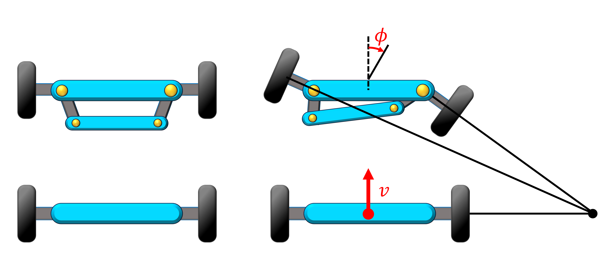

# Ackermann kinematic model

Autoware now supports control inputs for vehicles based on an Ackermann kinematic model.  
This section introduces you a brief concept of Ackermann kinematic model and explains how Autoware controls it.

- If your vehicle does not suit the Ackermann kinematic model, you have to modified the control commands. [Another document gives you an example how to convert your Ackermann kinematic model control inputs into a differential drive model.](https://autowarefoundation.github.io/autoware-documentation/main/how-to-guides/integrating-autoware/creating-vehicle-interface-package/customizing-for-differential-drive-model/)

## Geometry

The basic style of Ackermann kinematic model has four wheels with an Ackermann link on the front, and it is powered by the rear wheels.  
The key point of Ackermann kinematic model is that the axes of all wheels intersect at a same point, which means all wheels will trace a circular trajectory with a different radii but a common center point (See the figure below).  
Therefore, this model has a great advantage that it minimizes the slippage of the wheels, and prevent tires to get worn soon.

In general, Ackermann kinematic model accepts the longitudinal speed $v$ and the steering angle $\phi$ as inputs.
In autoware, $\phi$ is positive if it is steered counter clockwise, so the steering angle in the figure below is actually negative.

<figure markdown>
  { align=center }
  <figcaption>
    The basic style of an Ackermann kinematic model. The left figure shows a vehicle facing straight forward, while the right figure shows a vehicle steering to the right.
  </figcaption>
</figure>

### Control

Autoware publishes a ROS 2 topic named `control_cmd` from several types of publishers.  
A `control_cmd` topic is a [`AckermannControlCommand`](https://gitlab.com/autowarefoundation/autoware.auto/autoware_auto_msgs/-/blob/master/autoware_auto_control_msgs/msg/AckermannControlCommand.idl) type message that contains

```bash title="AckermannControlCommand"
  builtin_interfaces/Time stamp
  autoware_auto_control_msgs/AckermannLateralCommand lateral
  autoware_auto_control_msgs/LongitudinalCommand longitudinal
```

where,

```bash title="AckermannLateralCommand"
  builtin_interfaces/Time stamp
  float32 steering_tire_angle
  float32 steering_tire_rotation_rate
```

```bash title="LongitudinalCommand"
  builtin_interfaces/Time stamp
  float32 speed
  float32 accelaration
  float32 jerk
```

See the [AckermannLateralCommand.idl](https://gitlab.com/autowarefoundation/autoware.auto/autoware_auto_msgs/-/blob/master/autoware_auto_control_msgs/msg/AckermannLateralCommand.idl) and [LongitudinalCommand.idl](https://gitlab.com/autowarefoundation/autoware.auto/autoware_auto_msgs/-/blob/master/autoware_auto_control_msgs/msg/LongitudinalCommand.idl) for details.

The vehicle interface should realize these control commands through your vehicle's control device.

Moreover, Autoware also provides brake commands, light commands, and more (see [vehicle interface design](https://autowarefoundation.github.io/autoware-documentation/main/design/autoware-interfaces/components/vehicle-interface/)), so the vehicle interface module should be applicable to these commands as long as there are devices available to handle them.
