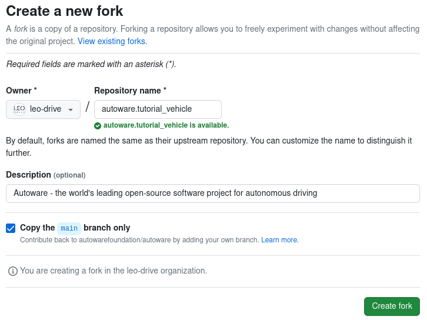

# Creating Autoware repositories

## What is Meta-repository?

A meta-repository is a repository that manages multiple repositories, and [Autoware](https://github.com/autowarefoundation/autoware) is one of them.
It serves as a centralized control point for referencing, configuring, and versioning other repositories.

By using Ansible and VCS, you can automatically set up your Autoware.
`autoware.repos` file manages the configuration of multiple repositories.

Note:
[VCS](https://github.com/dirk-thomas/vcstool) stands for Version Control System,
such as Git or Subversion.

## How to create and customize your autoware meta-repository

### 1. Create autoware meta-repository

If you want to integrate Autoware into your vehicle, the first step is to create an Autoware meta-repository.

One easy way is to fork autoware repository and clone it.
(For how to fork a repository, refer to [GitHub Docs](https://docs.github.com/en/get-started/quickstart/fork-a-repo))

- In order to do that,
  please go to the [autoware](https://github.com/autowarefoundation/autoware) repository
  and click the fork button.
  For example,
  we will integrate `tutorial_vehicle` for these guidelines
  (If you set up multiple types of vehicles,
  adding a suffix like `autoware.vehicle_A` or `autoware.vehicle_B` is recommended),
  so our forking should be like this:



Then click "Create fork" button to continue. After that, we can clone our fork repository on our local system.

```bash
git clone https://github.com/YOUR_NAME/autoware.git
```

For example, it should be for our documentation:

```bash
git clone https://github.com/leo-drive/autoware.tutorial_vehicle.git
```

#### 1.1 Create vehicle individual repositories

For integrating autoware on your own individual vehicles, you need fork and modify the following repositories as well:

- [sample_sensor_kit](https://github.com/autowarefoundation/sample_sensor_kit_launch): This repository will be used for sensing launch files, their pipelines-organizations and sensor descriptions.
  Please fork and rename as autoware meta-repository. At this point, our forked repository name will be `tutorial_vehicle_sensor_kit`.
- [sample_vehicle_launch](https://github.com/autowarefoundation/sample_vehicle_launch): This repository will be used for vehicle launch files, vehicle_descriptions and vehicle_model.
  Please fork and rename this repository as well. At this point, our forked repository name will be `tutorial_vehicle_launch`.
- [autoware_individual_params](https://github.com/autowarefoundation/autoware_individual_params): This repository stores parameters that change depending on each vehicle (i.e. sensor calibrations). Please fork
  and rename this repository as well, our forked repository name will be `tutorial_vehicle_individual_params`.
- [autoware_launch](https://github.com/autowarefoundation/autoware_launch): This contains node configurations and their parameters for Autoware. Please fork
  and rename this repository as previous forked repositories, our forked repository name will be `autoware_launch.tutorial_vehicle`.

### 2. Customize your autoware.repos for your environment

You need to customize `autoware.repos` for your own vehicle's Autoware.
The all autoware repos (except calibration and simulator repos)
information is included in this file.

Now we can add forked individual repositories to `autoware.repos` file.
So, if we use vcs with importing (vcs import < autoware.repos) or pulling (vcs pull src),
then these operations occur on forked repos.

#### 2.1 Adding individual repos to autoware.repos

After the forking of all repositories, we can start adding these repos to autoware.repos file.
In order to do that, you should open autoware.repos via any text editor.
You need to update `sample_sensor_kit_launch`,
`sample_vehicle_launch`,
`autoware_individual_params` and `autoware launch` with your own individual repos.
In example at this tutorial,
the necessary changes for our forked `tutorial_vehicle` repos should be like this:

- Sensor Kit:

  ```diff
  - sensor_kit/sample_sensor_kit_launch:
  -   type: git
  -   url: https://github.com/autowarefoundation/sample_sensor_kit_launch.git
  -   version: main
  + sensor_kit/tutorial_vehicle_sensor_kit:
  +   type: git
  +   url: https://github.com/leo-drive/tutorial_vehicle_sensor_kit.git
  +   version: main
  ```

- Vehicle Launch:

  ```diff
  - vehicle/sample_vehicle_launch:
  -   type: git
  -   url: https://github.com/autowarefoundation/sample_vehicle_launch.git
  -   version: main
  + vehicle/tutorial_vehicle_launch:
  +   type: git
  +   url: https://github.com/leo-drive/tutorial_vehicle_launch.git
  +   version: main
  ```

- Individual Params:

  ```diff
  - param/autoware_individual_params:
  -   type: git
  -   url: https://github.com/autowarefoundation/autoware_individual_params.git
  -   version: main
  + param/tutorial_vehicle_individual_params:
  +   type: git
  +   url: https://github.com/leo-drive/tutorial_vehicle_individual_params.git
  +   version: main
  ```

- Autoware Launch:

  ```diff
  - launcher/autoware_launch:
  -   type: git
  -   url: https://github.com/autowarefoundation/autoware_launch.git
  -   version: main
  + launcher/autoware_launch.tutorial_vehicle:
  +   type: git
  +   url: https://github.com/leo-drive/autoware_launch.tutorial_vehicle.git
  +   version: main
  ```

After that, we are ready to use `vcs import < autoware.repos`.
This commands imports our prepared repositories right now.

Please refer to the following documentation link for instructions on how to create and customize each `vehicle_interface`:

- [creating-vehicle-and-sensor-description](https://autowarefoundation.github.io/autoware-documentation/main/how-to-guides/integrating-autoware/creating-vehicle-and-sensor-description/creating-vehicle-and-sensor-description)
- [creating-vehicle-interface-package](https://autowarefoundation.github.io/autoware-documentation/main/how-to-guides/integrating-autoware/creating-vehicle-interface-package/creating-a-vehicle-interface-for-an-ackermann-kinematic-model/)
- [customizing-for-differential-drive-model](https://autowarefoundation.github.io/autoware-documentation/main/how-to-guides/integrating-autoware/creating-vehicle-interface-package/customizing-for-differential-drive-model/)

Please remember to add all your custom packages, such as interfaces and descriptions, to your `autoware.repos` to ensure that your packages are properly included and managed within the Autoware repository.
