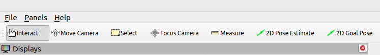
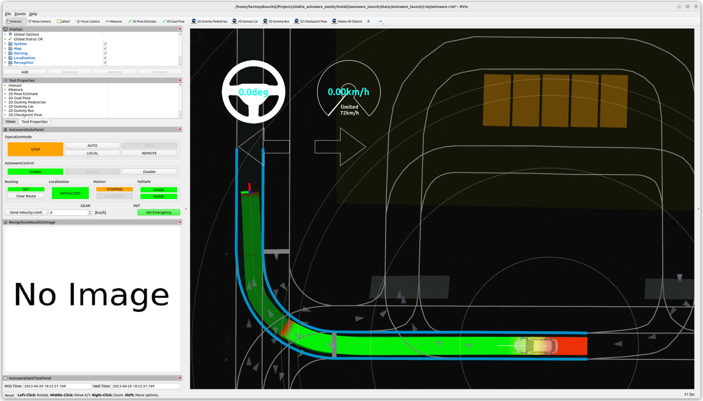
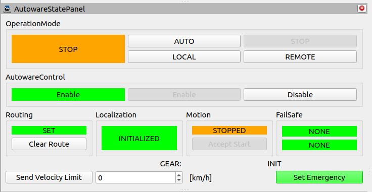
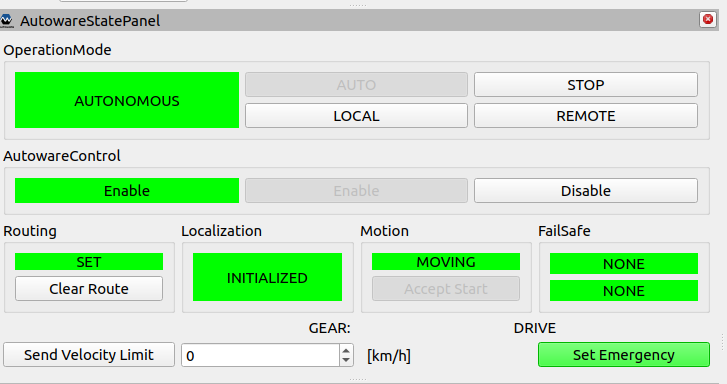

# Launch Autoware

!!! warning

    Under Construction

This section explains how to run your vehicle with Autoware.

## Install Autoware

Follow the [installation steps of Autoware](../../../installation/).

## Launch Autoware

Launch Autoware with the following command:

```bash
ros2 launch autoware_launch autoware.launch.xml vehicle_model:=YOUR_VEHICLE sensor_kit:=YOUR_SENSOR_KIT map_path:=/PATH/TO/YOUR/MAP
```

It is possible to specify which components to launch using command-line arguments.
For example, if you don't need to launch perception, planning, and control for localization debug, you can launch the following:

```bash
ros2 launch autoware_launch autoware.launch.xml vehicle_model:=YOUR_VEHICLE sensor_kit:=YOUR_SENSOR_KIT map_path:=/PATH/TO/YOUR/MAP \
    launch_perception:=false \
    launch_planning:=false \
    launch_control:=false
```

The basic command-line options are documented in [autoware.launch.xml](https://github.com/autowarefoundation/autoware_launch/blob/main/autoware_launch/launch/autoware.launch.xml).

There are options available to switch between different methods for some component.
For example, by specifying `localization_mode` or `perception_mode`, you can switch localization and perception methods, respectively.
These options allow you to choose the desired algorithms or sensor configurations for the respective functionalities.

For options on eagleye component, please refer to the sub-pages.

- [localization-mode](localization-mode/index.md)
- [perception-mode](perception.md)

## Set initial pose

If GNSS is available, Autoware automatically initializes the vehicle's pose.

If not or if the automatic initialization returns an incorrect position, you need to set the initial pose using the RViz GUI.

1. Click the 2D Pose estimate button in the toolbar, or hit the P key

   

2. In the 3D View pane, click and hold the left mouse button, and then drag to set the direction for the initial pose.

## Set goal pose

Set a goal pose for the ego vehicle.

1. Click the 2D Nav Goal button in the toolbar, or hit the G key

   

2. In the 3D View pane, click and hold the left mouse button, and then drag to set the direction for the goal pose.
   If successful, you will see the calculated planning path on RViz.

   {width="800"}

## Engage

In your terminal, execute the following command.

```bash
source ~/autoware.YOURS/install/setup.bash
ros2 topic pub /autoware.YOURS/engage autoware_auto_vehicle_msgs/msg/Engage "engage: true" -1
```

You can also engage via RViz with "AutowareStatePanel".
The panel can be found in `Panels > Add New Panel > tier4_state_rviz_plugin > AutowareStatePanel`.

Once the route is computed, the "AUTO" button becomes active. Pressing the AUTO button engages the autonomous driving mode.



Now the vehicle should drive along the calculated path!

During the autonomous driving, the StatePanel appears as shown in the image below. Pressing the "STOP" button allows you to stop the vehicle.


