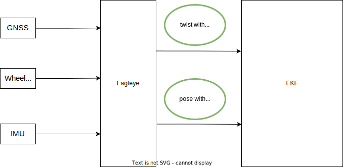

# Using Eagleye with Autoware

This page will show you how to set up [Eagleye](https://github.com/MapIV/eagleye) in order to use it with Autoware.
For the details of the integration proposal, please refer to [this](https://github.com/orgs/autowarefoundation/discussions/3257) Discussion.

## What is Eagleye?

Eagleye is an open-source GNSS/IMU-based localizer initially developed by [MAP IV. Inc](https://map4.jp/). It provides a cost-effective alternative to LiDAR and point cloud-based localization by using low-cost GNSS and IMU sensors to provide vehicle position, orientation, and altitude information. 
The users can choose between LiDAR and point cloud-based localization stacks or GNSS/IMU-based Eagleye localizer, depending on their specific needs and operating environment.

### Dependencies

The below packages are automatically installed during the setup of Autoware as they are listed in [autoware.repos](https://github.com/autowarefoundation/autoware/blob/main/autoware.repos).

1. [Eagleye](https://github.com/MapIV/eagleye.git) (autoware-main branch)
2. [RTKLIB ROS Bridge](https://github.com/MapIV/rtklib_ros_bridge.git) (ros2-v0.1.0 branch)
3. [LLH Converter](https://github.com/MapIV/llh_converter.git) (ros2 branch)


## Architecture

Eagleye can be utilized in the Autoware localization stack in two ways:

1. Feed only twist into the EKF localizer.

   

2. Feed both twist and pose from Eagleye into the EKF localizer (twist can also be used with regular `gyro_odometry`).

   


**Note: RTK positioning is required when using Eagleye as the pose estimator.** 
On the other hand, it is not mandatory when using it as the twist estimator.

## Requirements

Eagleye requires GNSS, IMU and vehicle speed as inputs.

### IMU topic

`sensor_msgs/msg/Imu` is supported for Eagleye IMU input.

### Vehicle speed topic

`geometry_msgs/msg/TwistStamped` and `geometry_msgs/msg/TwistWithCovarianceStamped` are supported for the input vehicle speed.

### GNSS topic

Eagleye requires latitude/longitude height and doppler velocity generated by the GNSS receiver.
Your GNSS ROS driver must publish the following messages:

- `sensor_msgs/msg/NavSatFix`: This message contains latitude, longitude, and height information.
- `geometry_msgs/msg/TwistWithCovarianceStamped`: This message contains gnss doppler velocity information.

Eagleye has been tested with the following example GNSS ROS drivers: ublox_gps and septentrio_gnss_driver. The settings needed for each of these drivers are as follows:

| GNSS ROS drivers                                                                              | modification                                                                                                                                                                                        |
|-----------------------------------------------------------------------------------------------|-----------------------------------------------------------------------------------------------------------------------------------------------------------------------------------------------------|
| [ublox_gps](https://github.com/KumarRobotics/ublox/tree/ros2/ublox_gps)                       | It publishes `sensor_msgs/msg/NavSatFix` and `geometry_msgs/msg/TwistWithCovarianceStamped` required by Eagleye with default settings. Therefore, no additional settings are required. |
| [septentrio_gnss_driver](https://github.com/septentrio-gnss/septentrio_gnss_driver/tree/ros2) | Set `publish.navsatfix` and `publish.twist` in the config file [`gnss.yaml`](https://github.com/septentrio-gnss/septentrio_gnss_driver/blob/ros2/config/gnss.yaml#L90) to `true`                    |

## Parameter Modifications for Integration into Your Vehicle


### topic name & topic type

The users must correctly specify input topics for GNSS latitude, longitude, and height , GNSS doppler speed , IMU , and vehicle speed in the [`eagleye_config.yaml`](https://github.com/MapIV/autoware_launch/blob/3f04a9dd7bc4a4c49d4ec790e3f6b9958ab822da/autoware_launch/config/localization/eagleye_config.param.yaml#L7-L16).

```yaml
# Topic
twist:
  twist_type: 1 # TwistStamped : 0, TwistWithCovarianceStamped: 1
  twist_topic: /sensing/vehicle_velocity_converter/twist_with_covariance
imu_topic: /sensing/imu/tamagawa/imu_raw
gnss:
  velocity_source_type: 2 # rtklib_msgs/RtklibNav: 0, nmea_msgs/Sentence: 1, ublox_msgs/NavPVT: 2, geometry_msgs/TwistWithCovarianceStamped: 3
  velocity_source_topic: /sensing/gnss/ublox/navpvt
  llh_source_type: 2 # rtklib_msgs/RtklibNav: 0, nmea_msgs/Sentence: 1, sensor_msgs/NavSatFix: 2
  llh_source_topic: /sensing/gnss/ublox/nav_sat_fix
```

### sensor frequency 
Also, the frequency of GNSS and IMU must be set in [`eagleye_config.yaml`](https://github.com/MapIV/autoware_launch/blob/3f04a9dd7bc4a4c49d4ec790e3f6b9958ab822da/autoware_launch/config/localization/eagleye_config.param.yaml#L36)

```yaml
common:
  imu_rate: 50
  gnss_rate: 5
```

### fix to pose

これは変更する必要があるの?

Additionally, the parameters for converting `sensor_msgs/msg/NavSatFix` to `geometry_msgs/msg/PoseWithCovarianceStamped` is listed in [`fix2pose.yaml`](https://github.com/MapIV/eagleye/blob/autoware-main/eagleye_util/fix2pose/launch/fix2pose.xml).

### Other parameters

The other parameters are described [here](https://github.com/MapIV/eagleye/tree/autoware-main/eagleye_rt/config).
Basically, these do not need to be changed .

## Execution

You need to change Autoware's launch files to use Eagleye.

### Modifying Autoware launch files

Please refer to `map4_localization_launch` in the `autoware.universe` package and `map4_localization_component.launch.xml` in `autoware_launch` package for information on how to modify the localization launch.

Eagleye has a function for position estimation and twist estimation, namely `pose_estimator` and `twist_estimator`, respectively.

| localization launch                                               | twist estimator                     | pose estimator                      |
|-------------------------------------------------------------------|-------------------------------------|-------------------------------------|
| `tier4_localization_launch`                                       | `gyro_odometry`                     | `ndt_scan_matcher`                  |
| `map4_localization_launch/eagleye_twist_localization_launch`      | `eagleye_rt`(gyro/odom/gnss fusion) | `ndt_scan_matcher`                  |
| `map4_localization_launch/eagleye_pose_twist_localization_launch` | `eagleye_rt`(gyro/odom/gnss fusion) | `eagleye_rt`(gyro/odom/gnss fusion) |


twist_estimatorの変更のしかたが書いてない。

In Autoware, you can set the pose estimator to GNSS by setting `pose_estimator_mode:=gnss` in `map4_localization_component.launch.xml` in `autoware_launch` package.
Note that the output position might not appear to be in the point cloud maps if you are using maps that are not properly georeferenced.
In the case of a single GNSS antenna, initial position estimation (dynamic initialization) can take several seconds to complete after starting to run in an environment where GNSS positioning is available.

Alternatively, the twist estimator can be set to Eagleye and the pose estimator to NDT by specifying `pose_estimator_mode:=lidar` in the same launch file.
Unlike Eagleye position estimation, Eagleye twist estimation first outputs uncorrected raw values when activated, and then outputs corrected twists as soon as static initialization is complete.

### Execution command

Enable Eagleye in Autoware by switching the localization module in autoware.launch.xml and the `pose_estimator_mode` parameter in `map4_localization_component.launch.xml` in `autoware.launch.xml`.

When using Eagleye, comment out `tier4_localization_component.launch.xml` and start `map4_localization_component.launch.xml` in `autoware.launch.xml`.

```xml
  <!-- Localization -->
  <group if="$(var launch_localization)">
    <!-- <include file="$(find-pkg-share autoware_launch)/launch/components/tier4_localization_component.launch.xml"/> -->
    <include file="$(find-pkg-share autoware_launch)/launch/components/map4_localization_component.launch.xml"/>
  </group>
```

## Notes on initialization

Eagleye requires an initialization process for proper operation. **Without initialization, the output for twist will be in the raw value, and the pose data will not be available.**

### 1. Static Initialization
The first step is static initialization, which involves allowing the Eagleye to remain stationary for approximately 5 seconds after startup to estimate the yaw-rate offset.

### 2. Dynamic initialization
The next step is dynamic initialization, which involves running the Eagleye in a straight line for approximately 30 seconds. This process estimates the scale factor of wheel speed and azimuth angle. 


Once dynamic initialization is complete, the Eagleye will be able to provide corrected twist and pose data.
