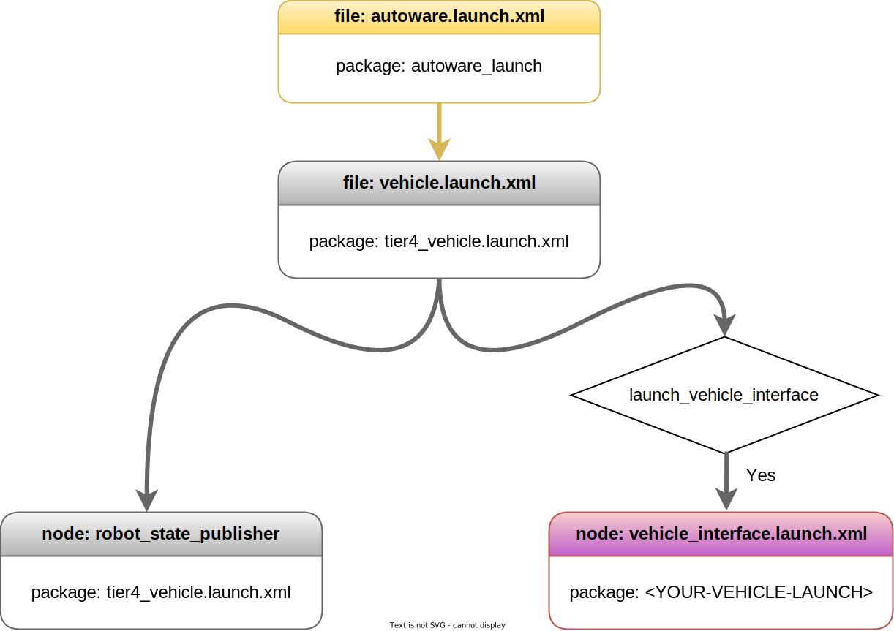

# Vehicle Launch Files

## Overview

The Autoware vehicle stacks begin launching with autoware_launch.xml as mentioned on the
[Launch Autoware](../index.md) page,
and the tier4_vehicle.launch.xml is called in this context. The following diagram describes some of
the Autoware vehicle launch file flow within the `autoware_launch` and `autoware.universe` packages.

<figure markdown>
  { align=center width=720}
  <figcaption>
    Autoware vehicle launch flow diagram
  </figcaption>
</figure>

!!! note

    The Autoware project is a large project.
    Therefore, as we manage the Autoware project, we utilize specific
    arguments in the launch files.
    ROS 2 offers an argument-overriding feature for these launch files.
    Please refer to [the official ROS 2 launch documentation](https://docs.ros.org/en/humble/Tutorials/Intermediate/Launch/Using-ROS2-Launch-For-Large-Projects.html#parameter-overrides) for further information.
    For instance,
    if we define an argument at the top-level launch,
    it will override the value on lower-level launches.

We don't have many modification options here, but you can disable vehicle_interface launching.
For example,
if you want
to run robot_state_publisher but not `vehicle_interface` you can run autoware with the following command line arguments:

```bash
ros2 launch autoware_launch autoware.launch.xml ... launch_vehicle_interface:=false ...
```

Or you can change it on your `autoware.launch.xml` launch file:

```diff
- <arg name="launch_vehicle_interface" default="true" description="launch vehicle interface"/>
+ <arg name="launch_vehicle_interface" default="false" description="launch vehicle interface"/>
```
