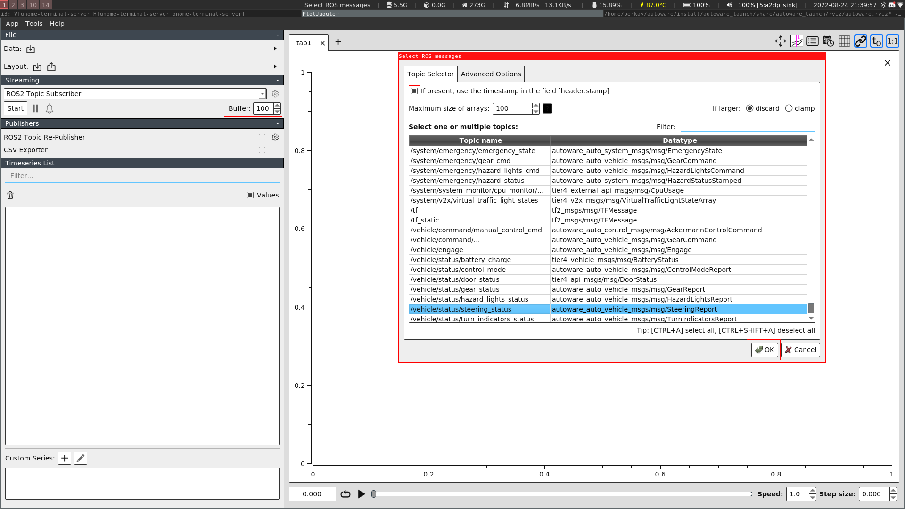
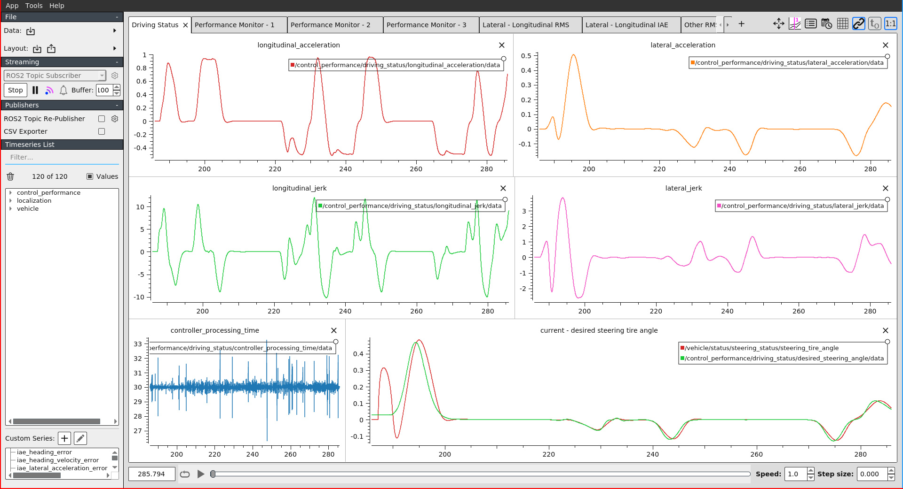
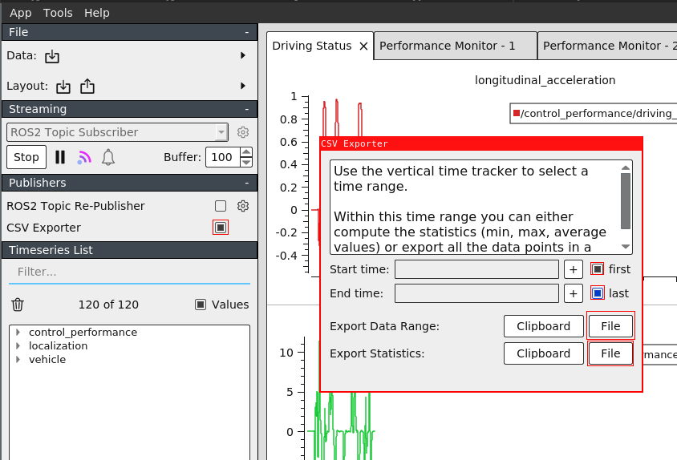
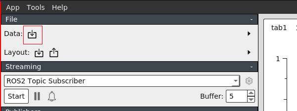
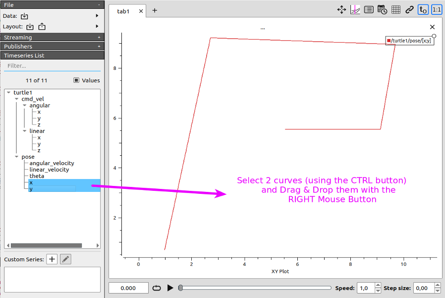

# Evaluating the controller performance

This page shows how to use `control_performance_analysis` package to evaluate the controllers.

`control_performance_analysis` is the package to analyze the tracking performance of a control module
and monitor the driving status of the vehicle.

If you need more detailed information about package, refer to the [control_performance_analysis](https://github.com/autowarefoundation/autoware_universe/tree/main/control/control_performance_analysis).

## How to use

### Before Driving

#### 1. Firstly you need to launch Autoware. You can also use this tool with real vehicle driving

#### 2. Initialize the vehicle and send goal position to create route

- If you have any problem with launching Autoware, please see the [tutorials](../../../tutorials/index.md) page.

#### 3. Launch the control_performance_analysis package

```bash
ros2 launch control_performance_analysis control_performance_analysis.launch.xml
```

- After this command, you should be able to see the driving monitor and error variables in topics.

#### 4. Run the PlotJuggler in sourced terminal

```bash
source ~/autoware/install/setup.bash
```

```bash
ros2 run plotjuggler plotjuggler
```

- If you do not have PlotJuggler in your computer, please refer [here](https://github.com/facontidavide/PlotJuggler#installation) for installation guideline.

#### 5. Increase the buffer size (maximum is 100), and import the layout from `/autoware_universe/control/control_performance_analysis/config/controller_monitor.xml`

- After import the layout, please specify the topics that are listed below.

> - /localization/kinematic_state
> - /vehicle/status/steering_status
> - /control_performance/driving_status
> - /control_performance/performance_vars

- Please mark the `If present, use the timestamp in the field [header.stamp]` box, then select the OK.



#### 6. Now, you can start to driving. You should see all the performance and driving variables in PlotJuggler



### After Driving

#### 1. You can export the statistical output and all data to compare and later usage

- With statistical data, you can export the all statistical values like (min, max, average) to compare the controllers.



- You can also export all data to later use. To investigate them again, after launch PlotJuggler, import the `.cvs` file from data section.



### Tips

- You can plot the vehicle position. Select the two curve (keeping CTRL key pressed) and Drag & Drop them using the **RIGHT Mouse button**. Please visit the `Help -> Cheatsheet` in PlotJuggler to see more tips about it.



- If you see too much noised curve in plots, you can adjust the `odom_interval` and `low_pass_filter_gain` from [here](https://github.com/autowarefoundation/autoware_universe/blob/main/control/control_performance_analysis/config/control_performance_analysis.param.yaml) to avoid noised data.
