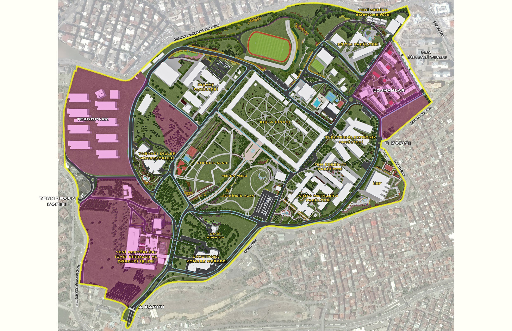

# Sample tuning for campus environment

## Introduction

This section will guide you on how to fine-tune Autoware's localization, perception,
and planning stacks for the Yıldız Technical University (YTU) campus environment.
This document serves as your roadmap for optimizing the performance of
Autoware within the cutting-edge capabilities of a sample university campus environment.
Through meticulous parameter adjustments, our aim is to ensure that your
autonomous systems operate seamlessly and efficiently in similar complex real-world scenarios.

## Yıldız Technical University Campus Environment

[Yıldız Technical University (YTU)](https://yildiz.edu.tr/en) is located in Istanbul, Turkey,
and it encompasses multiple campuses. One of these campuses is the
Davutpaşa Campus, where we operate autonomous vehicles. Here is some
general information about the YTU Davutpaşa Campus:

1. **Slopes and Terrains**

   YTU Davutpaşa Campus has varied topography.
   Some areas may be flat, while others may have gentle or steep slopes.
   These features can influence accessibility and landscaping choices.

2. **Greenery and Trees**

   YTU Davutpaşa Campus is typically landscaped with a variety of plants and trees. They provide aesthetic
   appeal, shade, and contribute to the overall environment. There may be designated green spaces,
   gardens, and courtyards.

3. **Building structures**

   The Davutpaşa Campus features a diverse range of buildings, ranging in size from small-scale structures
   to more substantial edifices. These buildings will be utilized for NDT localization.

<figure markdown>
  { align=center }
  <figcaption>
    Yıldız Technical University (YTU) campus map.
  </figcaption>
</figure>

## Yıldız Technical University Campus Map

### Yıldız Technical University Campus Pointcloud Map

Utilizing the LIO-SAM mapping package, we have effectively created a point cloud map of Yıldız
Technical University's Davutpaşa campus. This real-time lidar-inertial odometry system has empowered
us to achieve precision in this unique campus environment. For detailed information on how we
constructed the point cloud map at YTU Davutpaşa, please refer to the
[LIO-SAM page](../../creating-maps/open-source-slam/lio-sam). Additionally,
we have converted the output map into MGRS format.

<figure markdown>
  { align=center }
  <figcaption>
    Yıldız Technical University (YTU) campus pointcloud map.
  </figcaption>
</figure>

### Yıldız Technical University Campus Lanelet2 Map

We have generated a Lanelet2 HD map, incorporating regulatory elements like crosswalks,
speed bumps, stop lines etc., tailored for the YTU campus environment. For more detailed
information on the Lanelet2 map creation process, please refer to the [`Creating Maps` page](../../creating-maps).

<figure markdown>
  { align=center }
  <figcaption>
    Yıldız Technical University (YTU) campus lanelet2 map.
  </figcaption>
</figure>
