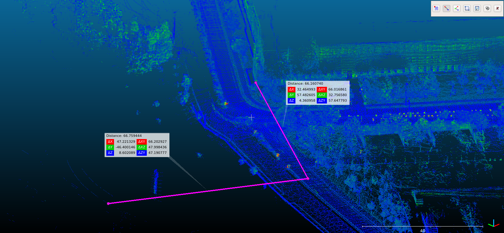
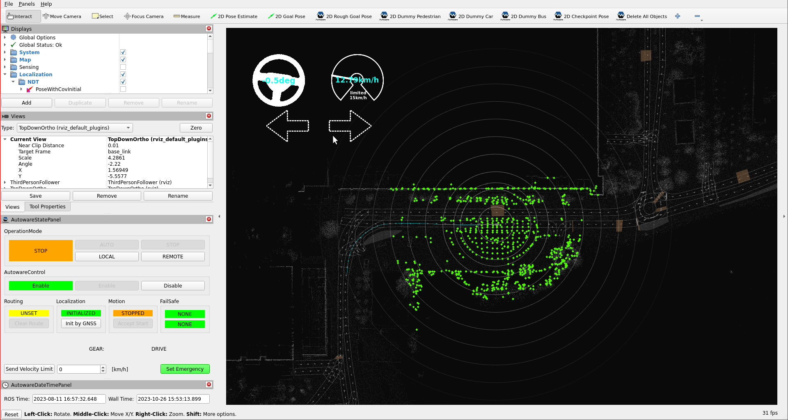
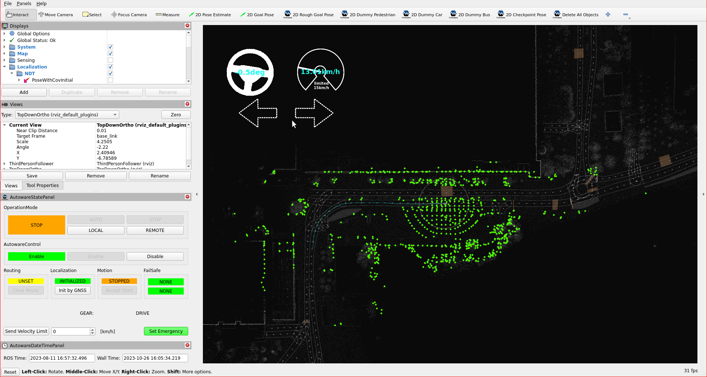
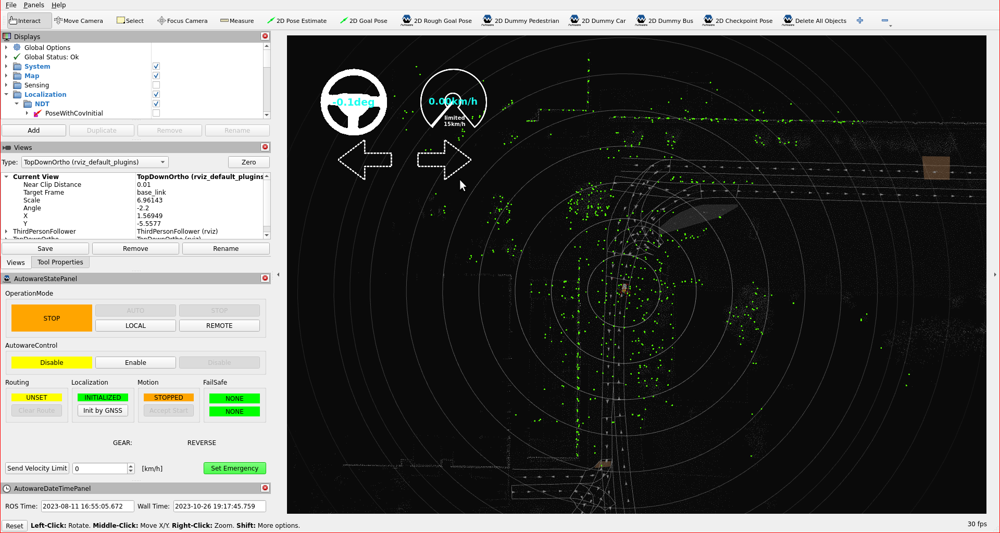
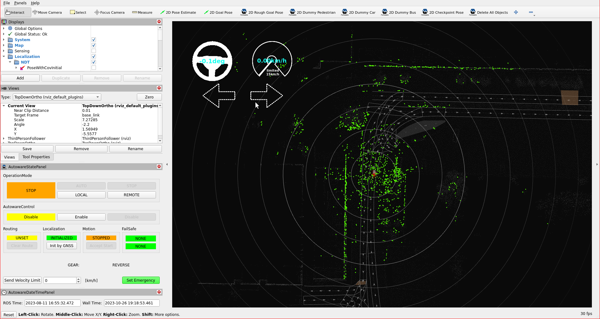

# Tuning localization

## Introduction

In this section,
our focus will be on refining localization accuracy within the YTU Campus environment through updates to localization parameters and methods.
Our approach involves
utilizing NDT as the pose input source and the Gyro Odometer as the twist input source.
These adjustments play a pivotal role
in achieving a heightened level of precision and reliability in our localization processes,
ensuring optimal performance in the specific conditions of the YTU campus.

## NDT parameter tuning

### Crop-box filter for localization input

- In our campus environment, certain areas can be challenging for NDT localization,
  particularly those near cliffs or wooded areas that are far from buildings.

<figure markdown>
  { align=center }
  <figcaption>
    Yıldız Technical University (YTU) campus challenging areas for NDT localization.
  </figcaption>
</figure>

- In these areas,
  the default NDT range
  (which involves cropping the NDT input point cloud at the localization utility point cloud pipeline)
  may prove insufficient for aligning point clouds.
  The default NDT input point cloud parameters are shown below:

!!! note "The default [crop_box_filter_measurement_range.param.yaml](https://github.com/autowarefoundation/autoware_launch/blob/main/autoware_launch/config/localization/crop_box_filter_measurement_range.param.yaml) file for localization util."

    ```yaml
    /**:
      ros__parameters:
      input_frame: "base_link"
      output_frame: "base_link"
      min_x: -60.0
      max_x: 60.0
      min_y: -60.0
      max_y: 60.0
      min_z: -30.0
      max_z: 50.0
      negative: False
    ```

- The green points (topic name: `/localization/pose_estimator/points_aligned`)
  represent the NDT localization aligned points on the map in the image below.
  The default range is 60 meters, meaning points beyond this distance cannot be utilized.

<figure markdown>
  { align=center }
  <figcaption>
   NDT aligned points within a 60-meter crop box range
  </figcaption>
</figure>

- If we wish to increase our NDT input point cloud range,
  we can make the following changes in the `crop_box_filter_measurement_range.param.yaml` file.
  However,
  please bear in mind that since this alteration enlarges the size of the NDT input point cloud,
  it will require additional resources on your processor.

!!! note "[`crop_box_filter_measurement_range.param.yaml`](https://github.com/autowarefoundation/autoware_launch/blob/main/autoware_launch/config/localization/crop_box_filter_measurement_range.param.yaml) parameter file:"

    ```diff
    /**:
      ros__parameters:
        input_frame: "base_link"
        output_frame: "base_link"
    -   min_x: -60.0
    +   min_x: -150.0
    -   max_x: 60.0
    +   max_x: 150.0
    -   min_y: -60.0
    +   min_y: -150.0
    -   max_y: 60.0
    +   max_y: 150.0
        min_z: -30.0
        max_z: 50.0
        negative: False
    ```

<figure markdown>
  { align=center }
  <figcaption>
    NDT aligned points within a 150-meter crop box range
  </figcaption>
</figure>

### Voxel-grid filter for localization input

- Voxel Grid filtering is a technique used in point cloud pre-processing
  to reduce the density of 3D point cloud data while preserving its overall structure.
  This is especially useful in scenarios
  where high-resolution point clouds are computationally expensive
  to process or unnecessary for the task at hand.
  The default voxel size for all three axes in Autoware is 3.0.
  If you have additional computational resources,
  reducing the voxel size can enhance localization accuracy.
  However, please be aware that this will demand more computational power.

!!! note " The default [voxel_grid_filter.param.yaml](https://github.com/autowarefoundation/autoware_launch/blob/main/autoware_launch/config/localization/voxel_grid_filter.param.yaml) file for localization util."

    ```yaml
    /**:
      ros__parameters:
      voxel_size_x: 3.0
      voxel_size_y: 3.0
      voxel_size_z: 3.0
    ```

- The default voxel size for downsampling is 3.0,
  and the resulting aligned points will resemble the image below.

<figure markdown>
  { align=center }
  <figcaption>
    Voxel size 3.0 aligned points (more sparse)
  </figcaption>
</figure>

- We have sufficient computational power available on our tutorial vehicle,
  so we will reduce the voxel size to improve localization accuracy.
  Feel free to experiment with tuning the voxel size for your own computer setup.

!!! note "[voxel_grid_filter.param.yaml](https://github.com/autowarefoundation/autoware_launch/blob/main/autoware_launch/config/localization/voxel_grid_filter.param.yaml) parameter file:"

    ```diff

    /**:
      ros__parameters:
    - voxel_size_x: 3.0
    + voxel_size_x: 1.0
    - voxel_size_y: 3.0
    + voxel_size_y: 1.0
    - voxel_size_z: 3.0
    + voxel_size_z: 1.0
    ```

<figure markdown>
  { align=center }
  <figcaption>
    Voxel size 1.0 aligned points (more dense but it requires computational power)
  </figcaption>
</figure>
