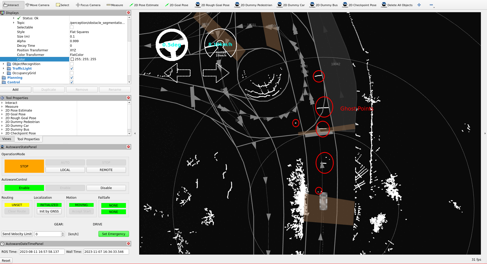
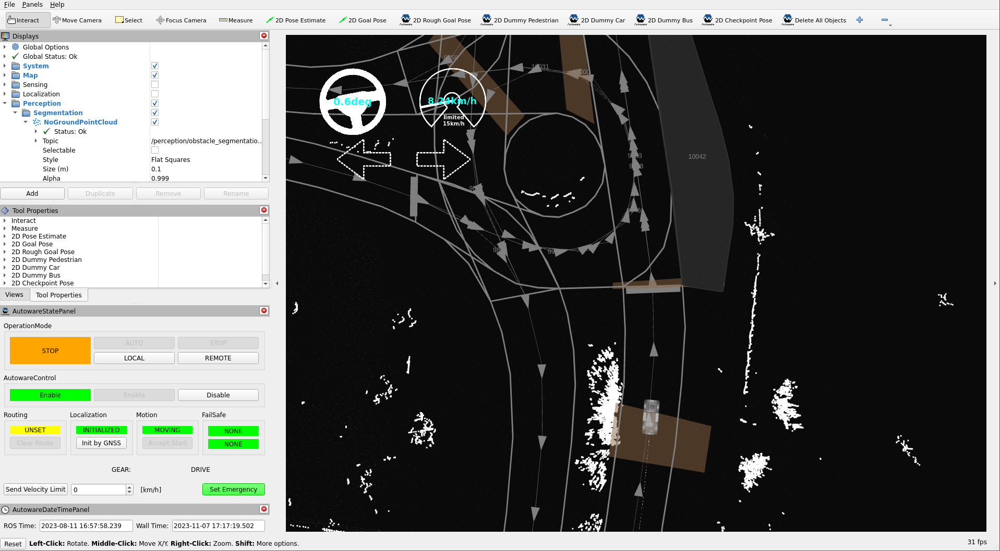
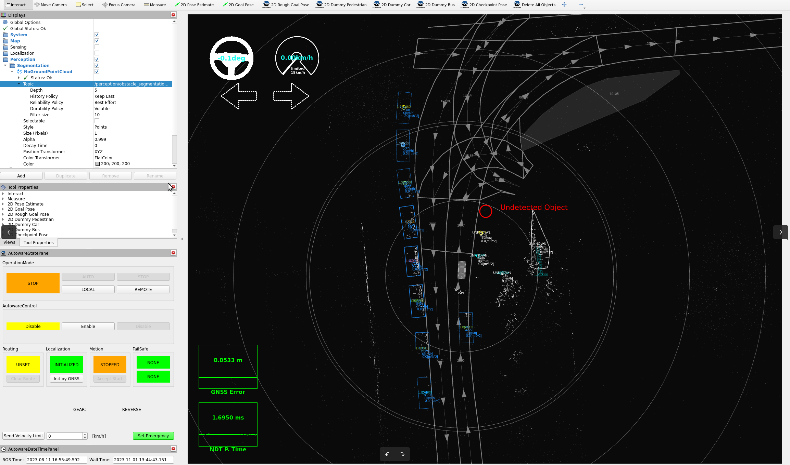
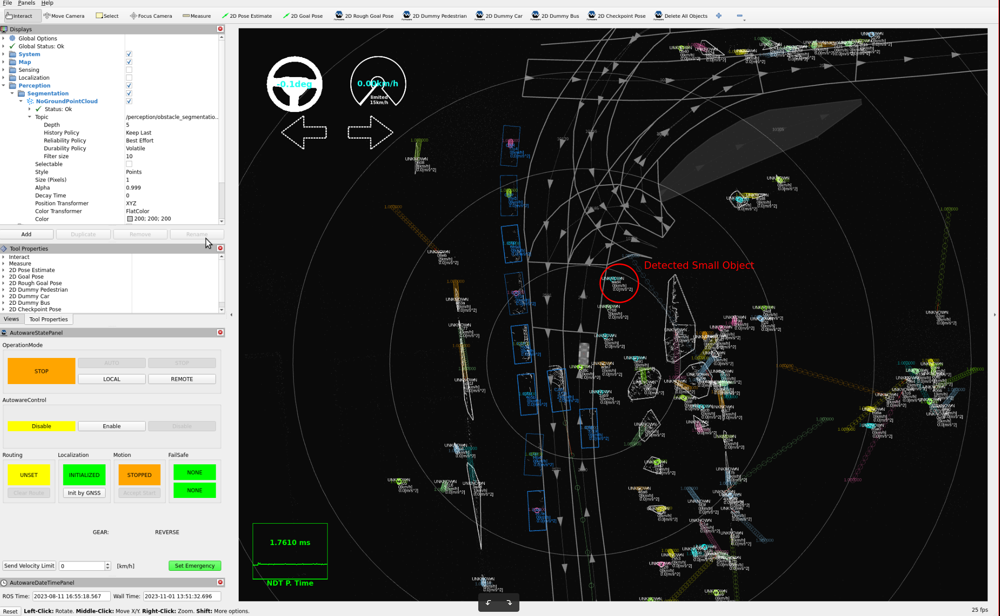

# Tuning perception

## Introduction

In this section, we plan to enhance our perception accuracy within the YTU Campus environment
by updating some parameters and methods.
We will enable camera-lidar
fusion as our chosen perception method. This approach holds the potential to significantly
improve our ability to accurately perceive and understand the surroundings, enabling our vehicles
to navigate more effectively and safely within the campus premises. By fine-tuning these perception
parameters, we aim to advance the capabilities of our systems and further optimize their performance
in this specific environment.

## Perception parameter tuning

### Enabling camera-lidar fusion

- To enable camera-lidar fusion, you need to first calibrate both your camera and lidar.
  Following that, you will need to utilize the `image_info`
  and `rectified_image` topics in order to employ the `tensorrt_yolo` node.
  Once these ROS 2 topics are prepared,
  we can proceed with enabling camera-lidar fusion as our chosen perception method:

!!! note "Enabling camera lidar fusion on [`autoware.launch.xml`](https://github.com/autowarefoundation/autoware_launch/blob/2255356e0164430ed5bc7dd325e3b61e983567a3/autoware_launch/launch/autoware.launch.xml#L42)"

    ```diff
    -  <arg name="perception_mode" default="lidar" description="select perception mode. camera_lidar_radar_fusion, camera_lidar_fusion, lidar_radar_fusion, lidar, radar"/>
    +  <arg name="perception_mode" default="camera_lidar_fusion" description="select perception mode. camera_lidar_radar_fusion, camera_lidar_fusion, lidar_radar_fusion, lidar, radar"/>
    ```

After that,
we need
to run the [TensorRT YOLO node](https://github.com/autowarefoundation/autoware.universe/tree/main/perception/tensorrt_yolo) for our camera topics
if it hasn't been launched on your sensor model.
You can launch the tensorrt_yolo nodes by uncommenting the following lines in the [`camera_lidar_fusion_based_detection.launch.xml`](https://github.com/autowarefoundation/autoware.universe/blob/main/launch/tier4_perception_launch/launch/object_recognition/detection/camera_lidar_fusion_based_detection.launch.xml)
file:

!!! note "Please adjust the following lines in the `camera_lidar_fusion_based_detection.launch.xml` file based on the number of your cameras (image_number)"

    ```xml
    <include file="$(find-pkg-share tensorrt_yolo)/launch/yolo.launch.xml">
      <arg name="image_raw0" value="$(var image_raw0)"/>
      <arg name="image_raw1" value="$(var image_raw1)"/>
      <arg name="image_raw2" value="$(var image_raw2)"/>
    ...
    ```

- Also, you need to update the roi_sync.param.yaml parameter file according to your camera number.
  Firstly,
  please refer to the roi_cluster_fusion documentation for more information about this package.
  Then, you will update your camera offsets.
  For example,
  if you have four cameras for the perception detection pipeline,
  and you haven't measured their timestamps,
  you can set these camera offsets to "0" as the initial value.
  Please be careful with the offset array size; it must be equal to your camera count.

!!! note "[roi_sync.param.yaml](https://github.com/autowarefoundation/autoware_launch/blob/main/autoware_launch/config/perception/object_recognition/detection/image_projection_based_fusion/roi_sync.param.yaml) parameter file:"

    ```diff
    - input_offset_ms: [61.67, 111.67, 45.0, 28.33, 78.33, 95.0] # 6 cameras
    + input_offset_ms: [0.0, 0.0, 0.0, 0.0] # 4 cameras
    ```

- If you have used different namespaces for your camera and ROI topics,
  you will need to add the input topics for camera_info,
  image_raw,
  and rois messages in the `tier4_perception_component.launch.xml` launch file.

!!! note "[`tier4_perception_component.launch.xml`](https://github.com/autowarefoundation/autoware_launch/blob/main/autoware_launch/launch/components/tier4_perception_component.launch.xml) launch file:"

    ```diff
    - <arg name="image_raw0" default="/sensing/camera/camera0/image_rect_color" description="image raw topic name"/>
    + <arg name="image_raw0" default="<YOUR-CAMERA-TOPIC-NAME>" description="image raw topic name"/>
    - <arg name="camera_info0" default="/sensing/camera/camera0/camera_info" description="camera info topic name"/>
    + <arg name="camera_info0" default="<YOUR-CAMERA-INFO-TOPIC-NAME>" description="camera info topic name"/>
    - <arg name="detection_rois0" default="/perception/object_recognition/detection/rois0" description="detection rois output topic name"/>
    + <arg name="detection_rois0" default="<YOUR-ROIS-TOPIC-NAME>" description="detection rois output topic name"/>
    ```

### Tuning ground segmentation

- The ground segmentation package removes the ground points from the input point cloud for the perception pipeline.
  In our campus environment, there are a lot of high slopes and rough roads.
  Therefore, this condition makes it difficult to accurately segment ground and non-ground points.

- For example, when we pass over speed bumps,
  there are a lot of false positives (ghost points) that appear as non-ground points,
  as shown in the image below.

<figure markdown>
  { align=center }
  <figcaption>
    There are some false positive (ghost)
points on the high-slope roads with default configurations.
  </figcaption>
</figure>

- These ghost points affect the motion planner of Autoware,
  causing the vehicle to stop even though there is no obstacle on the road during autonomous driving.
  We will reduce the number of false positive non-ground points
  by fine-tuning the ground segmentation in Autoware.

- There are three different ground segmentation algorithms included in Autoware:
  `ray_ground_filter`, `scan_ground_filter`, and `ransac_ground_filter`.
  The default method is the `scan_ground_filter`.
  Please refer to the [`ground_segmentation` package documentation](https://autowarefoundation.github.io/autoware.universe/main/perception/ground_segmentation/)
  for more information about these methods and their parameter definitions.

- Firstly,
  we will change the `global_slope_max_angle_deg` value from 10 to 30 degrees at [`ground_segmentation.param.yaml`](https://github.com/autowarefoundation/autoware_launch/blob/main/autoware_launch/config/perception/obstacle_segmentation/ground_segmentation/ground_segmentation.param.yaml) parameter file.
  This change will reduce our false positive non-ground points.
  However, be cautious when increasing the threshold,
  as it may lead to an increase in the number of false negatives.

!!! note "[`ground_segmentation.param.yaml`](https://github.com/autowarefoundation/autoware_launch/blob/main/autoware_launch/config/perception/obstacle_segmentation/ground_segmentation/ground_segmentation.param.yaml) parameter file:"

    ```diff
    - global_slope_max_angle_deg: 10.0
    + global_slope_max_angle_deg: 30.0
    ```

- Then we will update the split_height_distance parameter from 0.2 to 0.35 meters.
  This adjustment will help in reducing false positive non-ground points,
  especially on step-like road surfaces or in cases of misaligned multiple lidar configurations.

!!! note "[`ground_segmentation.param.yaml`](https://github.com/autowarefoundation/autoware_launch/blob/main/autoware_launch/config/perception/obstacle_segmentation/ground_segmentation/ground_segmentation.param.yaml) parameter file:"

    ```diff
    - split_height_distance: 0.2
    + split_height_distance: 0.35
    ```

- Now, we will change the non_ground_height_threshold value from 0.2 to 0.3 meters.
  This will help us in reducing false positive non-ground points,
  but it may also decrease the number of true positive non-ground points
  that are below this threshold value.

!!! note "[`ground_segmentation.param.yaml`](https://github.com/autowarefoundation/autoware_launch/blob/main/autoware_launch/config/perception/obstacle_segmentation/ground_segmentation/ground_segmentation.param.yaml) parameter file:"

    ```diff
    - non_ground_height_threshold: 0.2
    + non_ground_height_threshold: 0.3
    ```

- The following image illustrates the results after these fine-tunings with the ground remover package.

<figure markdown>
  { align=center }
  <figcaption>
    After tuning the ground segmentation,
the false positive points will disappear from the same location.
  </figcaption>
</figure>

- You need to update the ground segmenation according to your environment.
  These examples are provided for high slopes and rough road conditions.
  If you have better conditions,
  you can adjust your parameters
  by referring to the [`ground_segmentation` package documentation page](https://autowarefoundation.github.io/autoware.universe/main/perception/ground_segmentation/).

### Tuning euclidean clustering

- The `euclidean_clustering` package applies Euclidean clustering methods
  to cluster points into smaller parts for classifying objects.
  Please refer to [`euclidean_clustering` package documentation](https://github.com/autowarefoundation/autoware.universe/tree/main/perception/euclidean_cluster) for more information.
  This package is used in the detection pipeline of Autoware architecture.
  There are two different euclidean clustering methods included in this package:
  `euclidean_cluster` and `voxel_grid_based_euclidean_cluster`.
  In the default design of Autoware,
  the `voxel_grid_based_euclidean_cluster` method serves as the default Euclidean clustering method.

- In the YTU campus environment, there are many small objects like birds,
  dogs, cats, balls, cones, etc. To detect, track,
  and predict these small objects, we aim to assign clusters to them as small as possible.

- Firstly, we will change our object filter method from lanelet_filter to position_filter
  to detect objects that are outside the lanelet boundaries at the [`tier4_perception_component.launch.xml`](https://github.com/autowarefoundation/autoware_launch/blob/main/autoware_launch/launch/components/tier4_perception_component.launch.xml).

!!! note "[`tier4_perception_component.launch.xml`](https://github.com/autowarefoundation/autoware_launch/blob/main/autoware_launch/launch/components/tier4_perception_component.launch.xml) launch file:"

    ```diff
    - <arg name="detected_objects_filter_method" default="lanelet_filter" description="options: lanelet_filter, position_filter"/>
    + <arg name="detected_objects_filter_method" default="position_filter" description="options: lanelet_filter, position_filter"/>
    ```

- After changing the filter method for objects,
  the output of our perception pipeline looks like the image below:

<figure markdown>
  { align=center }
  <figcaption>
    The default clustering parameters with the object position filter default parameters.
  </figcaption>
</figure>

- Now, we can detect unknown objects that are outside the lanelet map,
  but we still need to update the filter range
  or disable the filter for unknown objects in the [`object_position_filter.param.yaml`](https://github.com/autowarefoundation/autoware_launch/blob/main/autoware_launch/config/perception/object_recognition/detection/object_filter/object_position_filter.param.yaml) file.

!!! note "[`object_position_filter.param.yaml`](https://github.com/autowarefoundation/autoware_launch/blob/main/autoware_launch/config/perception/object_recognition/detection/object_filter/object_position_filter.param.yaml) parameter file:"

    ```diff
        upper_bound_x: 100.0
    -   lower_bound_x: 0.0
    +   lower_bound_x: -100.0
    -   upper_bound_y: 10.0
    +   upper_bound_y: 100.0
    -   lower_bound_y: -10.0
    +   lower_bound_y: -100.0
    ```

- Also, you can simply disable the filter for unknown labeled objects.

!!! note "[`object_position_filter.param.yaml`](https://github.com/autowarefoundation/autoware_launch/blob/main/autoware_launch/config/perception/object_recognition/detection/object_filter/object_position_filter.param.yaml) parameter file:"

    ```diff
    - UNKNOWN : true
    + UNKNOWN : false
    ```

- After that,
  we can update our clustering parameters
  since we can detect all objects regardless of filtering objects with the lanelet2 map.
  As we mentioned earlier, we want to detect small objects.
  Therefore,
  we will decrease the minimum cluster size to 1 in the `voxel_grid_based_euclidean_cluster.param.yaml` file.

!!! note "[`voxel_grid_based_euclidean_cluster.param.yaml`](https://github.com/autowarefoundation/autoware_launch/blob/main/autoware_launch/config/perception/object_recognition/detection/clustering/voxel_grid_based_euclidean_cluster.param.yaml) parameter file:"

    ```diff
    - min_cluster_size: 10
    + min_cluster_size: 1
    ```

- After making these changes, our perception output is shown in the following image:

<figure markdown>
  { align=center }
  <figcaption>
    The minimum cluster size is set to "1" with the unknown object filter disabled.
  </figcaption>
</figure>

If you want to use an object filter after fine-tuning clusters for unknown objects,
you can utilize either the lanelet filter or the position filter for unknown objects.
Please refer to the documentation of the [`detected_object_validation` package page](https://autowarefoundation.github.io/autoware.universe/main/perception/detected_object_validation/) for further information.
