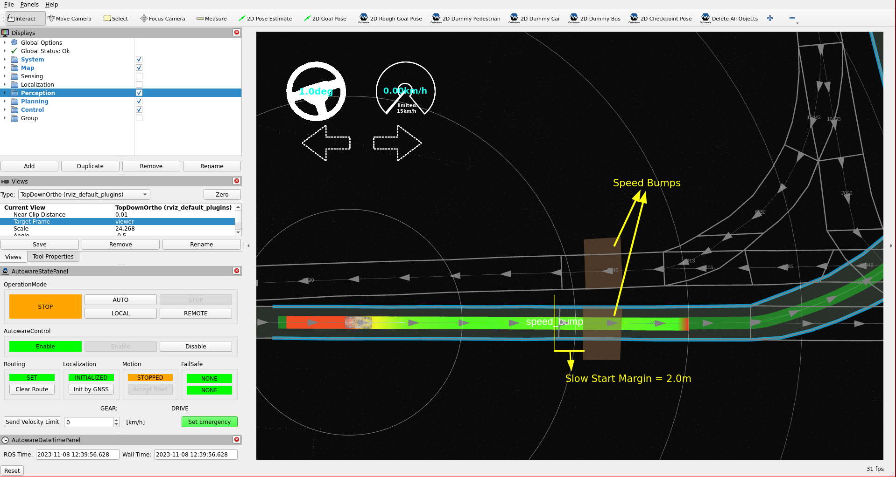
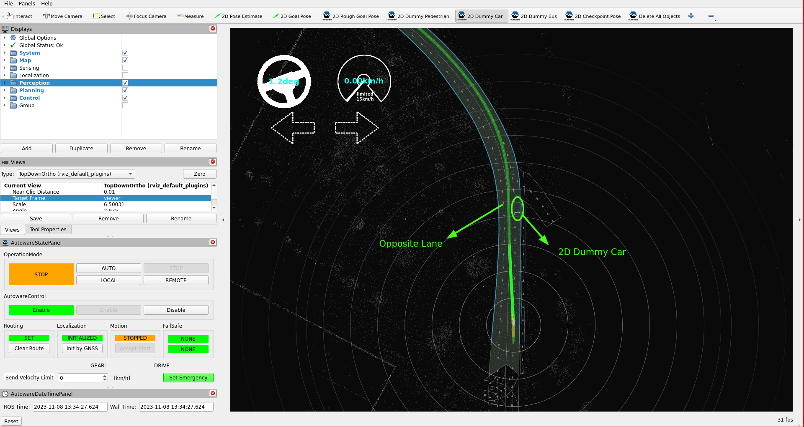
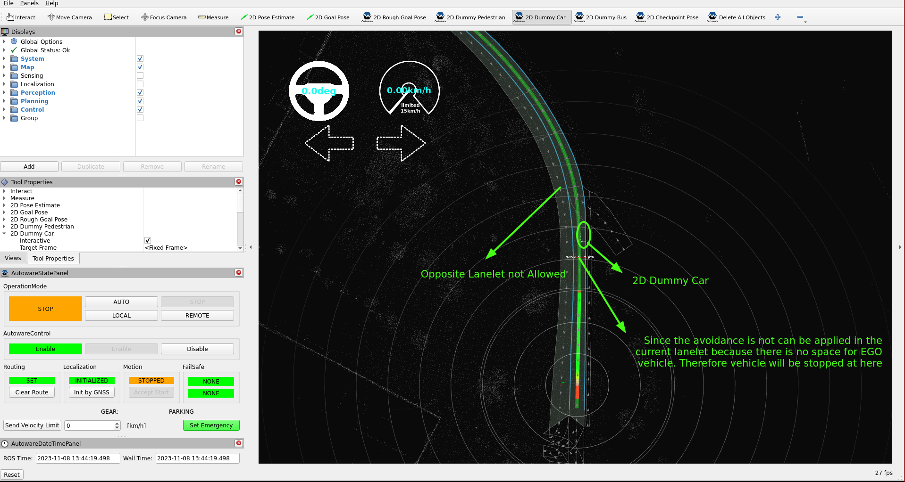
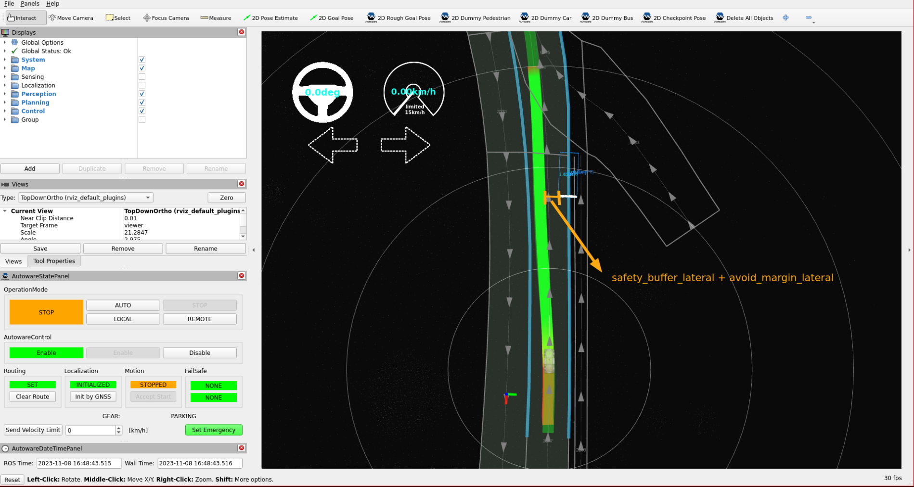
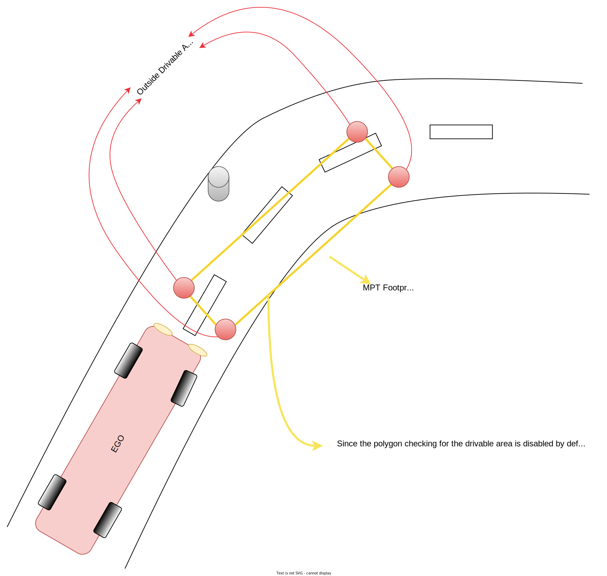
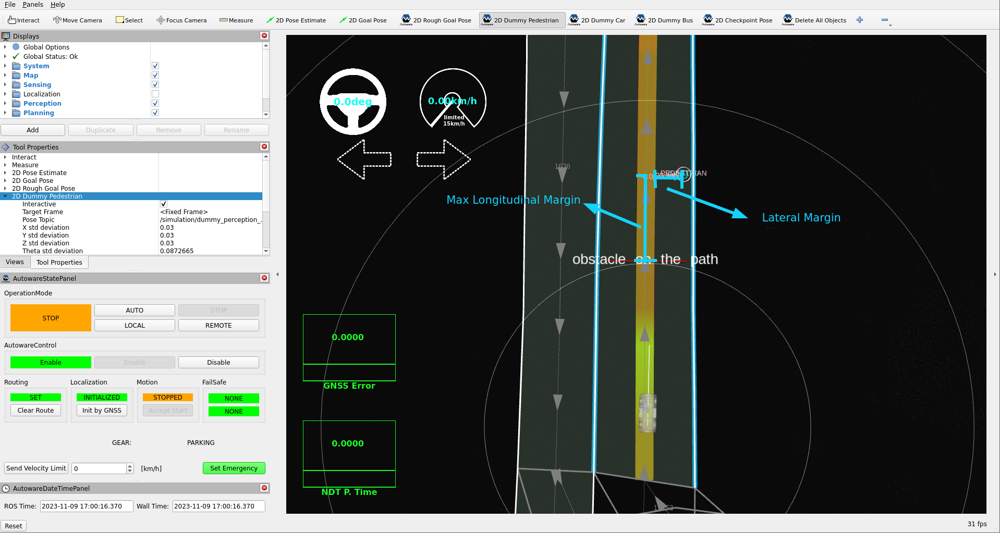

# Tuning planning

In this section, we will update, evaluate, and fine-tune the Autoware planning modules,
with a specific emphasis on the lane driving modules within the YTU campus environment.
The Autoware planning side consists of the following main lane driving sections:
**Behavior planning and motion planning**. Our focus will be on fine-tuning these modules to
enhance our planning performance in the campus environment.

## Introduction

## Planning parameter tuning

### Behavior planning tuning

#### Behavior velocity planner

The Behavior velocity planner is a planner that adjusts velocity based on traffic rules.
It loads modules as plugins. Please refer to the package documentation for more
information about these modules.

To enable or disable Behavior velocity planner modules,
we will enable or disable the necessary plugin modules in the [`default_preset.yaml` file](https://github.com/autowarefoundation/autoware_launch/blob/main/autoware_launch/config/planning/preset/default_preset.yaml) according to our preferences.

- For example, in the YTU campus environment, there are many speed bumps, pedestrians, and specific areas where autonomous driving is not permitted.
  We will enable the following three modules to handle these conditions:

  - Speed bump module
  - Out of lane module

To enable these modules,
we need to set the launch\_<MODULE-NAME> argument
to `true` for these modules in the `default_preset.yaml` parameter file:

!!! note "[`default_preset.param.yaml`](https://github.com/autowarefoundation/autoware_launch/blob/main/autoware_launch/config/planning/preset/default_preset.yaml) parameter file:"

    ```diff
    arg:
      name: launch_speed_bump_module
    -   default: "false"
    +   default: "true"
    arg:
      name: launch_out_of_lane_module
    -   default: "false"
    +   default: "true"
    ```

#### Speed bump module tuning

- Our vehicle's cruising speed is set to `15 km/h`.
  Therefore,
  we will decrease the default speed bump velocity limits in the `speed_bump.param.yaml`
  to allow for minimum and maximum speeds when going over speed bumps.

!!! note "[`speed_bump.param.yaml`](https://github.com/autowarefoundation/autoware_launch/blob/main/autoware_launch/config/planning/scenario_planning/lane_driving/behavior_planning/behavior_velocity_planner/speed_bump.param.yaml) parameter file:"

    ```diff
    - min_speed: 1.39  # [m/s] = [5 kph]
    + min_speed: 1.11  # [m/s] = [4 kph]
    - max_speed: 2.78  # [m/s] = [10 kph]
    + max_speed: 2.22  # [m/s] = [8 kph]
    ```

- Also, we will increase the slow_start_margin parameter to provide
  a greater margin for slowing down when approaching a speed bump.
  Please refer to the speed bump module page for more information
  about these parameters. It is essential to fine-tune these modules
  based on your specific vehicle and environmental conditions.

!!! note "[`speed_bump.param.yaml`](https://github.com/autowarefoundation/autoware_launch/blob/main/autoware_launch/config/planning/scenario_planning/lane_driving/behavior_planning/behavior_velocity_planner/speed_bump.param.yaml) parameter file:"

    ```diff
    - slow_start_margin: 1.0 [m]
    + slow_start_margin: 2.0 [m]
    ```

- The following image illustrates the virtual wall created by the slow start margin
  of the speed bump module. If you increase or decrease the `slow_start_margin` parameter,
  you will observe that the position of the virtual wall changes is relative to the speed bump.

<figure markdown>
  { align=center }
  <figcaption>
    The speed bump module slow start margin is demonstrated as a virtual wall in RViz.
  </figcaption>
</figure>

#### Avoidance

The Avoidance module plays a pivotal role in Autoware's behavior planning scene modules,
offering rule-based avoidance capabilities. It provides the flexibility to define behavior
based on intuitive parameters like lateral jerk and avoidance distance margin, enabling
adaptable avoidance strategies tailored to your specific environment. This module operates
within lane constraints, requiring access to lane structure information to ensure compliance
with traffic rules. For example, it triggers indicator signals when the vehicle crosses a lane.
The key distinction between motion and behavior modules in the planning stack is their consideration
of traffic rules.
Please refer to the [`Avoidance Module` page](https://autowarefoundation.github.io/autoware.universe/main/planning/behavior_path_planner/docs/behavior_path_planner_avoidance_design/) for more information about the module's capabilities.

We will modify and update certain avoidance rules and margin parameters
to handle with the specific conditions of our YTU campus environment
and the capabilities of our vehicle.

- First, we will disable the use of opposite lanelets while avoiding,
  as we do not want to utilize them in our YTU Campus environment.
  The default avoidance behavior in our environment is as depicted in the image below.

<figure markdown>
  { align=center }
  <figcaption>
    When the opposite_lane parameter is set to true,
the path can be shifted to the opposite lane if the ego vehicle cannot fit in the current lane.
  </figcaption>
</figure>

- To disable the use of the opposite lanelet in the avoidance, we will modify the value in the `avoidance.param.yaml` file:

!!! note "[`avoidance.param.yaml`](https://github.com/autowarefoundation/autoware_launch/blob/main/autoware_launch/config/planning/scenario_planning/lane_driving/behavior_planning/behavior_path_planner/avoidance/avoidance.param.yaml) parameter file:"

    ```diff
    - use_opposite_lane: true
    + use_opposite_lane: false
    ```

Now, we expect the avoidance module not to utilize the opposite lane in our area.
If the vehicle cannot fit past an obstacle in the same lanelet, it will come to a stop,
as depicted in the image below:

<figure markdown>
  { align=center }
  <figcaption>
    When the opposite_lane parameter is set to false,
the path cannot be shifted to the opposite lane, even if the ego vehicle cannot fit in the current lane.
  </figcaption>
</figure>

Since we disabled the use of opposite lanelets for the Avoidance module,
there may be instances where we cannot avoid objects due to the shifted path
(`safety_buffer_lateral` + `avoid_margin_lateral`) not fitting within the available lanelet.
As a small vehicle, we will reduce the `avoid_margin_lateral` parameter to decrease the distance
between objects and the ego vehicle.
You can adjust these changes to any target object according to your preference.
For more information on these parameters, please refer to
the [avoidance module documentation](https://autowarefoundation.github.io/autoware.universe/main/planning/behavior_path_planner/docs/behavior_path_planner_avoidance_design/).

!!! note "[`avoidance.param.yaml`](https://github.com/autowarefoundation/autoware_launch/blob/main/autoware_launch/config/planning/scenario_planning/lane_driving/behavior_planning/behavior_path_planner/avoidance/avoidance.param.yaml) parameter file:"

    ```diff
    ...
    -   avoid_margin_lateral: 1.0                    # [m]
    +   avoid_margin_lateral: 0.5                    # [m]
    ...
    ```

<figure markdown>
  { align=center }
  <figcaption>
    The Avoidance module's behavior changes when the avoid_margin value is decreased,
such that the shifted path fits within the lanelet.
  </figcaption>
</figure>

- Also, you can choose which objects can be avoided along the path.
  In the YTU campus environment, as mentioned earlier, there are many
  pedestrians, and we do not want to perform avoidance maneuvers for them.
  Therefore, we will disable the avoidance maneuver for pedestrians by
  modifying the target value in the [`avoidance.param.yaml` file](https://github.com/autowarefoundation/autoware_launch/blob/main/autoware_launch/config/planning/scenario_planning/lane_driving/behavior_planning/behavior_path_planner/avoidance/avoidance.param.yaml).
  You can disable any target object according to your preference.

!!! note "[`avoidance.param.yaml`](https://github.com/autowarefoundation/autoware_launch/blob/main/autoware_launch/config/planning/scenario_planning/lane_driving/behavior_planning/behavior_path_planner/avoidance/avoidance.param.yaml) parameter file:"

    ```diff
      ...
            pedestrian:
    -         is_target: true
    +         is_target: false
      ...
    ```

### Motion Planning Tuning

#### Obstacle avoidance planner

The obstacle avoidance planner generates a kinematically feasible
and collision-free trajectory based on the input path and drivable area.
It updates the trajectory's position and orientation but retains the velocity from the input path.
Please refer to the [Obstacle Avoidance Planner](https://autowarefoundation.github.io/autoware.universe/main/planning/obstacle_avoidance_planner/)
and [Model Predictive Trajectory (MPT)](https://autowarefoundation.github.io/autoware.universe/main/planning/obstacle_avoidance_planner/docs/mpt/)
documentation page for more information about this package.

- The YTU Campus environment features numerous U-turns, narrow roads, and roundabouts.
  Given our vehicle's maximum steering angle is insufficient for these conditions,
  we must consider our steering angle limit (defined in the vehicle_info.param.yaml)
  to navigate these road types without exceeding road boundaries.
  Therefore, we will enable the steer_limit_constraint parameter for the obstacle avoidance planner:

!!! note "[`obstacle_avoidance_planner.param.yaml`](https://github.com/autowarefoundation/autoware.universe/blob/main/planning/obstacle_avoidance_planner/config/obstacle_avoidance_planner.param.yaml) parameter file:"

    ```diff
    - steer_limit_constraint: false
    + steer_limit_constraint: true
    ```

- Additionally, we will modify our mechanism for checking outside the drivable area.
  By default, the obstacle avoidance planner checks the four corner points of the MPT footprint.
  However, this may lead to incorrect information in some situations, as shown in the following image.

<figure markdown>
  { align=center }
  <figcaption>
The obstacle avoidance planner's default method for checking the drivable area is
to check the four corner points of the MPT footprint.
This may not be sufficient to detect if the footprint extends beyond the lane boundaries.
  </figcaption>
</figure>

- To address this issue,
  we will enable the `use_footprint_polygon_for_outside_drivable_area_check` parameter
  to consider the footprint as a polygon and check if it exceeds the Lanelet2 boundaries.

!!! note "[`obstacle_avoidance_planner.param.yaml`](https://github.com/autowarefoundation/autoware.universe/blob/main/planning/obstacle_avoidance_planner/config/obstacle_avoidance_planner.param.yaml) parameter file:"

    ```diff
    -    use_footprint_polygon_for_outside_drivable_area_check: false # If false, only the footprint's corner points are considered.
    +    use_footprint_polygon_for_outside_drivable_area_check: true # If false, only the footprint's corner points are considered.
    ```

#### Obstacle stop planner

Autoware implements two motion stop planners:
the obstacle stop planner and the obstacle cruise planner.
We use the obstacle stop planner in the campus environment because it considers the input point cloud to insert stop points into the trajectory
(more safety).
The obstacle cruise planner, on the other hand, uses dynamic objects instead of the point cloud.
This provides higher accuracy than estimating the velocity on the planning side.

To determine which stop planner is being used,
please update the motion_stop_planner_type parameter in the `default_preset.yaml` file:

!!! note "[`default_preset.param.yaml`](https://github.com/autowarefoundation/autoware_launch/blob/main/autoware_launch/config/planning/preset/default_preset.yaml) parameter file:"

    ```yaml
      - arg:
          name: motion_stop_planner_type
          default: obstacle_stop_planner
          # option: obstacle_stop_planner
          #         obstacle_cruise_planner
          #         none
    ```

In our YTU environment and test vehicle conditions,
due to the short vehicle width, the trajectory is also short.
To improve the detection range of obstacle stop planner,
we will increase the lateral margin for detection area.
For more information on the parameters and inner working algorithms of the obstacle stop planner,
please refer to the [documentation page](https://autowarefoundation.github.io/autoware.universe/main/planning/obstacle_stop_planner/).

!!! note "[`obstacle_stop_planner.param.yaml`](https://github.com/autowarefoundation/autoware_launch/blob/main/autoware_launch/config/planning/scenario_planning/lane_driving/motion_planning/obstacle_stop_planner/obstacle_stop_planner.param.yaml) parameter file:"

    ```diff
      detection_area:
    -   lateral_margin: 0.0                  # margin [m]
    +   lateral_margin: 0.6                  # margin [m]
    ```

The following image illustrates the motion behavior of the trajectory,
considering the lateral_margin and max_longitudinal_margin parameters.

<figure markdown>
  { align=center }
  <figcaption>
  The obstacle stop planner checks the detection area with the given lateral margin.
If any points from the input cloud are detected,
it inserts a stop point behind the detected point cloud with the maximum longitudinal margin.
  </figcaption>
</figure>

Autoware has a lot of changeable parameters and methods.
The mentioned sample parameter tuning examples are just a small part of what is possible.
For more information on the modules and their parameters,
please refer to the [Autoware Universe documentation](https://autowarefoundation.github.io/autoware.universe/main/).
