# Planning Evaluation Using Scenarios

## Introduction

The performance of Autoware's planning stack is evaluated through a series of defined scenarios that outline the
behaviors of other road users and specify the success and failure conditions for the autonomous vehicle, referred to
as "Ego." These scenarios are specified in a machine-readable format and executed using the Scenario Simulator tool.
Below, brief definitions of the three primary tools used to create, execute, and analyze these scenarios are provided.

- **[Scenario Editor](https://scenario.ci.tier4.jp/scenario_editor/)**: A web-based GUI tool used to create and edit
  scenario files easily.

- **[Scenario Simulator](https://github.com/tier4/scenario_simulator_v2)**: A tool designed to simulate these
  machine-readable scenarios. It configures the environment, dictates the behavior of other road users, and sets both
  success and failure conditions.

- **[Autoware Evaluator](https://evaluation.ci.tier4.jp/)**: A web-based CI/CD platform that facilitates the uploading,
  categorization, and execution of scenarios along with their corresponding map files. It allows for parallel scenario
  executions and provides detailed results.

## Creating Scenarios

Scenarios are created using the Scenario Editor tool, which provides a user-friendly interface to define road users,
their behaviors, and the success and failure conditions for the ego vehicle.

To demonstrate the scenario creation process, we will create a simple scenario.

### Scenario Definition

- **Initial condition:** The ego vehicle is driving in a straight lane, and a bicycle is stopped in the same lane.
- **Action:** When the longitudinal distance between the ego vehicle and the bicycle is less than 10 meters, the bicycle
  starts moving at a speed of 2 m/s.
- **Success condition:** The ego vehicle reaches the goal point.
- **Failure condition:** The ego vehicle collides with the bicycle.

### Scenario Creation

1. Open the [Scenario Editor](https://scenario.ci.tier4.jp/scenario_editor/) tool.
2. Load the map from the **MAP** tab. For this tutorial, we will use the `LEO-VM-00001` map, which can be downloaded
   from the [Autoware Evaluators' `Maps` section](https://evaluation.ci.tier4.jp/evaluation/maps/972?project_id=awf).
3. In the `Edit` tab, add both the ego vehicle and the bicycle from the `Add Entity` section. After adding them, select
   the ego vehicle and set its destination from the `Edit` tab.

   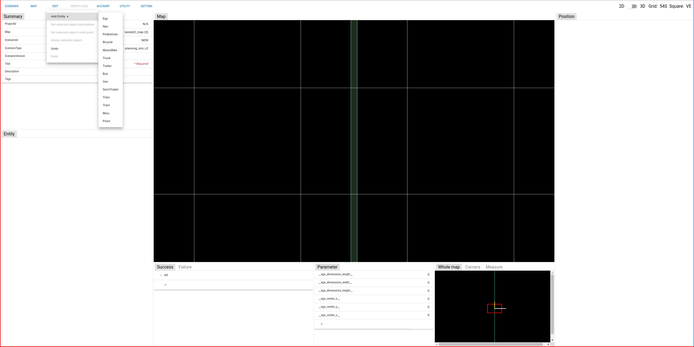

4. After setting the positions of the bicycle, ego vehicle, and ego vehicle's destination, set the initial velocity of
   the bicycle to 0 m/s as shown below. Then, click the `Scenario` tab and click on the `Add new act` button. Using
   this, define an action that starts the bicycle moving when the distance condition is satisfied.

   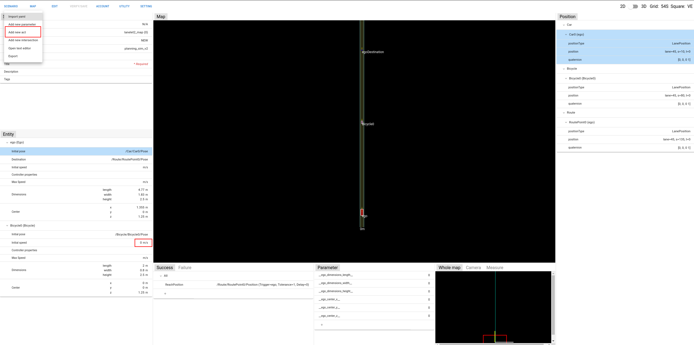

5. As shown below, define a start condition for an action named `act_start_bicycle`. This condition checks the distance
   between the ego vehicle and the bicycle. If the distance is less than or equal to 10 meters, the action is triggered.

   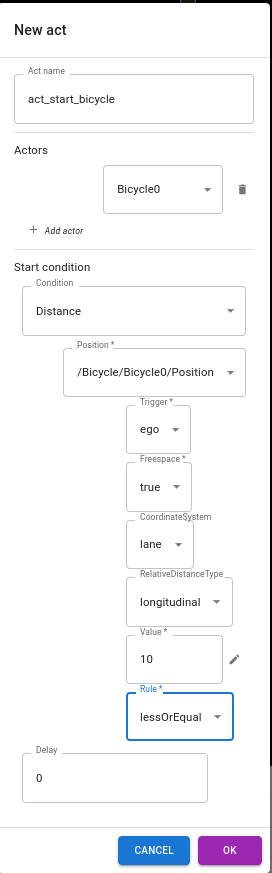

6. After the start condition, define an **event** for this action. Since there are no other conditions for this event,
   set a dummy condition where SimulationTime is greater than 0, as shown below.

   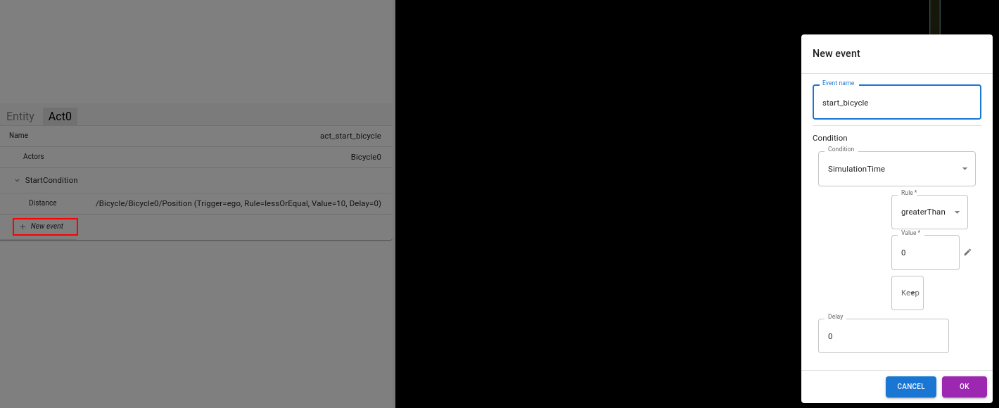

7. Define an **action** for this event. This action will set the velocity of the actor, Bicycle0, to 2 m/s.

   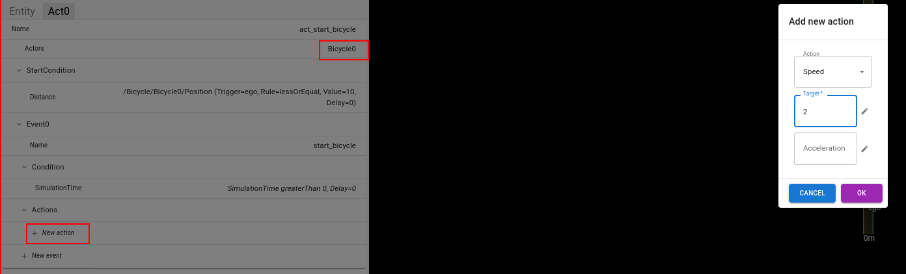

8. The scenario is now ready to be tested. You can export the scenario from the `Scenario` tab by clicking the `Export`
   button.

   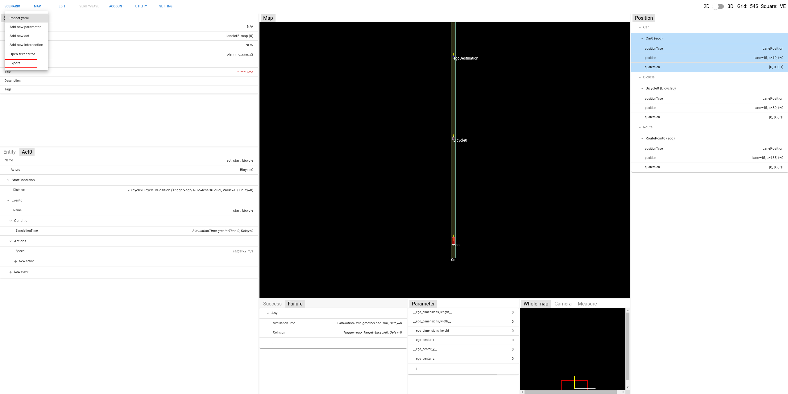

### Important Notes for Scenario Creation

- The tutorial we made is a simple scenario implementation for more complex definitions and other road user actions,
  please refer to
  the [Scenario Simulator documentation](https://tier4.github.io/scenario_simulator_v2-docs/).
- Due to the complexity of the scenario format, support for editing in the GUI is not yet complete for all scenario
  features. Therefore, if there are any items that cannot be supported or are difficult to edit using the GUI, you can
  edit and adjust the scenario directly using a text editor. In that case, the schema of the scenario format is checked
  before saving, so you can edit with confidence.
- Best way to understand other complex scenario implementations is to look at the existing scenarios. You can check the
  scenarios in the
  [Autoware Evaluator](https://evaluation.ci.tier4.jp/) to see other implementations.

## Running Scenarios using Scenario Simulator

### Creating the Scenario Simulator Environment

- Clone the Autoware main repository.

```bash
git clone https://github.com/autowarefoundation/autoware.git
```

- Create source directory.

```bash
cd autoware
mkdir src
```

- Import the necessary repositories both for the Autoware and Scenario Simulator.

```bash
vcs import src < autoware.repos
vcs import src < simulator.repos
```

- If you are installing Autoware for the first time, you can automatically install the dependencies by using the
  provided Ansible script. Please refer to
  the [Autoware source installation page](https://autowarefoundation.github.io/autoware-documentation/main/installation/autoware/source-installation/)
  for more information.

```bash
./setup-dev-env.sh
```

- Install dependent ROS packages.

Autoware and Scenario Simulator require some ROS 2 packages in addition to the core components. The tool rosdep allows
an automatic search and
installation of such dependencies. You might need to run rosdep update before rosdep install.

```bash
source /opt/ros/humble/setup.bash
rosdep install -y --from-paths src --ignore-src --rosdistro $ROS_DISTRO
```

- Build the workspace.

```bash
colcon build --symlink-install --cmake-args -DCMAKE_BUILD_TYPE=Release
```

- If you have any issues with the installation, or if you need more detailed instructions, please refer to the
  [Autoware source installation page](https://autowarefoundation.github.io/autoware-documentation/main/installation/autoware/source-installation/).

### Execute the scenario by using Scenario Simulator

We created an example scenario above and exported it into our local machine. Now, we will execute this scenario using
Scenario Simulator.

- Firstly, we should define the `lanelet2_map.osm` and `pointcloud_map.pcd` files in the scenario file. In default, the
  configuration is below:

```yaml
RoadNetwork:
  LogicFile:
    filepath: lanelet2_map.osm
  SceneGraphFile:
    filepath: lanelet2_map.pcd
```

User should change the `filepath` field according to the map file we downloaded before. You can find
both `lanelet2_map.osm` and `pointcloud_map.pcd` files in the `Maps` section of the Autoware Evaluator.

**Note:** Although the `pointcloud_map.pcd` file is mandatory, it is not used in the simulation. Therefore, you can
define a dummy file for this field.

- After defining the map files, we can execute the scenario by using the Scenario Simulator. The command is below:

```bash
ros2 launch scenario_test_runner scenario_test_runner.launch.py \
record:=false \
scenario:='/path/to/scenario/sample.yaml' \
sensor_model:=sample_sensor_kit \
vehicle_model:=sample_vehicle
```

- Now, the scenario will be executed in the Scenario Simulator. You can see the simulation in the RViz window.

- To see the condition details in the scenario while playing it in RViz, you should enable the `Condition Group` marker,
  it is not enabled by default.

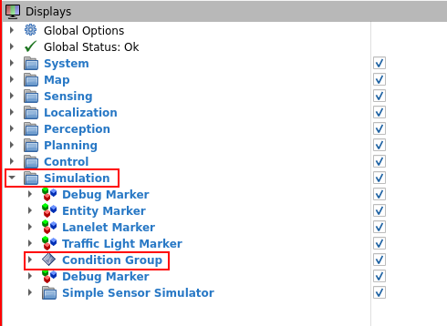

- By using the `Condition Group` marker, you can see the conditions that are satisfied and not satisfied in the
  scenario. So it would be helpful to investigate the scenario.

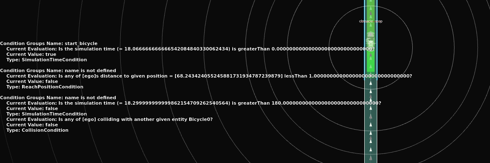

## Understanding the Autoware Evaluator

Autoware Evaluator is a web-based CI/CD platform that facilitates the uploading, categorization, and execution of
scenarios along with their corresponding map files. It allows for parallel scenario executions and provides detailed
results.

**Note: The Autoware Evaluator is a private tool. Currently, you should be invited to the AWF project to access it.
However, the AWF project will be public, it is under development.**

- Firstly, you should create a free TIER IV account to access the Autoware Evaluator. You can create an account by using
  the [TIER IV account creation page](https://account.tier4.jp/registration).

- After you created an account, please reach out to Hiroshi IGATA (<hiroshi.igata@tier4.jp>), the AWF ODD WG leader, for
  an invitation to AWF project of the Autoware Evaluator. It is advised to join the ODD WG meeting once to briefly
  introduce yourself and your interest. The ODD WG information
  is [here](https://github.com/autowarefoundation/autoware-projects/wiki/operational-design-domain-working-group#how-to-participate-in-the-working-group).

Let's explore the Autoware Evaluator interface page by page.

### Scenarios

In `Scenarios` tab, user can view, search, and filter all the uploaded scenarios. If you are looking for a specific
scenario, you can use this page's search bar to find it.
If the scenario labeled ticked, it means that the scenario is reviewed and approved by manager, otherwise, it waits for
a review.

### Catalogs

The `Catalogs` tab displays scenario catalogs which means a group of suites that were created for a specific use case.
In Evaluator, user can execute a test for all scenarios in a catalog.

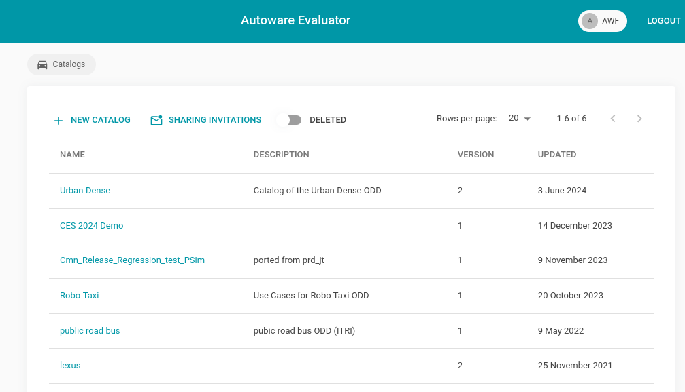

### Suites

`Suites` mean a group of scenarios that were created for a specific testing purposes, it is the smallest unit of the
scenario group. It can be assigned to any catalog to be tested for a use case.

### Maps

The `Maps` tab displays a list of maps that are used in the scenarios. Developers can find the map that they need to
execute the scenario.

### Reports

The `Reports` tab displays a list of results from scenario tests. Here, users can view the most recent test executions.

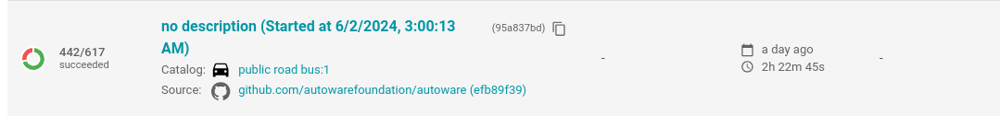

The screenshot above illustrates the latest test execution for the public road bus catalog. In the source column, the
default Autoware repository with the latest commit is displayed. For a deeper analysis, users can click on the title to
view comprehensive results.

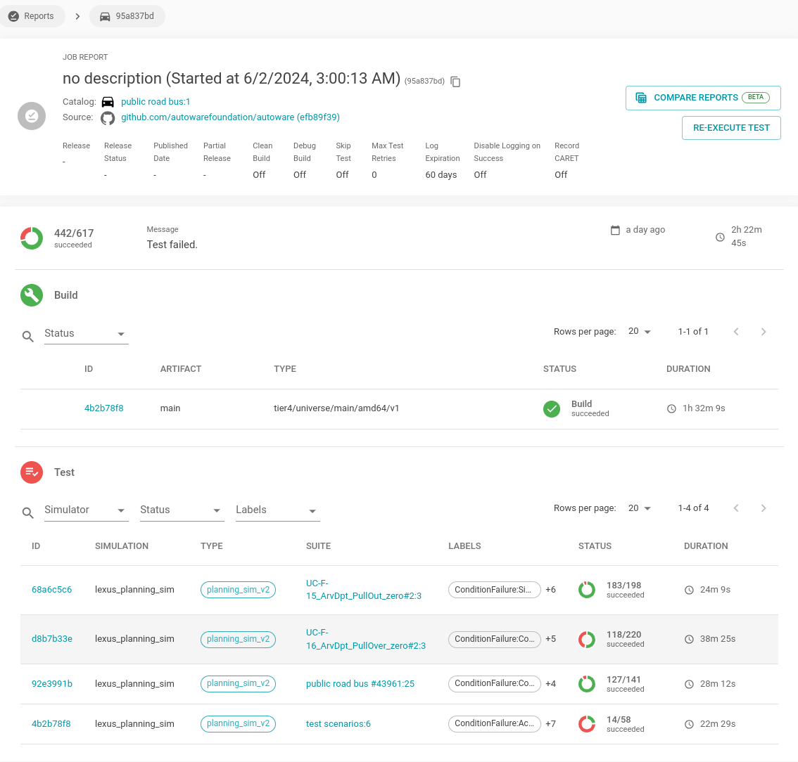

Clicking on the title of a test execution leads to a page displaying build logs and individual test results for each
suite. By selecting links in the `ID` column, users can access detailed results for each suits.

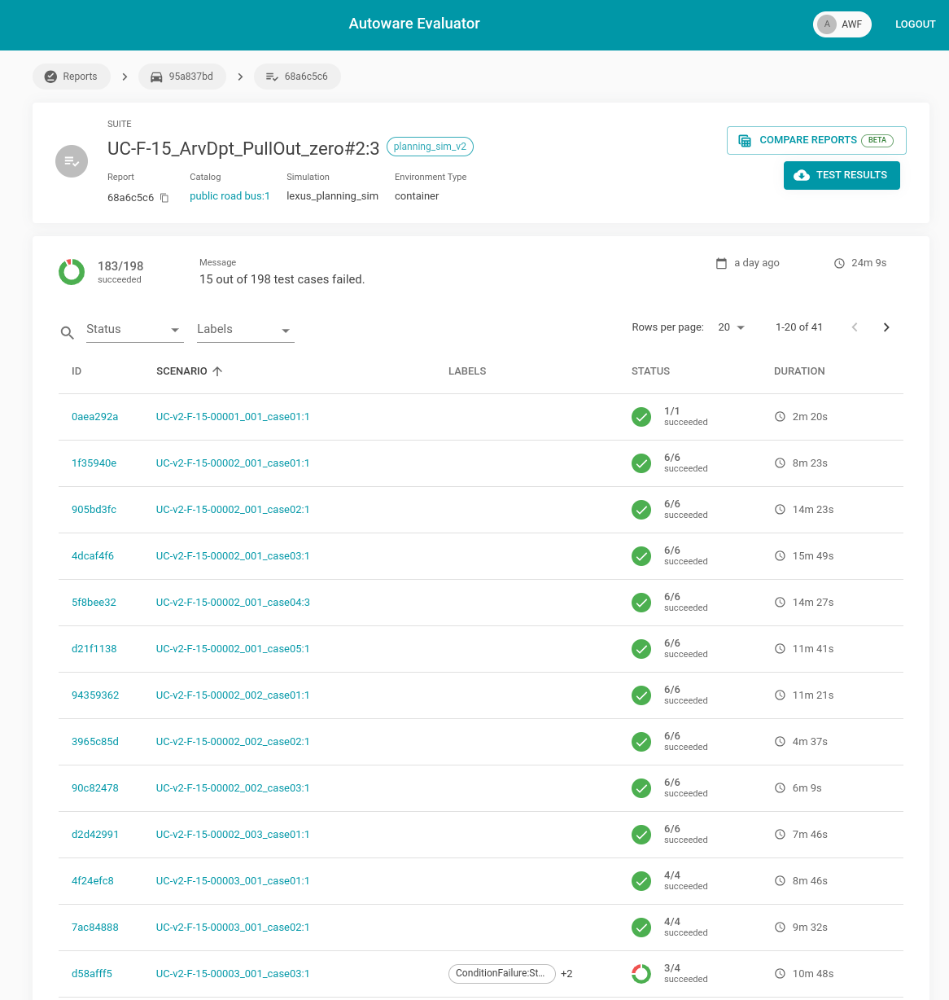

After clicking the `ID` link, users can view detailed test results for the scenarios within the suite. For instance, in
our case, 183 out of 198 scenarios succeeded. This page is a useful resource for developers to further investigate
scenarios that failed.

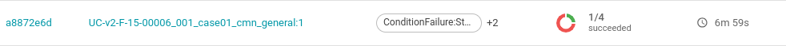

- `ID` links to a page which shows detailed test results for the scenario.
- `Scenario Name` links to a page displaying the scenario's definition.
- `Labels` indicate the conditions under which the scenario failed; if successful, this field remains empty.
- `Status` shows the count of failed and succeeded cases within a scenario.

To investigate deeper for this specific scenario, we should click into `ID` link.

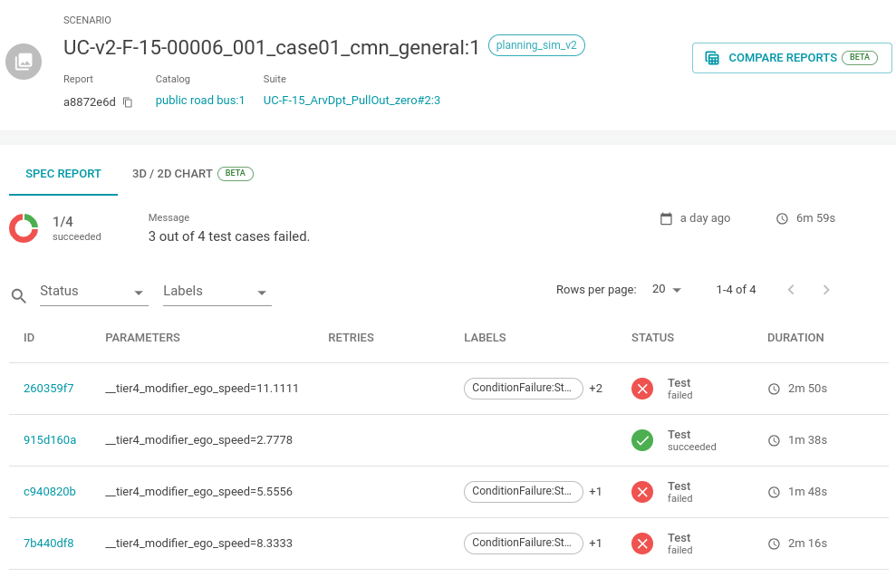

For this scenario, three of the four cases failed. Each case represents changing the `ego_speed` parameter. To deep dive
into the failed cases, click on the `ID` link.

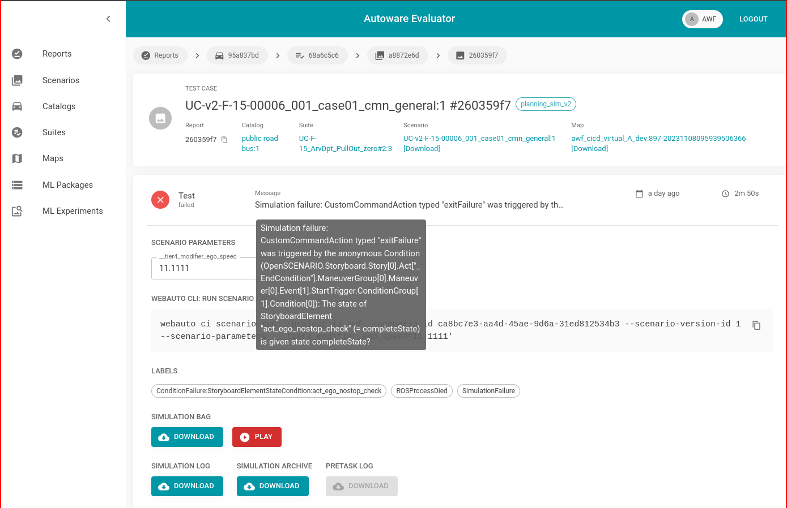

This page show us the detailed information of the failed case. We can understand why the case failing by looking into
the `Message`. For our case, the message
is `Simulation failure: CustomCommandAction typed "exitFailure" was triggered by the anonymous Condition (OpenSCENARIO.Storyboard.Story[0].Act["_EndCondition"].ManeuverGroup[0].Maneuver[0].Event[1].StartTrigger.ConditionGroup[1].Condition[0]): The state of StoryboardElement "act_ego_nostop_check" (= completeState) is given state completeState?`

From this message, we can understand that an action which is used for checking the vehicle is not stopped is in complete
state. And, the scenario author set this condition as a failure condition. Therefore, the scenario failed.

- To test the scenario in local, you can download the scenario and its map by using links which are marked image above.
  Running scenario on local machine was explained in the previous section.

- To compare the test executions to analyze when the scenarios were successfully running, you can use `Compare Reports`
  button in the page which shows result of previous test executions.

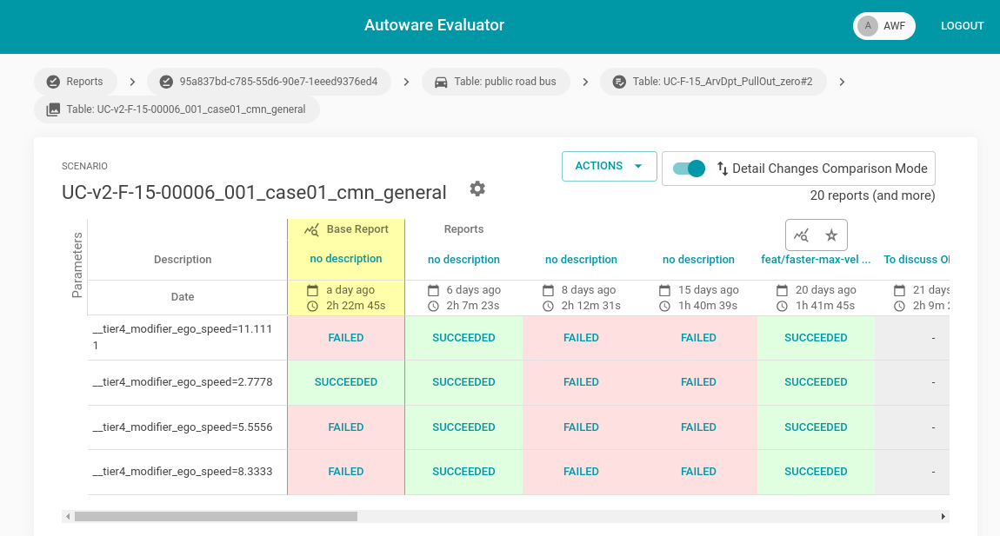

- To see how the scenario failed, you can replay the scenario by clicking the `Play` button. It shows the executed test.

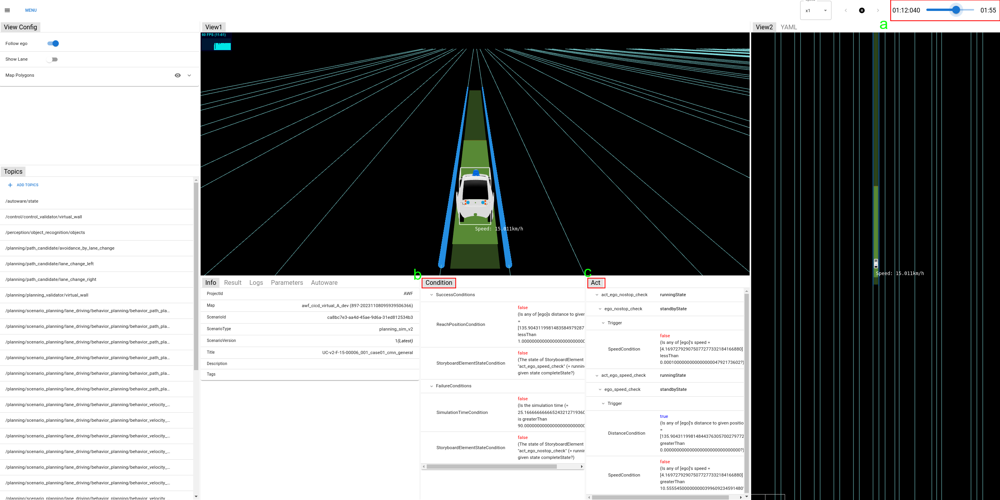

- a) The bar that assists us in rewinding or fast-forwarding
- b) Shows the success and failing conditions are satisfied or not
- c) Shows the state of the actions and events and their start conditions

## For Further Support

Creating scenarios, analyzing them using Autoware Evaluator would be complicated for new users. If you need further help
or support, you can reach out to the Autoware community through
the [Autoware Discord server](https://discord.gg/Q94UsPvReQ), and you can ask questions about scenario creation process
or Autoware Evaluator in `odd` channel. Also, you can attend the weekly ODD Working Group meeting to get support from
the community. You can join
the [ODD WG invitation group](https://groups.google.com/a/autoware.org/g/operational-design-domain-working-group-meeting-invitations)
to get the meeting invitations.

- ODD WG meetings are held weekly in the single time slot which is 2:00pm, Monday (UTC).

### Other Useful Pages

- <https://docs.web.auto/en/user-manuals/>
- <https://tier4.github.io/scenario_simulator_v2-docs/>
