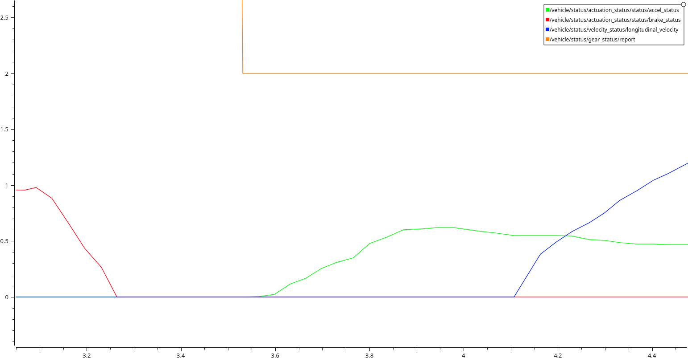

# Reducing start delays on real vehicles

In simulation, the ego vehicle reacts nearly instantly to the control commands generated by Autoware.
However, with a real vehicle, some delays occur that may make ego feel less responsive.

This page presents start delays experienced when using Autoware on a real vehicle.
We define the start delay as the time between
(a) when Autoware decides to make the ego vehicle start and
(b) when the vehicle actually starts moving.
More precisely:

- (a) is the time when the speed or acceleration command output by Autoware switches to a non-zero value.
- (b) is the time when the measured velocity of the ego vehicle switches to a positive value.

## Start delay with manual driving

First, let us look at the start delay when a human is driving.

The following figure shows the start delay when a human driver switches the gear
from _parked_ to _drive_ and instantly releases the brake to push the throttle pedal and make the velocity of the vehicle increase.

There are multiple things to note from this figure.

- Brake (red): despite the driver instantly releasing the brake pedal,
  we see that the measured brake takes around `150ms` to go from `100%` to `0%`.
- Gear (orange): the driver switches gear _before_ releasing the brake pedal, but the gear is measured to switch _after_
  the brake is released.
- Throttle (green) and velocity (blue): the driver pushes the throttle pedal and the vehicle is measured to start moving around `500ms` later.

## Filter delay

To guarantee passenger comfort,
some Autoware modules implement filters on the jerk of the vehicle, preventing sudden changes in acceleration.

For example,
the [`vehicle_cmd_gate`](https://autowarefoundation.github.io/autoware.universe/main/control/vehicle_cmd_gate/)
filters the acceleration command generated by the controller
and [was previously introducing significant delays](https://github.com/autowarefoundation/autoware.universe/pull/3385)
when transitioning between a stop command where the acceleration is negative,
and a move command where the acceleration is positive.
Because of the jerk filter, the transition between negative and positive was not instantaneous and would take several hundreds of milliseconds.

## Gear delay

In many vehicles, it is necessary to change gear before first starting to move the vehicle.
When performed autonomously, this gear change can take some significant time.
Moreover, as seen from the data recorded with manual driving, the measured gear value may be delayed.

In Autoware, the controller sends a stopping control command until the gear is changed to the _drive_ state.
This means that delays in the gear change and its reported value can greatly impact the start delay.
Note that this is only an issue when the vehicle is initially in the _parked_ gear.

The only way to reduce this delay is by tuning the vehicle to increase the gear change speed
or to reduce the delay in the gear change report.

## Brake delay

In vehicles with a brake pedal,
the braking system will often be made of several moving parts which cannot move instantly.
Thus, when Autoware sends brake commands to a vehicle,
some delays should be expected in the actual brake applied to the wheels.

This lingering brake may prevent or delay the initial motion of the ego vehicle.

This delay can be reduced by tuning the vehicle.

## Throttle response

For vehicles with throttle control,
one of the main cause of start delays is due to the
[throttle response](https://en.wikipedia.org/wiki/Throttle_response) of the vehicle.
When pushing the throttle pedal, the wheels of the vehicle do not instantly start rotating.
This is partly due to the inertia of the vehicle,
but also to the motor which may take a significant time to start applying
some torque to the wheels.

It may be possible to tune some vehicle side parameters to reduce this delay,
but it is often done at the cost of reduced energy efficiency.

On the Autoware side, the only way to decrease this delay is to increase the initial throttle
but this can cause uncomfortably high initial accelerations.

## Initial acceleration and throttle

As we just discussed, for vehicles with throttle control, an increased initial throttle value can reduce the start delay.

Since Autoware outputs an acceleration value, the conversion module
[`raw_vehicle_cmd_converter`](https://autowarefoundation.github.io/autoware.universe/main/vehicle/raw_vehicle_cmd_converter/)
is used to map the acceleration value from Autoware to a throttle value to be sent to the vehicle.
Such mapping is usually calibrated automatically using the
[`accel_brake_map_calibrator`](https://autowarefoundation.github.io/autoware.universe/main/vehicle/accel_brake_map_calibrator/accel_brake_map_calibrator/) module,
but it may produce a low initial throttle which leads to high start delays.

In order to increase the initial throttle, there are two options:
increase the initial acceleration output by Autoware,
or modify the acceleration to throttle mapping.

The initial acceleration output by Autoware can be tuned in the
[`motion_velocity_smoother`](https://autowarefoundation.github.io/autoware.universe/main/planning/motion_velocity_smoother/)
with parameters `engage_velocity` and `engage_acceleration`.
However, the [`vehicle_cmd_gate`](https://autowarefoundation.github.io/autoware.universe/main/control/vehicle_cmd_gate/)
applies a filter on the control command to prevent too sudden changes in jerk and acceleration,
limiting the maximum allowed acceleration while the ego vehicle is stopped.

Alternatively, the mapping of acceleration can be tuned to increase the throttle corresponding to the initial acceleration.
If we look at an example
[acceleration map](https://github.com/tier4/autoware_individual_params/blob/main/individual_params/config/default/pacmod/accel_map.csv),
it does the following conversion:
when the ego velocity is `0` (first column), acceleration values between `0.631` (first row) and `0.836` (second row)
are converted to a throttle between `0%` and `10%`.
This means that any initial acceleration bellow `0.631m/s²` will not produce any throttle.
Keep in mind that after tuning the acceleration map,
it may be necessary to also update the
[`brake map`](https://github.com/tier4/autoware_individual_params/blob/main/individual_params/config/default/pacmod/brake_map.csv).

| default | _0_     | 1.39  | 2.78  | 4.17  | 5.56   | 6.94   | 8.33   | 9.72   | 11.11  | 12.5   | 13.89  |
| ------- | ------- | ----- | ----- | ----- | ------ | ------ | ------ | ------ | ------ | ------ | ------ |
| 0       | _0.631_ | 0.11  | -0.04 | -0.04 | -0.041 | -0.096 | -0.137 | -0.178 | -0.234 | -0.322 | -0.456 |
| 0.1     | _0.836_ | 0.57  | 0.379 | 0.17  | 0.08   | 0.07   | 0.068  | 0.027  | -0.03  | -0.117 | -0.251 |
| 0.2     | _1.129_ | 0.863 | 0.672 | 0.542 | 0.4    | 0.38   | 0.361  | 0.32   | 0.263  | 0.176  | 0.042  |
| 0.3     | _1.559_ | 1.293 | 1.102 | 0.972 | 0.887  | 0.832  | 0.791  | 0.75   | 0.694  | 0.606  | 0.472  |
| 0.4     | _2.176_ | 1.909 | 1.718 | 1.588 | 1.503  | 1.448  | 1.408  | 1.367  | 1.31   | 1.222  | 1.089  |
| 0.5     | _3.027_ | 2.76  | 2.57  | 2.439 | 2.354  | 2.299  | 2.259  | 2.218  | 2.161  | 2.074  | 1.94   |
