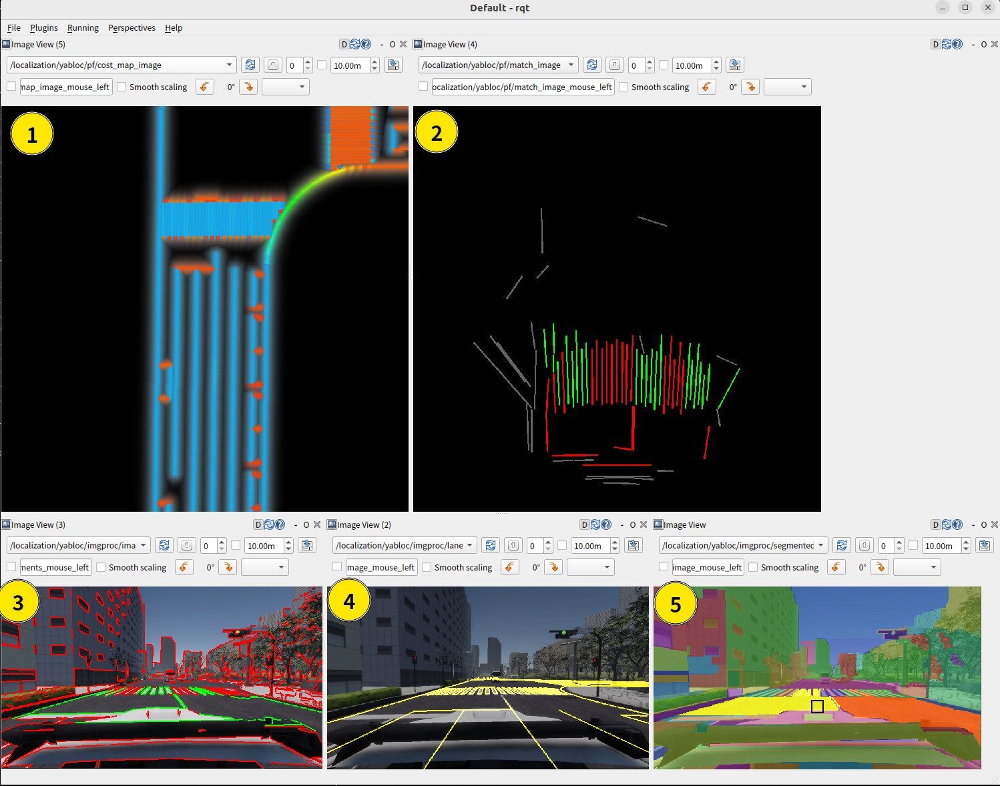

# Using YabLoc in Autoware

## What is YabLoc?

YabLoc is a camera-based localization method. 
It estimates position by matching road surface markings extracted from images with a vector map.
Point cloud maps and LiDAR are not required.
YabLoc enables users localize with vehicles that are not equipped with LiDAR and in environments where point cloud maps are not available.

### Principle
The diagram below illustrates the basic principle of YabLoc. It extracts road surface markings by masking the line segments using the road area obtained from graph-based segmentation. The red line at the center-top of the diagram represents the line segments identified as road surface markings. YabLoc transforms these segments for each particle and determines the particle's weight by comparing them with the cost map generated from Lanelet2.


### YabLoc Packages
- [yabloc_common](https://github.com/autowarefoundation/autoware.universe/tree/main/localization/yabloc/yabloc_common/README.md)
- [yabloc_imgproc](https://github.com/autowarefoundation/autoware.universe/tree/main/localization/yabloc/yabloc_imgproc/README.md)
- [yabloc_particle_filter](https://github.com/autowarefoundation/autoware.universe/tree/main/localization/yabloc/yabloc_particle_filter/README.md)
- [yabloc_pose_initializer](https://github.com/autowarefoundation/autoware.universe/tree/main/localization/yabloc/yabloc_pose_initializer/README.md)

## How to Launch

When launching autoware, if you set `localization_mode:=yabloc` as an argument, YabLoc will be launched instead of NDT.
By default, `localization_mode` is `ndt`.

A sample command to use YabLoc is as follows

```shell
ros2 launch autoware_launch logging_simulator.launch.xml \
  map_path:=$HOME/autoware_map/sample-map-rosbag\
  vehicle_model:=sample_vehicle \
  sensor_model:=sample_sensor_kit \
  localization_mode:=yabloc
```

## Architecture


### Inputs

| Name                                                  | Type                                           |
| ----------------------------------------------------- | ---------------------------------------------- |
| `/sensing/camera/traffic_light/image_raw/compressed`  | `sensor_msgs/msg/CompressedImage`              |
| `/sensing/camera/traffic_light/camera_info`           | `sensor_msgs/msg/CameraInfo`                   |
| `/sensing/gnss/pose_with_covariance`                  | `geometry_msgs/msg/PoseWithCovarianceStamped`  |
| `/localization/twist_estimator/twist_with_covariance` | `geometry_msgs/msg/TwistWithCovarianceStamped` |
| `/map/vector_map`                                     | `autoware_auto_mapping_msgs/msg/HADMapBin`     |
| `/tf_static`                                          | `tf2_msgs/msg/TFMessage`                       |
| `/initialpose3d`                                      | `geometry_msgs/msg/PoseWithCovarianceStamped`  |

### Outputs

| Name                                                  | Type                                          |
| ----------------------------------------------------- | --------------------------------------------- |
| `/localicazation/pose_estimator/pose_with_covariance` | `geometry_msgs/msg/PoseWithCovarianceStamped` |

## Visualization

### Core visualization topics

These topics are not visualized by default.


| index | topic name                                              | description                                                                                                                                                            |
| ----- | ------------------------------------------------------- | ---------------------------------------------------------------------------------------------------------------------------------------------------------------------- |
| 1     | `/localicazation/yabloc/pf/predicted_particle_marker`   | particle distribution of particle fitler. Red particles are probable candidate.                                                                                        |
| 2     | `/localicazation/yabloc/pf/scored_cloud`                | 3D projected line segments. the color indicates how well they match the map.                                                                                           |
| 3     | `/localicazation/yabloc/imgproc/lanelet2_overlay_image` | overlay of lanelet2 (yellow lines) onto image based on estimated pose. If they match well with the actual road markings, it means that the localization performs well. |

### Image topics for debug

These topics are not visualized by default.



| index | topic name                                                       | description                                                                     |
| ----- | ---------------------------------------------------------------- | ------------------------------------------------------------------------------- |
| 1     | `/localicazation/yabloc/pf/cost_map_image`                       | cost map made from lanelet2                                                     |
| 2     | `/localicazation/yabloc/pf/match_image`                          | projected line segments                                                         |
| 3     | `/localicazation/yabloc/imgproc/image_with_colored_line_segment` | classifified line segments. green line segments are used in particle correction |
| 4     | `/localicazation/yabloc/imgproc/lanelet2_overlay_image`          | overlay of lanelet2                                                             |
| 5     | `/localicazation/yabloc/imgproc/segmented_image`                 | graph based segmentation result                                                 |

## Limitation

- **Running YabLoc and NDT simultaneously is not supported.**
  - This is because both are computationally expensive.
  - Also, in most cases, NDT is superior to YabLoc, so there is less benefit to running them at the same time.
- It does not estimate roll and pitch, therefore some of the perception nodes may not work well.
- It doesn't support multiple cameras now. But it will in the future.
- In places where there are few road surface markings, such as intersections, the estimation heavily relies on GNSS, IMU, and vhielce twist.
- If the road boundary or road surface markings are not included in the Lanelet2, the estimation fails.
- The sample rosbag provided in the autoware tutorial does not include images, so it is not possible to run YabLoc with it.
